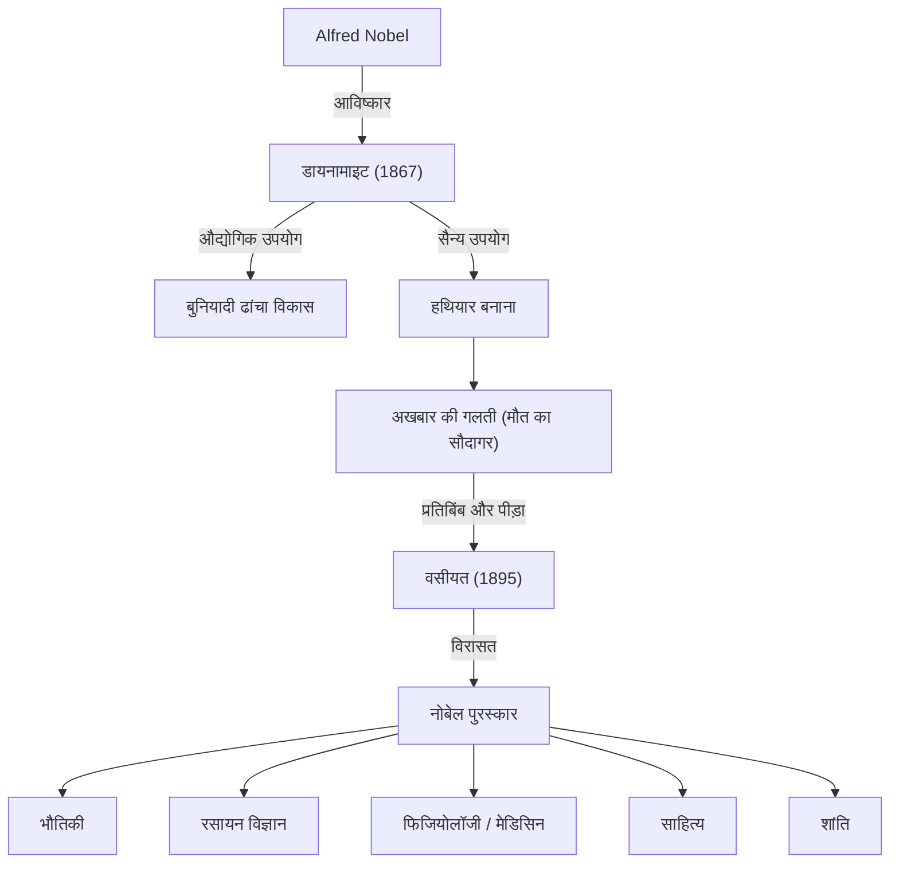

अल्फ्रेड नोबेल ने डायनामाइट के आविष्कार से अपार संपत्ति अर्जित की और अपनी विरासत के साथ नोबेल पुरस्कार की स्थापना की। उनका जीवन विज्ञान और प्रौद्योगिकी के विकास से लाए गए प्रकाश और छाया का प्रतीक है।

## एक आविष्कारक के रूप में प्रतिभा और डायनामाइट का जन्म

अल्फ्रेड बर्नहार्ड नोबेल का जन्म 1833 में स्टॉकहोम, स्वीडन में हुआ था। नाइट्रोग्लिसरीन दुर्घटना में अपने भाई की मृत्यु के दुख पर काबू पाते हुए, नोबेल ने खुद को सुरक्षित विस्फोटक विकसित करने के लिए समर्पित कर दिया। 1867 में, उन्होंने "डायनामाइट" का आविष्कार किया, जिसने बुनियादी ढांचे के विकास में बहुत मदद की।

## "मौत के सौदागर" का कलंक

अंततः डायनामाइट का उपयोग सैन्य रूप से एक हथियार के रूप में किया जाने लगा। 1888 में, जब उनके भाई लुडविग की मृत्यु हुई, तो एक फ्रांसीसी समाचार पत्र ने गलती से उन्हें अल्फ्रेड समझ लिया और प्रकाशित किया: "मौत का सौदागर मर गया"।
इस बात से दुखी होकर, नोबेल ने गंभीरता से सोचना शुरू किया कि समाज को अपनी विरासत कैसे वापस की जाए।

## शांति की कामना: नोबेल पुरस्कार की स्थापना

1895 की अपनी वसीयत में, नोबेल ने अपनी संपत्ति उन लोगों को पुरस्कृत करने के लिए समर्पित कर दी जिन्होंने मानवता को सबसे बड़ा लाभ पहुँचाया था।

## भावी पीढ़ियों पर प्रभाव और दर्शन

अल्फ्रेड नोबेल का जीवन विज्ञान और प्रौद्योगिकी की दोहरी प्रकृति का प्रतीक है। आज भी नोबेल पुरस्कार एक बेहतर भविष्य की ओर मानवता का मार्ग प्रशस्त करता है।
