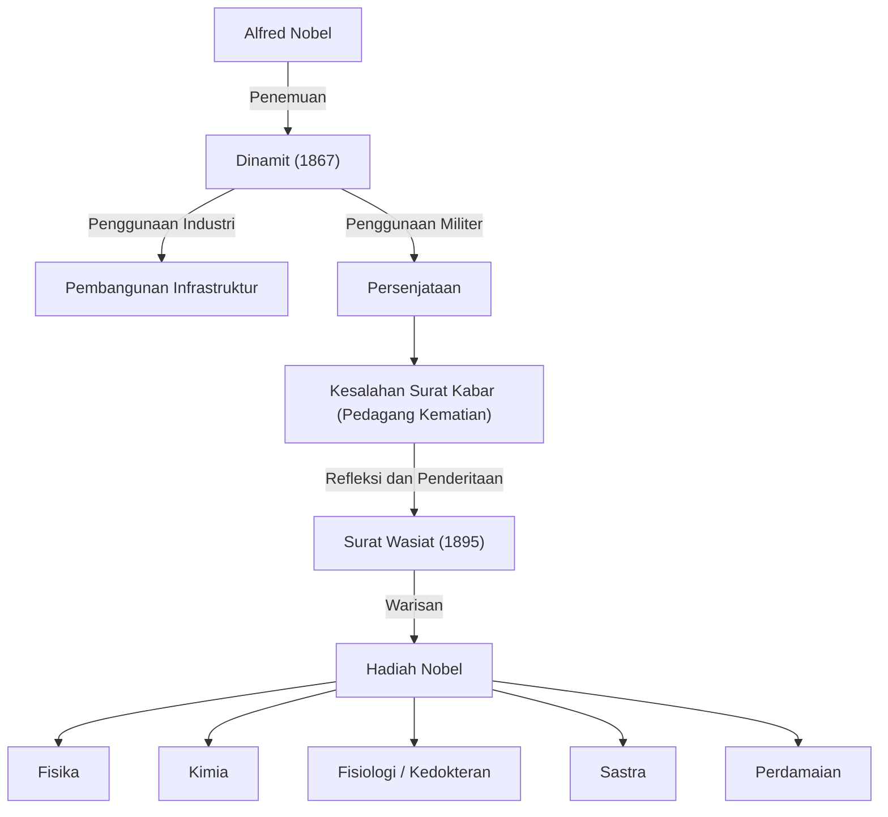

Alfred Nobel mengumpulkan kekayaan besar melalui penemuan dinamit dan mendirikan Hadiah Nobel dengan warisannya. Kehidupannya mewujudkan cahaya dan bayangan dari perkembangan ilmu pengetahuan dan teknologi.

## Bakat sebagai Penemu dan Kelahiran Dinamit

Alfred Bernhard Nobel lahir di Stockholm, Swedia, pada tahun 1833. Mengatasi kematian saudaranya dalam kecelakaan nitrogliserin, Nobel mendedikasikan dirinya untuk mengembangkan bahan peledak yang aman. Pada tahun 1867, ia menemukan "dinamit", yang merevolusi pembangunan infrastruktur dan memberinya kekayaan besar.

## Stigma "Pedagang Kematian"

Dinamit akhirnya digunakan secara militer sebagai senjata. Pada tahun 1888, ketika saudaranya Ludvig meninggal, sebuah surat kabar Prancis salah mengira dia sebagai Alfred dan menerbitkan: "Pedagang kematian telah mati".
Sangat terkejut, Nobel mulai berpikir serius tentang bagaimana mengembalikan warisannya kepada masyarakat.

## Keinginan untuk Perdamaian: Pendirian Hadiah Nobel

Dalam surat wasiatnya tahun 1895, Nobel mendedikasikan kekayaannya untuk memberi penghargaan kepada mereka yang memberikan manfaat terbesar bagi umat manusia.

## Dampak pada Generasi Mendatang dan Filosofi

Kehidupan Alfred Nobel melambangkan sifat ganda dari ilmu pengetahuan dan teknologi. Saat ini, Hadiah Nobel terus menjadi tujuan para ilmuwan dan aktivis perdamaian, menerangi jalan menuju masa depan yang lebih baik.
