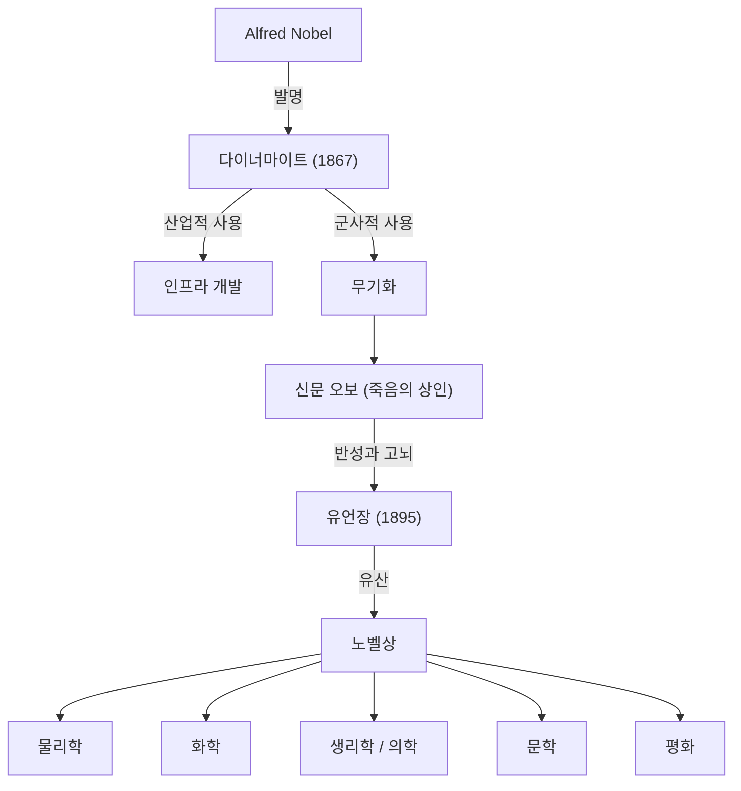

다이너마이트의 발명으로 거만적인 부를 축적하고 그 유산으로 노벨상을 창설한 알프레드 노벨. 그의 생애는 과학 기술의 발전이 가져오는 빛과 그림자를 체현한 것이었습니다.

## 발명가로서의 재능과 다이너마이트의 탄생

알프레드 노벨(Alfred Bernhard Nobel)은 1833년 스웨덴 스톡홀름에서 태어났습니다. 그는 어릴 때부터 공학과 화학에 둘러싸여 자랐으며, 17세 때 스웨덴어, 러시아어, 프랑스어, 영어, 독일어를 유창하게 구사했습니다.
니트로글리세린 폭발 사고로 동생을 잃는 비극을 극복하고, 노벨은 1867년 안전하게 다룰 수 있는 폭약인 "다이너마이트"를 발명하여 거대한 부를 쌓았습니다.

## '죽음의 상인'이라는 낙인과 고뇌

다이너마이트는 원래 산업 발전과 평화적인 목적을 위해 개발되었으나, 점차 군사 무기로 사용되었습니다.
1888년 형 루드비그가 사망했을 때, 프랑스의 한 신문이 알프레드가 죽은 것으로 착각하고 "죽음의 상인, 사망하다"라는 부고 기사를 냈습니다. 이 기사를 읽고 노벨은 큰 충격을 받았습니다.
자신의 생애가 '죽음의 상인'으로 기억될 것을 두려워한 그는 자신의 유산을 어떻게 사회에 환원할지 진지하게 고민하기 시작했습니다.

## 평화를 향한 염원: 노벨상의 창설

1895년에 그가 작성한 유언장에는 자신의 재산 대부분을 기금으로 하여 인류를 위해 가장 큰 공헌을 한 사람들에게 상을 수여할 것이 적혀 있었습니다.
이것이 현재의 "노벨상"의 시작입니다. 그가 지정한 분야는 물리학, 화학, 생리학·의학, 문학, 그리고 평화의 5개 분야였습니다.

특히 평화상의 창설에는 평화 운동가였던 전 비서 베르타 폰 주트너의 강한 영향이 있었습니다.

## 후세에 미친 영향과 철학

알프레드 노벨의 삶은 과학 기술의 양면성을 상징합니다. 그는 자신의 발명이 낳은 비참한 현실을 외면하지 않고, 전 재산을 투자하여 인류의 지혜와 평화를 기리는 시스템을 구축했습니다.
오늘날 노벨상은 세계에서 가장 권위 있는 상으로서 인류가 더 나은 미래를 향해 나아가는 길을 계속해서 비추고 있습니다.
