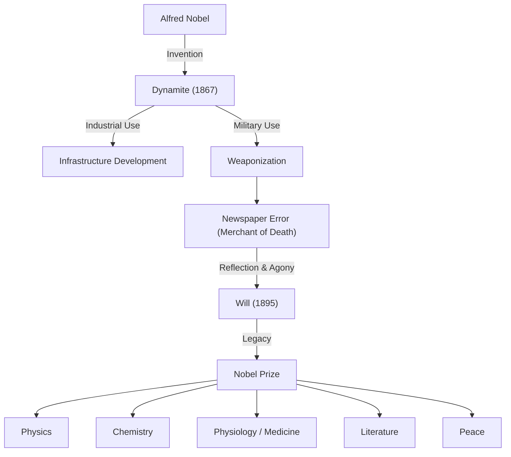

ダイナマイトの発明によって巨万の富を築き、その遺産でノーベル賞を創設したアルフレッド・ノーベル。彼の生涯は、科学技術の発展がもたらす光と影を体現したものでした。本記事では、発明家としての類まれな才能、死の商人と呼ばれた苦悩、そして彼が未来に託した平和への願いについて深く掘り下げます。

## 発明家としての才能とダイナマイトの誕生

アルフレッド・ノーベル（Alfred Bernhard Nobel）は、1833年にスウェーデンのストックホルムで生まれました。父親も発明家・技術者であり、アルフレッドは幼い頃から工学や化学に囲まれて育ちます。彼は語学にも堪能で、17歳の時にはスウェーデン語、ロシア語、フランス語、英語、ドイツ語を流暢に操るほどでした。

当時の土木工事や鉱山採掘では、黒色火薬に代わる強力な爆薬としてニトログリセリンが注目されていました。しかし、ニトログリセリンは極めて不安定で、わずかな衝撃でも爆発してしまう危険な物質でした。実際、ノーベルの弟エミールもニトログリセリンの爆発事故で命を落としています。

この悲劇を乗り越え、ノーベルは安全に扱える爆薬の開発に没頭します。そして1867年、ニトログリセリンを珪藻土に染み込ませることで安定化させる画期的な手法を発見し、「ダイナマイト」として特許を取得しました。この発明により、トンネル掘削や鉄道建設などのインフラ整備は飛躍的に進歩し、ノーベルは世界中に工場を建設して莫大な富を築くことになります。

## 「死の商人」という烙印と苦悩

ダイナマイトは元々、産業の発展と平和目的のために開発されたものでした。しかし、その破壊力の大きさゆえに、次第に兵器として軍事利用されるようになります。普仏戦争などを経て、ノーベルの爆薬は戦争の道具として多くの命を奪う結果をもたらしました。

彼に転機が訪れたのは1888年、兄ルドヴィグがフランスのカンヌで亡くなった時のことです。あるフランスの新聞が、アルフレッド自身が死んだと勘違いし、「死の商人、死す」という見出しの訃報記事を掲載しました。「かつてないほど大量の人を、かつてないほど素早く殺害する方法を発見し、富を築いた人物」と評されたこの記事を読んで、ノーベルは深い衝撃を受けます。

自分の生涯が「死の商人」として記憶されることに恐れを抱いた彼は、自身の遺産をどのように社会に還元し、後世にどのような記憶を残すかについて真剣に考え始めました。

## 平和への願い：ノーベル賞の創設

ノーベルは生涯独身であり、自身の富を親族ではなく人類の発展のために捧げる決断を下します。1895年に彼が作成した遺言状には、自身の財産の大部分（約3100万スウェーデン・クローナ）を基金とし、国籍を問わず人類のために最大たる貢献をした人々に賞を授与することが記されていました。

これが現在の「ノーベル賞」の始まりです。彼が指定した分野は、物理学、化学、生理学・医学、文学、そして平和の5分野でした。（後に経済学賞が追加されます）

特に「平和賞」の創設には、彼の元秘書であり平和運動家であったベルタ・フォン・ズットナー（後に女性初のノーベル平和賞受賞者）の強い影響があったと言われています。軍事技術に関わった自身の過去に対する贖罪と、平和な世界への強い祈りがそこには込められていました。

## 後世への影響と哲学

ノーベルは、「私の爆薬が、平和会議よりも早く戦争を終結させるかもしれない」と語ったとされています。圧倒的な破壊力を持つ兵器の存在が、かえって戦争の抑止力になるという考え（相互確証破壊の概念に近い）を抱いていたのです。これは、現代の核抑止論にも通じる複雑な哲学でした。

アルフレッド・ノーベルの人生は、科学技術の二面性を象徴しています。テクノロジーは使い方次第で人類を豊かにもし、破滅にも導きます。彼は自らの発明が生み出した悲惨な現実から目を背けることなく、全財産を投じて人類の英知と平和を称えるシステムを構築しました。

今日、ノーベル賞は世界で最も権威ある賞として、科学者や平和活動家たちの目標であり続けています。「死の商人」と呼ばれた男は、最終的に「平和と知のパトロン」として歴史にその名を刻むことに成功したのです。彼の残した遺産は、今もなお、より良い未来を目指す人類の歩みを照らし続けています。
