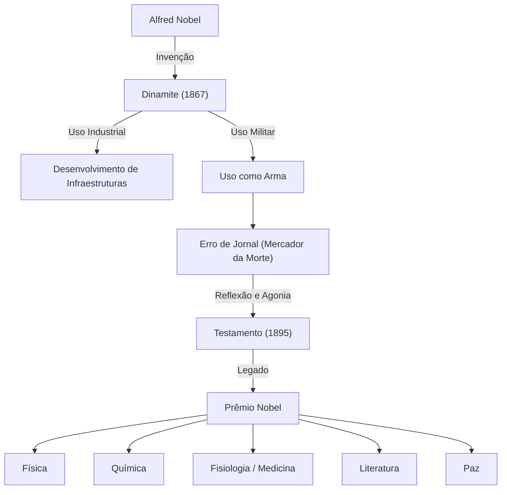

Alfred Nobel acumulou uma vasta fortuna através da invenção da dinamite e estabeleceu o Prêmio Nobel com o seu legado. A sua vida incorporou a luz e a sombra trazidas pelo desenvolvimento da ciência e da tecnologia.

## Talento como Inventor e o Nascimento da Dinamite

Alfred Bernhard Nobel nasceu em Estocolmo, Suécia, em 1833. Ele era fluente em sueco, russo, francês, inglês e alemão aos 17 anos.
Superando a morte de seu irmão num acidente com nitroglicerina, Nobel dedicou-se ao desenvolvimento de explosivos seguros. Em 1867, inventou a "dinamite", que impulsionou o desenvolvimento de infraestruturas e lhe rendeu enorme riqueza.

## O Estigma de "Mercador da Morte"

A dinamite começou a ser usada militarmente como arma. Em 1888, quando seu irmão Ludvig morreu, um jornal francês confundiu-o com Alfred e publicou: "O mercador da morte está morto".
Chocado, Nobel começou a pensar seriamente em como retribuir o seu legado à sociedade.

## Um Desejo de Paz: A Criação do Prêmio Nobel

Em seu testamento de 1895, Nobel dedicou sua fortuna a premiar aqueles que trouxessem o maior benefício à humanidade.

## Impacto nas Gerações Futuras e Filosofia

A vida de Alfred Nobel simboliza a natureza dupla da ciência e da tecnologia. Hoje, o Prêmio Nobel continua sendo o maior objetivo de cientistas e ativistas da paz, iluminando o caminho para um futuro melhor.
