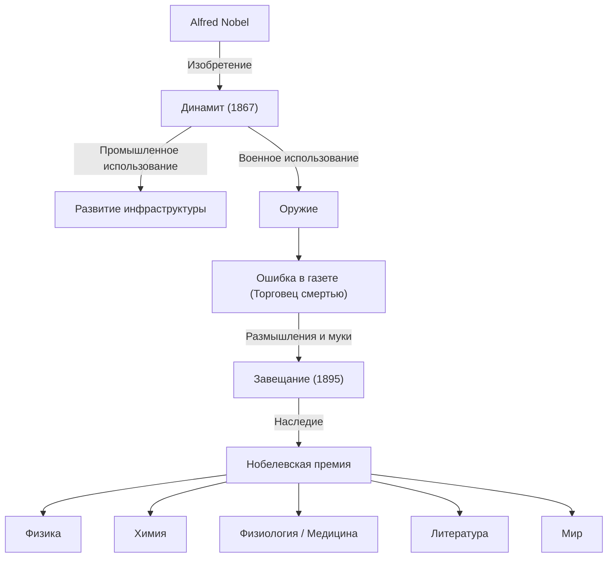

Альфред Нобель накопил огромное состояние благодаря изобретению динамита и учредил Нобелевскую премию, оставив после себя великое наследие.

## Талант изобретателя и рождение динамита

Альфред Нобель родился в Стокгольме, Швеция, в 1833 году. Преодолев гибель брата в результате несчастного случая с нитроглицерином, Нобель посвятил себя разработке безопасной взрывчатки. В 1867 году он изобрел «динамит», который произвел революцию в инфраструктуре и принес ему огромное богатство.

## Клеймо «Торговца смертью»

Динамит начал использоваться в военных целях как оружие. В 1888 году, когда умер его брат Людвиг, французская газета по ошибке опубликовала некролог: «Торговец смертью мертв». Потрясенный этим, Нобель начал серьезно думать о том, как вернуть свое наследие обществу.

## Желание мира: учреждение Нобелевской премии

В своем завещании 1895 года Нобель посвятил свое состояние награждению тех, кто принес наибольшую пользу человечеству.

## Влияние на будущие поколения и философия

Жизнь Альфреда Нобеля символизирует двойственную природу науки и техники. Сегодня Нобелевская премия продолжает оставаться целью ученых и борцов за мир.
