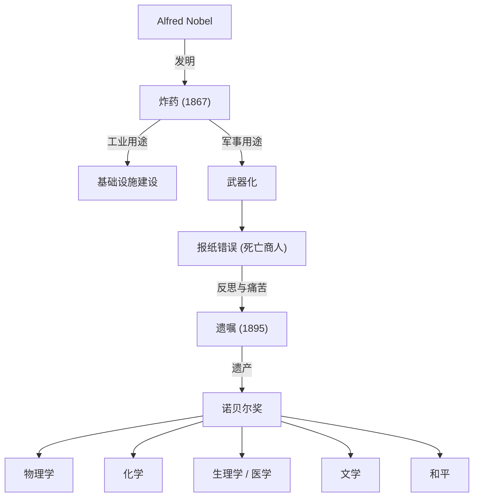

阿尔弗雷德·诺贝尔通过发明炸药积累了巨额财富，并用其遗产创立了诺贝尔奖。他的一生体现了科技发展带来的光与影。

## 作为发明家的天赋与炸药的诞生

阿尔弗雷德·诺贝尔1833年出生于瑞典斯德哥尔摩。他从小在工程学和化学的熏陶下长大，17岁时就能流利地说瑞典语、俄语、法语、英语和德语。
在克服了弟弟因硝酸甘油爆炸事故丧生的悲剧后，诺贝尔潜心研发安全的炸药。1867年，他发明了“炸药”，这极大地推动了基础设施建设，并为他积累了巨额财富。

## “死亡商人”的烙印与苦恼

炸药原本是为和平目的而开发的。然而，由于其巨大的破坏力，它逐渐被用作军事武器。
1888年他的哥哥去世时，一家法国报纸误以为是阿尔弗雷德死了，并发表了题为“死亡商人死了”的讣告。诺贝尔对此深感震惊。
由于害怕自己死后被人们记作“死亡商人”，他开始认真思考如何将自己的遗产回馈社会。

## 对和平的渴望：诺贝尔奖的创立

在他1895年起草的遗嘱中，他决定将自己的大部分财产设立基金，以奖励那些为人类做出最大贡献的人。
这便是如今“诺贝尔奖”的起源。他指定的五个领域是：物理学、化学、生理学或医学、文学以及和平。

## 对后世的影响与哲学

阿尔弗雷德·诺贝尔的一生象征着科学技术的两面性。今天，诺贝尔奖继续照亮着人类迈向更美好未来的道路。
