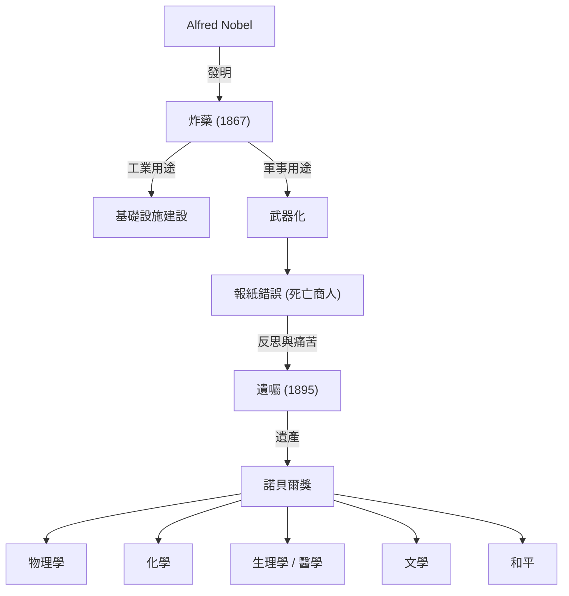

阿爾弗雷德·諾貝爾透過發明炸藥累積了巨額財富，並用其遺產創立了諾貝爾獎。他的一生體現了科技發展帶來的光與影。

## 作為發明家的天賦與炸藥的誕生

阿爾弗雷德·諾貝爾1833年出生於瑞典斯德哥爾摩。他從小在工程學和化學的薰陶下長大，17歲時就能流利地說瑞典語、俄語、法語、英語和德語。
在克服了弟弟因硝化甘油爆炸事故喪生的悲劇後，諾貝爾潛心研發安全的炸藥。1867年，他發明了「炸藥」，這極大地推動了基礎設施建設，並為他積累了巨額財富。

## 「死亡商人」的烙印與苦惱

炸藥原本是為和平目的而開發的。然而，由於其巨大的破壞力，它逐漸被用作軍事武器。
1888年他的哥哥去世時，一家法國報紙誤以為是阿爾弗雷德死了，並發表了題為「死亡商人死了」的訃告。諾貝爾對此深感震驚。
由於害怕自己死後被人們記作「死亡商人」，他開始認真思考如何將自己的遺產回饋社會。

## 對和平的渴望：諾貝爾獎的創立

在他1895年起草的遺囑中，他決定將自己的大部分財產設立基金，以獎勵那些為人類做出最大貢獻的人。
這便是如今「諾貝爾獎」的起源。他指定的五個領域是：物理學、化學、生理學或醫學、文學以及和平。

## 對後世的影響與哲學

阿爾弗雷德·諾貝爾的一生象徵著科學技術的兩面性。今天，諾貝爾獎繼續照亮著人類邁向更美好未來的道路。
