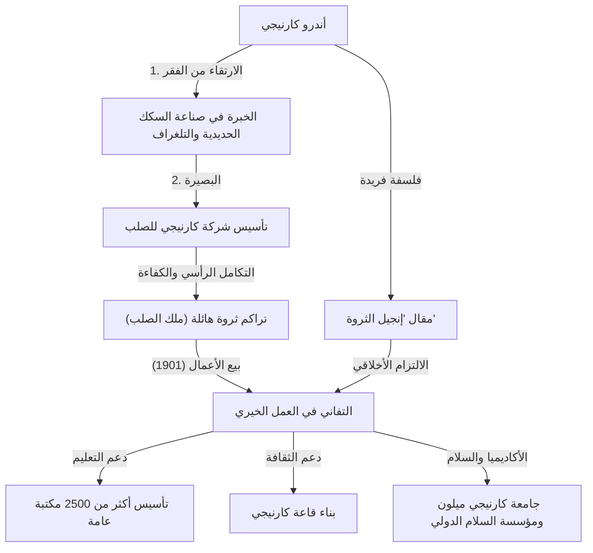

أندرو كارنيجي (1835-1919)، "ملك الصلب" الذي مثل عصر الثورة الصناعية الأمريكية. تُروى قصة حياته كنموذج لـ "الحلم الأمريكي" حيث بنى مهاجر فقير من اسكتلندا ثروة طائلة، وفي الوقت نفسه، كان له جانب كفاعل خير دعا إلى "إنجيل الثروة" وكرّس ثروته لرد الجميل للمجتمع. في هذا المقال، نتعمق في حياته الدرامية، وفلسفته التي لا تزال تُتوارث حتى اليوم، وتأثيره على الأجيال القادمة.

## الانطلاق من الفقر وتحقيق النجاح

وُلد أندرو كارنيجي عام 1835 في دنفرملاين، اسكتلندا. كان والده نساجاً يدوياً، ولكن مع موجة المكننة التي أحدثتها الثورة الصناعية، أُجبرت العائلة على العيش في فقر مدقع. في عام 1848، هاجرت العائلة إلى أليغيني، بنسلفانيا، في الولايات المتحدة (جزء من بيتسبرغ اليوم) بحثاً عن حياة جديدة.

بدأ كارنيجي حياته المهنية في سن الثالثة عشرة كعامل في مصنع للغزل براتب أسبوعي قدره 1.20 دولار فقط. ومع ذلك، سرعان ما لفت فضوله الفكري القوي واجتهاده انتباه من حوله. بعد عمله كساعي تلغراف، انضم إلى سكة حديد بنسلفانيا، حيث أتقن تقنية التلغراف، التي كانت أحدث التقنيات في ذلك الوقت، وسرعان ما ارتقى في السلم الوظيفي. تحت رعاية رئيسه، توماس أ. سكوت، تعلم أسرار الاستثمار وأدرك الإمكانات المستقبلية لبناء الجسور وصناعة الصلب، وبدأ في شق طريقه نحو الاستقلال.

## الطريق إلى "ملك الصلب": صعود شركة كارنيجي للصلب

بعد الحرب الأهلية، دخلت أمريكا عصراً من التصنيع السريع. متوقعاً زيادة هائلة في الطلب على الصلب مع توسع شبكات السكك الحديدية والتحضر، سارع كارنيجي إلى تبني عملية بيسمر (تقنية لإنتاج الصلب بكميات كبيرة).

في عام 1892، أسس شركة كارنيجي للصلب وأسس نموذج عمل رائد يُعرف بـ "التكامل الرأسي"، والذي يشمل كل شيء من استخراج المواد الخام إلى النقل والتصنيع والمبيعات. من خلال الخفض الصارم للتكاليف وتحسين الكفاءة، نمت الشركة لتصبح أكبر مصنع للصلب في العالم. طبق كارنيجي بصرامة فلسفة "الإنتاج بأقل تكلفة والبيع بالسعر الأنسب"، مما حقق أرباحاً هائلة.

ومع ذلك، وراء هذا النجاح كانت هناك ظلال داكنة، مثل ظروف العمل القاسية للعمال والنزاعات العمالية المأساوية مثل إضراب هومستيد عام 1892. خلق وجهه كمدير قاسي تناقضاً صارخاً مع الأنشطة الخيرية التي مارسها لاحقاً.

## فلسفة "إنجيل الثروة": من الملكية إلى التوزيع

ما يرمز إلى فكر كارنيجي هو مقال "إنجيل الثروة (The Gospel of Wealth)" الذي نُشر عام 1889. جادل فيه بأن "الأثرياء ليسوا سوى أمناء مؤقتين على ثروات المجتمع، وعليهم التزام أخلاقي بإعادة تلك الثروة لصالح المجتمع". قوله إن "الموت غنياً هو عار" يظهر فلسفة رأسمالية فريدة تختلف عن مجرد السعي وراء المال.

في عام 1901، في سن الخامسة والستين، باع كارنيجي شركة الصلب الخاصة به إلى الممول جيه. بي. مورغان مقابل 480 مليون دولار (أكثر من مئات المليارات من الدولارات بقيمة اليوم) وتقاعد تماماً من عالم الأعمال. كرس بقية حياته لـ "التوزيع" لوضع فلسفته موضع التنفيذ.

## رد الجميل للمجتمع والإرث

بعد تقاعده من عالم الأعمال، استثمر كارنيجي ثروته بسخاء من أجل تطوير التعليم والسلام والثقافة.

أحد أشهر مشاريعه الخيرية كان بناء المكتبات العامة. انطلاقاً من إيمانه بأن "المعرفة يجب أن تكون مفتوحة للجميع"، أسس أكثر من 2500 "مكتبة كارنيجي" ليس فقط في الولايات المتحدة ولكن أيضاً في جميع أنحاء العالم، بما في ذلك المملكة المتحدة وكندا.

بالإضافة إلى ذلك، كانت مساهماته واسعة النطاق، بما في ذلك تأسيس المؤسسة التعليمية التي سبقت جامعة كارنيجي ميلون، وبناء قاعة كارنيجي، وتأسيس مؤسسة كارنيجي للسلام الدولي لتعزيز السلام العالمي. بلغ إجمالي تبرعاته 350 مليون دولار في ذلك الوقت، وهو ما يعادل حوالي 90٪ من ثروته الشخصية.

## أهمية كارنيجي في العصر الحديث

تجسد حياة أندرو كارنيجي نور الرأسمالية وظلالها. بينما احتكر الثروة كرجل أعمال بارد القلب، فإن أفعاله في التخلي السخي عن تلك الثروة من أجل تقدم البشرية أثرت على العديد من المليارديرات المعاصرين مثل بيل غيتس ووارن بافيت، وأصبحت الدعامة الروحية للمبادرات الخيرية من قبل الأثرياء مثل "تعهد العطاء (Giving Pledge)".

آمن كارنيجي بروح الاعتماد على الذات "الله يساعد أولئك الذين يساعدون أنفسهم"، وبدلاً من إعطاء الناس أسماكاً، وفر لهم أماكن لتعلم كيفية صيد الأسماك (المكتبات والمدارس). إرثه لا يزال يتألق في كل ركن من أركان المجتمع، حتى بعد مرور أكثر من قرن.
