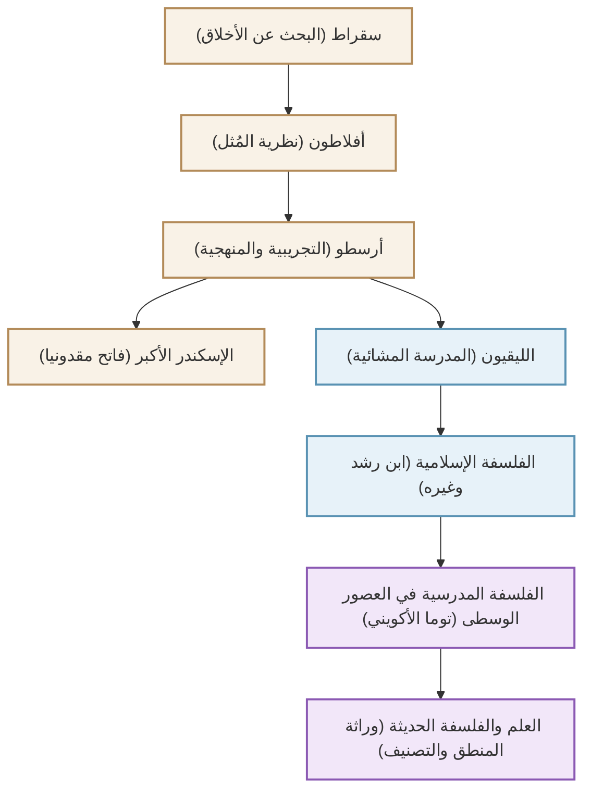

يُلقب بـ "أبو العلوم"، وهو الفيلسوف اليوناني القديم أرسطو (384 ق.م - 322 ق.م) الذي أرسى نظام المعرفة في العالم الغربي. لم يقتصر بحثه على الفلسفة فحسب، بل امتد حرفياً إلى "كل تخصص أكاديمي"، بما في ذلك المنطق والأخلاق والسياسة والعلوم الطبيعية وعلم الأحياء والشعر. في هذا المقال، سنشرح حياة أرسطو المليئة بالأحداث، وأفكاره العميقة التي لا تزال ذات صلة حتى يومنا هذا، والتأثير الذي لا يقاس والذي أحدثه على تاريخ البشرية.

## 1. حياة من المعرفة والاضطرابات

### مسقط رأسه مقدونيا ودراسته في الأكاديمية
وُلد أرسطو عام 384 قبل الميلاد في بلدة ستاغيرا الصغيرة بمنطقة تراقيا. كان والده طبيباً للملك أمينتاس الثالث ملك مقدونيا، ويُعتقد أن هذه الخلفية أثرت على منظوره العلمي والتجريبي اللاحق، فضلاً عن علاقاته القوية مع العائلة المالكة المقدونية.

في سن السابعة عشرة، توجه إلى أثينا، المركز الفكري لليونان، والتحق بـ "الأكاديمية" التي أسسها الفيلسوف العظيم أفلاطون. هناك درس تحت إشراف أفلاطون لنحو 20 عاماً، وبرز كطالب متميز في الأكاديمية. ويُقال إن أفلاطون قدره عالياً وأطلق عليه لقب "عقل المدرسة". ومع ذلك، عندما توفي معلمه أفلاطون، غادر أرسطو أثينا وعمق تفكيره المستقل في آسيا الصغرى وأماكن أخرى.

### من معلم للإسكندر الأكبر إلى تأسيس الليقيون
حوالي عام 342 قبل الميلاد، بدعوة من فيليب الثاني ملك مقدونيا، أصبح أرسطو معلماً للأمير الذي سيصبح لاحقاً "الإسكندر الأكبر". تعتبر العلاقة بين الفيلسوف العظيم والبطل الشاب الذي سيؤسس لاحقاً إمبراطورية عالمية واحدة من أكثر العلاقات بين المعلم والتلميذ دراماتيكية في التاريخ.

بعد أن تولى الإسكندر العرش، عاد أرسطو إلى أثينا وأسس مدرسته الخاصة، "الليقيون" (لوقيون). نظراً لأنه كان يناقش تلاميذه أثناء المشي في ممرات المشاة (بيريباتوس)، أصبحت مدرسته تُعرف باسم المدرسة "المشائية". هنا كتب العديد من المؤلفات وقام بتبويب معرفة هائلة.

## 2. فلسفة التجريبية والمنهجية

يبدأ فكر أرسطو بتجاوز نقدي لـ "نظرية المُثل" لمعلمه أفلاطون.

### "الصورة" (إيدوس) و"المادة" (هيولي)
بينما اعتقد أفلاطون أن الواقع الحقيقي يكمن في "عالم المُثل" المنفصل عن هذا العالم التجريبي، وجد أرسطو قيمة في العالم الحقيقي نفسه. جادل بأن كل ما هو موجود يتكون من "المادة" و"الصورة" (الجوهر أو الشكل). على سبيل المثال، يوجد التمثال البرونزي لأن "مادة" البرونز تُعطى "صورة" لشخص معين. وأكد أن الحقيقة ليست في عالم المُثل السماوي، بل تكمن داخل الأشياء الفردية الموجودة أمامنا.

### تأسيس المنطق و"القياس المنطقي"
أحد أعظم إنجازاته هو تأسيس وتدوين المنطق. قام بصياغة "القياس المنطقي" الشهير: "كل البشر فانون"، "سقراط إنسان"، "إذن سقراط فانٍ"، وأسس قواعد الاستدلال الصحيح. استمر هذا كأساس للمنطق لأكثر من 2000 عام.

### الغائية وأخلاق الوسطية (الاعتدال)
تستند نظرة أرسطو للطبيعة إلى "الغائية". كان يعتقد أن جميع الأشياء في العالم الطبيعي تتولد وتتغير نحو "غاياتها" الخاصة. وأوضح أن الغاية القصوى للبشر هي "السعادة" (يودايمونيا)، ولتحقيقها من المهم استخدام العقل وممارسة فضيلة "الوسطية" (الاعتدال) التي تتجنب التطرف. اعتبر أن الشجاعة تقع في منتصف الطريق بين "التهور" و"الجبن"، وأن التوازن المناسب هو ما يجلب التميز للإنسان.

## 3. التأثير الهائل الذي شكل تاريخ البشرية

مارس التراث الفكري لأرسطو تأثيراً لا مثيل له على تاريخ العالم اللاحق.

كادت أعماله أن تضيع من العالم اليوناني في أواخر العصور القديمة، لكنها تُرجمت إلى العربية في العالم الإسلامي وتمت دراستها بعمق من قبل فلاسفة مسلمين مثل ابن رشد. تم استيراد نتائج هذه الأبحاث في العالم الإسلامي لاحقاً إلى أوروبا الغربية خلال "نهضة القرن الثاني عشر".

في أوروبا في العصور الوسطى، اندمجت الفلسفة الأرسطية مع اللاهوت المسيحي وتمت ترقيتها إلى نظام فكري عظيم من قبل توما الأكويني، الذي أتم "المدرسية" (السكولاستية). بالنسبة لشعوب العصور الوسطى، لم يكن أرسطو مجرد فيلسوف آخر، بل كان سلطة مطلقة لدرجة أن مصطلح "الفيلسوف" كان يشير إليه ببساطة.

منذ الثورة العلمية الحديثة (القرن السابع عشر) فصاعداً، تم دحض فيزياء وعلم فلك أرسطو من قبل علماء مثل غاليليو ونيوتن. ومع ذلك، فإن طرق تصنيف المعرفة التي وضعها، وأساسيات المنطق، والموقف الفكري المتمثل في "مراقبة الواقع ومنهجته" لا تزال حية كأساس للعلوم والفلسفة حتى يومنا هذا.

## مخطط العلاقات وتوسع التأثير

يوضح الشكل أدناه النسب الفكري وتدفق التأثير المحيط بأرسطو.

## خاتمة
إن إرث "كل العلوم" الذي تركه أرسطو ليس مجرد معرفة من الماضي. موقفه المتمثل في طرح سؤال "لماذا؟" ومحاولة فهم الواقع بشكل منطقي ومنهجي يوضح حالة العقل المطلوبة في عصرنا الحديث الذي يفيض بالمعلومات. إن الباحث المطلق عن المعرفة الذي أنجبته اليونان القديمة لا يزال يوفر لنا علامة إرشادية لتفكيرنا اليوم.
