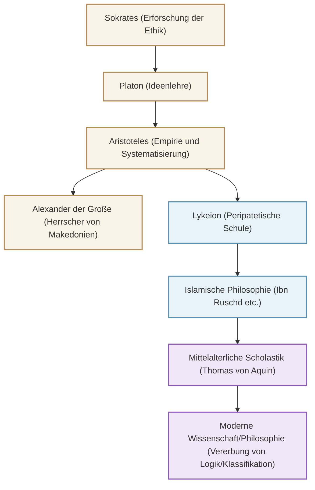

Aristoteles (384 v. Chr. - 322 v. Chr.), ein antiker griechischer Philosoph, der als "Vater aller Wissenschaften" bezeichnet wird und das System des Wissens im Westen aufgebaut hat. Seine Forschungen beschränkten sich nicht nur auf die Philosophie, sondern erstreckten sich buchstäblich auf "alle wissenschaftlichen Disziplinen", einschließlich Logik, Ethik, Politik, Naturwissenschaften, Biologie und Poetik. In diesem Artikel erläutern wir das turbulente Leben des Aristoteles, seine tiefe Philosophie, die bis heute relevant ist, und seinen unermesslichen Einfluss auf die Menschheitsgeschichte.

## 1. Ein Leben voller Wissen und Turbulenzen

### Heimatland Makedonien und das Studium an der Akademie
Aristoteles wurde 384 v. Chr. in der kleinen Stadt Stageira in der Region Thrakien geboren. Sein Vater diente als Leibarzt des makedonischen Königs Amyntas III., und man glaubt, dass diese Herkunft seine spätere naturwissenschaftliche und empirische Perspektive sowie seine starken Verbindungen zum makedonischen Königshaus beeinflusst hat.

Im Alter von 17 Jahren reiste er nach Athen, dem intellektuellen Zentrum Griechenlands, und trat in die vom großen Philosophen Platon gegründete Schule „Akademie“ ein. Dort studierte er etwa 20 Jahre lang unter Platon und zeichnete sich als Musterschüler der Schule aus. Es wird gesagt, dass Platon ihn hoch schätzte und als „Geist der Schule“ bezeichnete. Nach dem Tod seines Lehrers Platon verließ Aristoteles Athen jedoch und vertiefte seine eigenen Gedanken in Kleinasien und anderen Orten.

### Vom Hauslehrer Alexanders des Großen zur Gründung des Lykeions
Um 342 v. Chr. wurde Aristoteles auf Einladung des makedonischen Königs Philipp II. Hauslehrer des Prinzen, der später als „Alexander der Große“ bekannt wurde. Die Verbindung zwischen dem großen Philosophen und dem jungen Helden, der später ein Weltreich aufbauen sollte, ist eine der dramatischsten Lehrer-Schüler-Beziehungen in der Geschichte.

Nachdem Alexander den Thron bestiegen hatte, kehrte Aristoteles nach Athen zurück und gründete seine eigene Schule, das „Lykeion“. Da er beim Spazierengehen (Peripatos) mit seinen Schülern diskutierte, wurde seine Schule als „peripatetische Schule“ bekannt. Hier verfasste er zahlreiche Werke und systematisierte ein immenses Wissen.

## 2. Die Philosophie der Empirie und Systematisierung

Das Denken des Aristoteles beginnt mit der kritischen Überwindung der „Ideenlehre“ seines Lehrers Platon.

### „Form (Eidos)“ und „Materie (Hyle)“
Während Platon glaubte, dass die wahre Realität in einer von dieser Erfahrungswelt getrennten „Ideenwelt“ liege, fand Aristoteles den Wert in der realen Welt selbst. Er argumentierte, dass alles, was existiert, aus „Materie (Hyle)“ und „Form (Eidos)“ besteht. Zum Beispiel existiert eine Bronzestatue dadurch, dass der „Materie“ Bronze die „Form“ einer bestimmten Person gegeben wird. Die Wahrheit ruht nicht in einer himmlischen Ideenwelt, sondern in den einzelnen Dingen direkt vor unseren Augen.

### Die Etablierung der Logik und der „Syllogismus“
Eine seiner größten Errungenschaften ist die Systematisierung der Logik. Er formulierte den berühmten „Syllogismus“: „Alle Menschen sind sterblich“, „Sokrates ist ein Mensch“, „Also ist Sokrates sterblich“, und etablierte damit die Regeln des korrekten Schlussfolgerns. Dies blieb über 2000 Jahre lang als Grundlage der Logik bestehen.

### Teleologie und die Ethik der Mitte
Aristoteles' Naturverständnis basiert auf der „Teleologie“. Er glaubte, dass alle Dinge in der natürlichen Welt entstehen und sich auf ihren jeweiligen „Zweck“ (Telos) hin verändern. Der ultimative Zweck für den Menschen sei das „Glück (Eudaimonia)“, und um dies zu erreichen, lehrte er, dass es wichtig sei, die Vernunft zu gebrauchen und die Tugend der „Mitte (Mesotes)“ zu praktizieren, die Extreme vermeidet. Mut liegt zwischen „Tollkühnheit“ und „Feigheit“, und ein angemessenes Gleichgewicht bringt die menschliche Vortrefflichkeit hervor.

## 3. Der immense Einfluss, der die Menschheitsgeschichte prägte

Das intellektuelle Erbe des Aristoteles übte in der späteren Weltgeschichte einen unvergleichlichen Einfluss aus.

Seine Werke gingen in der Spätantike der griechischen Welt fast verloren, wurden aber in der islamischen Welt ins Arabische übersetzt und von islamischen Philosophen wie Ibn Ruschd (Averroes) tiefgreifend studiert. Die Ergebnisse dieser Studien im islamischen Raum wurden ab dem 12. Jahrhundert durch die „Renaissance des 12. Jahrhunderts“ nach Westeuropa reimportiert.

Im mittelalterlichen Europa verschmolz die Philosophie des Aristoteles mit der christlichen Theologie und wurde von Thomas von Aquin, dem Vollender der „Scholastik“, zu einem grandiosen intellektuellen System sublimiert. Für die Menschen des Mittelalters war Aristoteles nicht nur ein Philosoph, sondern die absolute Autorität schlechthin, sodass man sich mit dem Titel „Der Philosoph“ nur auf ihn bezog.

Seit der wissenschaftlichen Revolution in der Neuzeit (17. Jahrhundert) wurden Aristoteles' Physik und Astronomie von Galilei, Newton und anderen widerlegt. Seine Methode der Klassifizierung wissenschaftlicher Disziplinen, die Grundlagen der Logik und seine intellektuelle Haltung, „die Realität zu beobachten und zu systematisieren“, leben jedoch bis heute als Fundament von Wissenschaft und Philosophie weiter.

## Beziehungsdiagramm und die Ausbreitung des Einflusses

Das folgende Diagramm zeigt die intellektuelle Genealogie und den Fluss des Einflusses rund um Aristoteles.

## Fazit
Das allumfassende Erbe, das Aristoteles hinterlassen hat, ist nicht bloß Wissen der Vergangenheit. Seine Haltung, nach dem „Warum?“ zu fragen und zu versuchen, die Realität logisch und systematisch zu verstehen, zeigt genau die Art von Intellekt, die in der heutigen, von Informationen überfluteten Zeit benötigt wird. Der ultimative Wissenssucher, den das antike Griechenland hervorbrachte, gibt uns noch heute Wegweiser für unser Denken.
