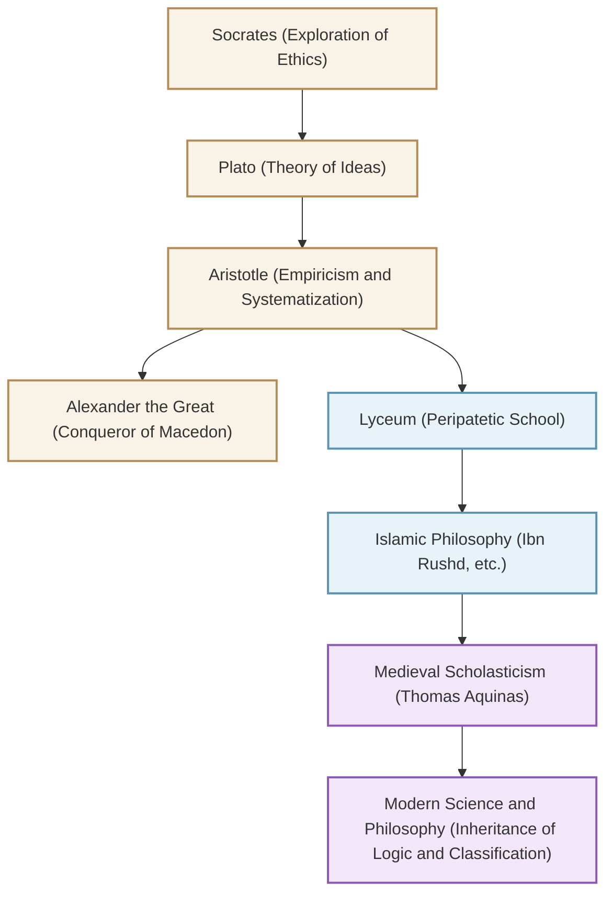

Known as the "Father of All Sciences," the ancient Greek philosopher Aristotle (384 BC - 322 BC) established the foundation of knowledge systems in the West. His inquiries extended far beyond philosophy, literally covering "all disciplines" from logic, ethics, and politics to natural sciences, biology, and poetics. In this article, we will explore Aristotle's eventful life, his profound thoughts that remain relevant today, and the immeasurable impact he has had on human history.

## 1. A Life of Intellect and Turbulence

### Hometown Macedonia and Training at the Academy
Aristotle was born in 384 BC in the small town of Stagira in the region of Thrace. His father served as the personal physician to King Amyntas III of Macedon. This background is believed to have influenced his later naturalistic and empirical perspectives, as well as his strong ties to the Macedonian royal family.

At the age of 17, he headed to Athens, the intellectual center of Greece, and entered the "Academy," a school founded by the great philosopher Plato. There, he studied under Plato for about 20 years, distinguishing himself as a prodigy of the school. It is said that Plato highly praised him, calling him the "Mind of the School." However, after his mentor Plato passed away, Aristotle left Athens to deepen his own thoughts in places like Asia Minor.

### From Tutor of Alexander the Great to the Foundation of the Lyceum
Around 342 BC, at the invitation of King Philip II of Macedon, Aristotle became the tutor for the prince who would later be known as "Alexander the Great." The connection between the great philosopher and the young hero who would later build a world empire is one of the most dramatic master-disciple relationships in history.

After Alexander ascended the throne, Aristotle returned to Athens and founded his own school, the "Lyceum." Because he discussed with his disciples while walking along the colonnades (peripatos), his school came to be known as the "Peripatetic school." Here, he wrote numerous works and systematized an enormous amount of knowledge.

## 2. The Philosophy of Empiricism and Systematization

Aristotle's philosophy begins by critically overcoming his teacher Plato's "Theory of Ideas."

### "Form (Eidos)" and "Matter (Hyle)"
While Plato believed that true reality existed in a "World of Ideas" separate from this empirical world, Aristotle found value in the real world itself. He argued that everything that exists consists of "Matter (Hyle)" and "Form (Eidos)." For example, a bronze statue exists because the "matter" of bronze is given the "form" of a specific person. He held that truth does not reside in a heavenly world of Ideas, but within the individual things right before our eyes.

### The Establishment of Logic and "Syllogism"
One of his greatest achievements is the systematization of logic. He formalized the famous "Syllogism," such as "All men are mortal," "Socrates is a man," "Therefore, Socrates is mortal," establishing the rules of valid inference. This remained the foundation of logic for over 2,000 years.

### Teleology and the Ethics of the Mean
Aristotle's view of nature is based on "Teleology." He believed that all things in the natural world undergo generation and change toward their respective "ends" or "purposes." He preached that the ultimate goal for human beings is "Happiness (Eudaimonia)," and to achieve it, it is important to exercise reason and practice the virtue of the "Mean (Mesotes)," avoiding extremes. Courage lies between "recklessness" and "cowardice," and he believed that a proper balance brings about human excellence.

## 3. The Enormous Influence That Shaped Human History

Aristotle's intellectual legacy exerted an unparalleled influence on subsequent world history.

His works were nearly lost to the Greek world during late antiquity but were translated into Arabic in the Islamic world and deeply studied by Islamic philosophers such as Ibn Rushd (Averroes). The results of this research in the Islamic sphere were reintroduced to Western Europe through the "Renaissance of the 12th Century."

In medieval Europe, Aristotelian philosophy merged with Christian theology and was elevated into a grand intellectual system by Thomas Aquinas, the perfecter of "Scholasticism." For the people of the Middle Ages, Aristotle was not just another philosopher; he possessed such absolute authority that referring to "The Philosopher" simply meant him.

Since the Scientific Revolution (17th century), Aristotle's physics and astronomy were rejected by figures like Galileo and Newton. However, the methods of academic classification he established, the foundations of logic, and his intellectual attitude of "observing and systematizing reality" continue to live on as the basis of science and philosophy to this day.

## Correlation Diagram and Spread of Influence

The following diagram illustrates the intellectual genealogy surrounding Aristotle and the flow of his influence.

## Conclusion
The legacy of "all sciences" left by Aristotle is not merely past knowledge. His attitude of asking "why?" and trying to understand reality logically and systematically shows the kind of intellect that is necessary today, in an era overflowing with information. The ultimate seeker of knowledge born in ancient Greece continues to provide us with a guidepost for thinking even now.
