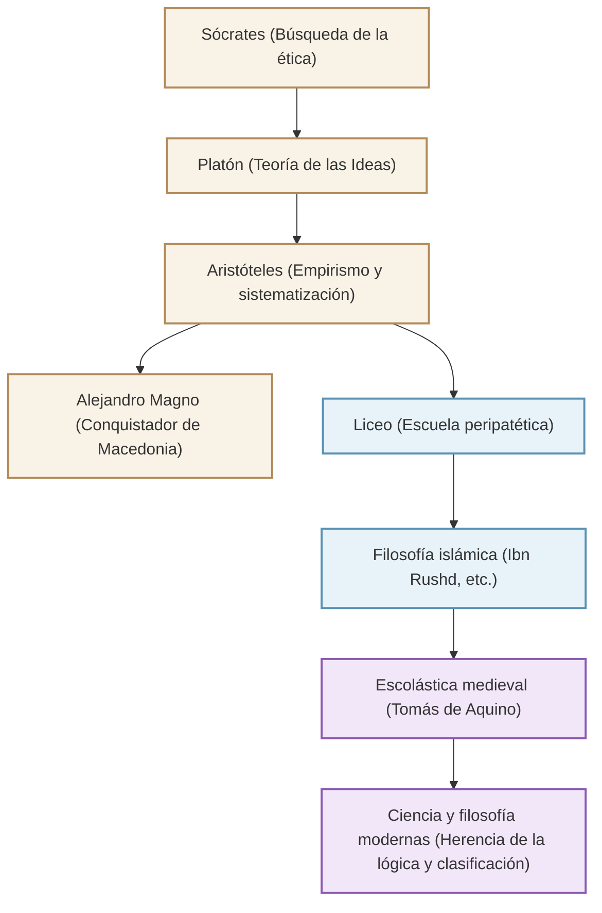

Conocido como el "padre de todas las ciencias" y artífice del sistema de conocimiento occidental, el filósofo griego antiguo Aristóteles (384 a. C. - 322 a. C.). Su búsqueda no se limitó a la filosofía, sino que abarcó literalmente "todas las disciplinas": lógica, ética, política, ciencias naturales, biología e incluso poética. En este artículo, explicaremos la turbulenta vida de Aristóteles, sus profundos pensamientos que aún resuenan en la actualidad y la inmensa influencia que ha tenido en la historia humana.

## 1. Conocimiento y una vida turbulenta

### Su tierra natal, Macedonia, y sus estudios en la Academia
Aristóteles nació en el 384 a. C. en Estagira, una pequeña ciudad de Tracia. Su padre fue médico personal del rey Amintas III de Macedonia, y se cree que este origen influyó en su posterior perspectiva empírica y científico-natural, así como en sus fuertes lazos con la familia real macedonia.

A los 17 años, se dirigió al centro intelectual de Grecia, Atenas, e ingresó en la "Academia" fundada por el gran filósofo Platón. Allí estudió bajo la tutela de Platón durante unos 20 años y se destacó como el talento más brillante de la escuela. Se dice que Platón lo elogiaba llamándolo el "espíritu de la escuela". Sin embargo, tras la muerte de su maestro Platón, Aristóteles abandonó Atenas para profundizar en su propio pensamiento en Asia Menor y otros lugares.

### De tutor de Alejandro Magno a la fundación del Liceo
Alrededor del 342 a. C., por invitación del rey Filipo II de Macedonia, Aristóteles se convirtió en el tutor del príncipe que más tarde sería conocido como "Alejandro Magno". El vínculo entre un gran filósofo y un joven héroe que más tarde construiría un imperio mundial es una de las relaciones maestro-discípulo más dramáticas de la historia.

Después de que Alejandro ascendiera al trono, Aristóteles regresó a Atenas y fundó su propia escuela, el "Liceo". Debido a que debatía con sus discípulos mientras caminaba por los senderos (peripatos), su escuela llegó a ser conocida como la "escuela peripatética". Aquí, escribió numerosas obras y sistematizó una vasta cantidad de conocimiento.

## 2. La filosofía del empirismo y la sistematización

El pensamiento de Aristóteles comienza superando críticamente la "teoría de las Ideas" de su maestro Platón.

### "Forma (Eidos)" y "Materia (Hyle)"
Mientras que Platón creía que la verdadera realidad residía en un "mundo de las Ideas" separado de este mundo empírico, Aristóteles encontró valor en el mundo real en sí. Argumentó que todo lo que existe está compuesto de "materia (material)" y "forma (esencia, figura)". Por ejemplo, una estatua de bronce existe al darse la "forma" de una persona específica a la "materia" que es el bronce. La verdad no reside en un mundo de ideas celestial, sino que habita en los objetos individuales que tenemos ante nuestros ojos.

### El establecimiento de la lógica y el "Silogismo"
Uno de sus mayores logros es la sistematización de la lógica. Formuló el famoso "silogismo", estableciendo reglas para el razonamiento correcto: "Todos los hombres son mortales", "Sócrates es hombre", "por lo tanto, Sócrates es mortal". Esto reinó como la base de la lógica durante más de 2000 años.

### La teleología y la ética del término medio
La visión de la naturaleza de Aristóteles se basa en la "teleología". Creía que todas las cosas en el mundo natural están en un proceso de generación y cambio hacia sus respectivos "fines" (propósitos). Enseñó que el fin supremo para los humanos es la "felicidad (eudaimonia)", y que para alcanzarla es importante ejercer la razón y practicar la virtud del "término medio (mesotes)", evitando los extremos. El coraje se encuentra entre la "temeridad" y la "cobardía", y consideró que un equilibrio adecuado es lo que aporta la excelencia humana.

## 3. Una enorme influencia que formó la historia humana

El legado intelectual de Aristóteles ejerció una influencia incomparable en la historia mundial posterior.

Sus obras estuvieron a punto de perderse en el mundo griego a finales de la Antigüedad, pero fueron traducidas al árabe en el mundo islámico y profundamente estudiadas por filósofos islámicos como Ibn Rushd (Averroes). Los resultados de estas investigaciones en el mundo islámico fueron reintroducidos en Europa occidental a través del "Renacimiento del siglo XII" a partir del siglo XII.

En la Europa medieval, la filosofía de Aristóteles se fusionó con la teología cristiana y fue elevada a un gran sistema intelectual por Tomás de Aquino, el consumador de la "escolástica". Para la gente de la Edad Media, Aristóteles no era un simple filósofo, sino una autoridad absoluta al punto de que llamarlo "El Filósofo" bastaba para referirse a él.

Tras la revolución científica moderna (siglo XVII), la física y la astronomía de Aristóteles fueron refutadas por figuras como Galileo y Newton. Sin embargo, su método de clasificación de disciplinas, los fundamentos de su lógica y su actitud intelectual de "observar la realidad y sistematizarla" siguen vivos como la base de la ciencia y la filosofía hasta el día de hoy.

## Diagrama de correlación y alcance de su influencia

El siguiente diagrama muestra la genealogía intelectual y el flujo de influencia en torno a Aristóteles.

## Conclusión
El legado de "todas las ciencias" dejado por Aristóteles no es un mero conocimiento del pasado. Su actitud de preguntar "¿por qué?" e intentar comprender la realidad de forma lógica y sistemática muestra una forma de inteligencia que es precisamente necesaria en nuestra época actual de inundación de información. El buscador supremo del conocimiento nacido en la antigua Grecia sigue proporcionándonos señales de guía para el pensamiento incluso hoy.
