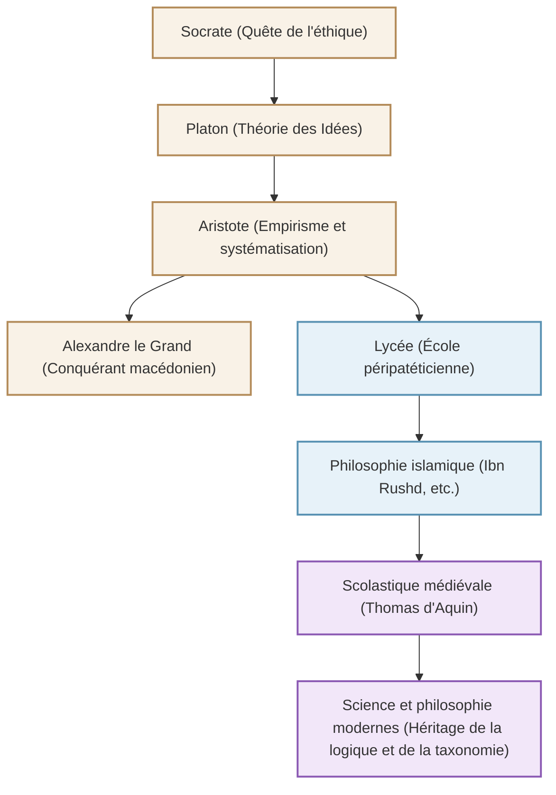

Surnommé le « père de toutes les sciences » et ayant bâti le système du savoir en Occident, le philosophe grec antique Aristote (384 av. J.-C. - 322 av. J.-C.). Ses recherches ne se sont pas limitées à la philosophie, mais ont littéralement couvert « toutes les disciplines », de la logique à l'éthique, en passant par la politique, les sciences naturelles, la biologie et la poétique. Cet article explique la vie tumultueuse d'Aristote, sa pensée profonde qui résonne encore aujourd'hui, et l'impact incommensurable qu'il a eu sur l'histoire de l'humanité.

## 1. Une vie de savoir et de bouleversements

### Formation en Macédoine natale et à l'Académie
Aristote est né en 384 av. J.-C. dans la petite ville de Stagire en Thrace. Son père était le médecin personnel du roi de Macédoine Amyntas III, et on pense que cette origine a influencé ses perspectives empiriques et en sciences naturelles ultérieures, ainsi que ses liens étroits avec la famille royale macédonienne.

À l'âge de 17 ans, il se rend à Athènes, centre intellectuel de la Grèce, et entre à l'« Académie », l'école fondée par le grand philosophe Platon. Là, il étudie sous la direction de Platon pendant environ 20 ans et se distingue comme un étudiant brillant de l'école. On raconte que Platon l'appréciait beaucoup et l'appelait « l'esprit de l'école ». Cependant, à la mort de son maître Platon, Aristote quitte Athènes et approfondit ses propres pensées en Asie Mineure et ailleurs.

### De précepteur d'Alexandre le Grand à la fondation du Lycée
Vers 342 av. J.-C., à l'invitation du roi Philippe II de Macédoine, Aristote devient le précepteur du prince qui deviendra plus tard « Alexandre le Grand ». Le lien entre le grand philosophe et le jeune héros qui bâtira plus tard un empire mondial est l'une des relations maître-élève les plus dramatiques de l'histoire.

Après l'accession d'Alexandre au trône, Aristote retourne à Athènes et fonde sa propre école, le « Lycée ». Parce qu'il discutait avec ses disciples en marchant sur la promenade (peripatos), son école est devenue connue sous le nom d'« école péripatéticienne ». C'est là qu'il a écrit de nombreux ouvrages et systématisé une vaste somme de connaissances.

## 2. La philosophie de l'empirisme et de la systématisation

La pensée d'Aristote commence par un dépassement critique de la « théorie des Idées » de son maître Platon.

### « Forme (Eidos) » et « Matière (Hylé) »
Alors que Platon pensait que la véritable réalité se trouvait dans un « monde des Idées » séparé de ce monde empirique, Aristote a trouvé de la valeur dans le monde réel lui-même. Il a soutenu que tout ce qui existe est composé de « matière (matériau) » et de « forme (essence, figure) ». Par exemple, une statue de bronze existe parce qu'une « matière » qu'est le bronze reçoit la « forme » d'une personne spécifique. La vérité ne réside pas dans le monde céleste des Idées, mais habite dans chaque chose individuelle devant nos yeux.

### L'établissement de la logique et le « syllogisme »
L'une de ses plus grandes réalisations est la systématisation de la logique. Il a formulé le célèbre « syllogisme », comme : « Tous les hommes sont mortels », « Socrate est un homme », « Donc Socrate est mortel », établissant ainsi les règles du raisonnement correct. Cela a continué à régner comme fondement de la logique pendant plus de 2000 ans.

### La téléologie et l'éthique du juste milieu
La vision de la nature d'Aristote est basée sur la « téléologie ». Il pensait que toutes les choses dans le monde naturel génèrent et changent vers leurs « buts » respectifs. Le but ultime de l'être humain est le « bonheur (Eudaimonia) », et pour l'atteindre, il a prêché qu'il était important d'exercer sa raison et de pratiquer la vertu du « juste milieu (Mesotes) » qui évite les extrêmes. Il pensait que le courage se situe entre la « témérité » et la « lâcheté », et qu'un équilibre modéré apporte l'excellence humaine.

## 3. L'influence colossale qui a façonné l'histoire humaine

L'héritage intellectuel d'Aristote a exercé une influence sans pareille dans l'histoire mondiale ultérieure.

Ses œuvres ont failli être perdues du monde grec à la fin de l'Antiquité, mais elles ont été traduites en arabe dans le monde islamique et profondément étudiées par des philosophes islamiques comme Ibn Rushd (Averroès). Les résultats de ces recherches dans le monde islamique ont été réimportés en Europe occidentale à travers la « Renaissance du XIIe siècle » à partir du XIIe siècle.

Dans l'Europe médiévale, la philosophie d'Aristote a fusionné avec la théologie chrétienne et a été sublimée en un système intellectuel grandiose par Thomas d'Aquin, celui qui a achevé la « scolastique ». Pour les peuples du Moyen Âge, Aristote n'était pas seulement un philosophe parmi d'autres, mais une autorité absolue au point que l'appeler « Le Philosophe » suffisait à le désigner.

Depuis la révolution scientifique moderne (XVIIe siècle), la physique et l'astronomie d'Aristote ont été rejetées par Galilée, Newton et d'autres. Cependant, la méthode de classification des disciplines, les fondements de la logique et l'attitude intellectuelle consistant à « observer la réalité et la systématiser » qu'il a établis restent vivants comme fondements de la science et de la philosophie jusqu'à ce jour.

## Diagramme des relations et étendue de l'influence

Le diagramme suivant montre la généalogie intellectuelle et le flux des influences entourant Aristote.

## Conclusion
L'héritage de « toutes les sciences » laissé par Aristote n'est pas qu'une simple connaissance du passé. Son attitude consistant à demander « pourquoi ? » et à essayer de comprendre la réalité de manière logique et systématique montre exactement la forme d'intelligence requise dans notre ère moderne inondée d'informations. L'ultime explorateur du savoir né en Grèce antique continue de nous donner des repères pour la pensée aujourd'hui encore.
