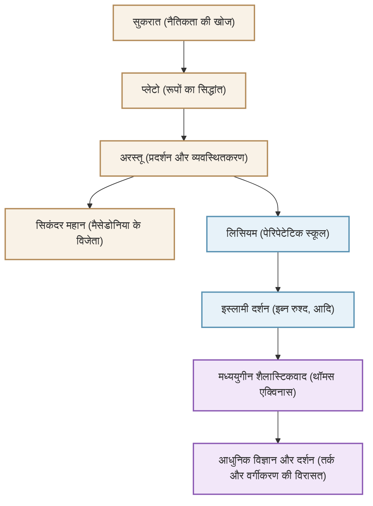

"सभी विज्ञानों के जनक" के रूप में जाने जाने वाले और पश्चिम में ज्ञान की प्रणाली का निर्माण करने वाले प्राचीन यूनानी दार्शनिक अरस्तू (384 ईसा पूर्व - 322 ईसा पूर्व)। उनकी खोज केवल दर्शनशास्त्र तक ही सीमित नहीं थी, बल्कि सचमुच तर्कशास्त्र, नैतिकता, राजनीति विज्ञान, प्राकृतिक विज्ञान, जीव विज्ञान और काव्यशास्त्र सहित "सभी विद्याओं" तक फैली हुई थी। इस लेख में, हम अरस्तू के उतार-चढ़ाव भरे जीवन, उनके गहरे विचारों जो आज भी प्रासंगिक हैं, और मानव इतिहास पर उनके अपार प्रभाव के बारे में विस्तार से बताएंगे।

## 1. ज्ञान और उथल-पुथल भरा जीवन

### गृह नगर मैसेडोनिया और अकादमी में अध्ययन
अरस्तू का जन्म 384 ईसा पूर्व में थ्रेस क्षेत्र के एक छोटे से शहर स्टेगिरा में हुआ था। उनके पिता मैसेडोनिया के राजा अमिंटास तृतीय के निजी चिकित्सक थे, और माना जाता है कि इस पृष्ठभूमि ने बाद में उनके प्राकृतिक विज्ञान और अनुभवजन्य दृष्टिकोण के साथ-साथ मैसेडोनिया के शाही परिवार के साथ उनके मजबूत संबंधों को प्रभावित किया।

17 साल की उम्र में, वह ग्रीस के बौद्धिक केंद्र एथेंस गए और महान दार्शनिक प्लेटो द्वारा स्थापित स्कूल "अकादमी" में प्रवेश लिया। वहां उन्होंने लगभग 20 वर्षों तक प्लेटो के अधीन अध्ययन किया और स्कूल के एक प्रतिभाशाली छात्र के रूप में उभरे। कहा जाता है कि प्लेटो ने उन्हें "अकादमी की आत्मा" कहकर उनकी बहुत प्रशंसा की थी। हालाँकि, जब उनके गुरु प्लेटो की मृत्यु हो गई, तो अरस्तू ने एथेंस छोड़ दिया और एशिया माइनर जैसी जगहों पर अपने स्वयं के विचारों को गहरा किया।

### सिकंदर महान के शिक्षक से लेकर लिसियम की स्थापना तक
लगभग 342 ईसा पूर्व में, मैसेडोनिया के राजा फिलिप द्वितीय के निमंत्रण पर, अरस्तू उस राजकुमार के निजी शिक्षक बन गए जिसे बाद में "सिकंदर महान" के रूप में जाना गया। एक महान दार्शनिक और एक युवा नायक के बीच का यह संबंध, जो बाद में एक विश्व साम्राज्य का निर्माण करेगा, इतिहास के सबसे नाटकीय गुरु-शिष्य संबंधों में से एक है।

सिकंदर के सिंहासन पर बैठने के बाद, अरस्तू एथेंस लौट आए और अपना खुद का स्कूल, "लिसियम" स्थापित किया। क्योंकि वह टहलते हुए (पेरिपेटोस) अपने शिष्यों के साथ बहस करते थे, इसलिए उनके स्कूल को "पेरिपेटेटिक स्कूल" (भ्रमणशील स्कूल) के रूप में जाना जाने लगा। यहां उन्होंने कई रचनाएं लिखीं और ज्ञान के विशाल भंडार को व्यवस्थित किया।

## 2. प्रदर्शन और व्यवस्थितकरण का दर्शन

अरस्तू का दर्शन उनके गुरु प्लेटो के "रूपों के सिद्धांत (Theory of Ideas)" को गंभीर रूप से पार करने से शुरू होता है।

### "रूप (Eidos)" और "पदार्थ (Hyle)"
जबकि प्लेटो का मानना था कि सच्ची वास्तविकता इस अनुभवजन्य दुनिया से अलग "रूपों की दुनिया (World of Ideas)" में मौजूद है, अरस्तू ने वास्तविकता की दुनिया में ही मूल्य पाया। उन्होंने तर्क दिया कि मौजूद सभी चीजें "पदार्थ (सामग्री)" और "रूप (सार/आकार)" से बनी हैं। उदाहरण के लिए, एक कांस्य की मूर्ति मौजूद है क्योंकि कांस्य (पदार्थ) को एक विशिष्ट व्यक्ति के आकार (रूप) में ढाला जाता है। सत्य किसी स्वर्गीय विचारों की दुनिया में नहीं, बल्कि हमारी आंखों के सामने मौजूद अलग-अलग चीजों में निवास करता है।

### तर्कशास्त्र की स्थापना और "सिोलोजिज़्म (Syllogism)"
उनकी सबसे बड़ी उपलब्धियों में से एक तर्कशास्त्र का व्यवस्थितकरण है। उन्होंने प्रसिद्ध "सिोलोजिज़्म" तैयार किया - "सभी मनुष्य नश्वर हैं", "सुकरात एक मनुष्य है", "इसलिए सुकरात नश्वर है" - और सही तर्क के नियम स्थापित किए। यह 2000 से अधिक वर्षों तक तर्कशास्त्र की नींव के रूप में सर्वोच्च बना रहा।

### उद्देश्यवादिता और स्वर्णिम मध्य (Golden Mean) की नैतिकता
अरस्तू का प्रकृति का दृष्टिकोण "उद्देश्यवादिता" पर आधारित है। उनका मानना था कि प्राकृतिक दुनिया में सभी चीजें अपने-अपने "उद्देश्यों" की ओर विकसित और बदल रही हैं। मनुष्य का अंतिम लक्ष्य "खुशी (Eudaimonia)" है, और उन्होंने सिखाया कि इसे प्राप्त करने के लिए, तर्क का उपयोग करना और "स्वर्णिम मध्य (Mesotes)" के गुण का अभ्यास करना महत्वपूर्ण है जो चरम सीमाओं से बचाता है। उन्होंने विचार किया कि साहस "दुस्साहस" और "कायरता" के बीच में है, और उचित संतुलन ही मानवीय उत्कृष्टता लाता है।

## 3. मानव इतिहास को आकार देने वाला विशाल प्रभाव

अरस्तू की बौद्धिक विरासत ने बाद के विश्व इतिहास में अद्वितीय प्रभाव डाला।

उनकी रचनाएँ प्राचीन काल के अंत में ग्रीक दुनिया से लगभग गायब हो गई थीं, लेकिन इस्लामी दुनिया में अरबी में उनका अनुवाद किया गया और इब्न रुश्द (Averroes) जैसे इस्लामी दार्शनिकों द्वारा उनका गहराई से अध्ययन किया गया। इस्लामी दुनिया के इन शोध परिणामों को 12वीं सदी और उसके बाद "12वीं सदी के पुनर्जागरण" के माध्यम से वापस पश्चिमी यूरोप लाया गया।

मध्ययुगीन यूरोप में, अरस्तू के दर्शन का ईसाई धर्मशास्त्र के साथ विलय हो गया, और "शैलास्टिकवाद" के सिद्धहस्त थॉमस एक्विनास द्वारा इसे एक भव्य बौद्धिक प्रणाली में बदल दिया गया। मध्य युग के लोगों के लिए, अरस्तू केवल एक दार्शनिक नहीं थे; उनका निरपेक्ष अधिकार ऐसा था कि "दार्शनिक (The Philosopher)" कहने भर से ही उनका बोध होता था।

आधुनिक वैज्ञानिक क्रांति (17वीं शताब्दी) के बाद, गैलीलियो और न्यूटन जैसे लोगों ने अरस्तू की भौतिकी और खगोल विज्ञान को खारिज कर दिया। हालाँकि, ज्ञान को वर्गीकृत करने के उनके तरीके, तर्कशास्त्र की उनकी नींव, और "वास्तविकता का निरीक्षण करने और उसे व्यवस्थित करने" का उनका बौद्धिक दृष्टिकोण आज भी विज्ञान और दर्शन की नींव के रूप में जीवित है।

## सहसंबंध आरेख और प्रभाव का प्रसार

नीचे दिया गया आरेख अरस्तू के बौद्धिक वंश और उनके प्रभाव के प्रवाह को दर्शाता है।

## निष्कर्ष
अरस्तू द्वारा छोड़ी गई "सभी विद्याओं" की विरासत केवल अतीत का ज्ञान नहीं है। उनका रवैया, जो "क्यों?" पूछता है और वास्तविकता को तार्किक और व्यवस्थित रूप से समझने की कोशिश करता है, यह दर्शाता है कि आज के सूचनाओं से भरे युग में किस प्रकार की बुद्धि की आवश्यकता है। प्राचीन ग्रीस द्वारा निर्मित ज्ञान का यह अंतिम अन्वेषक आज भी हमें सोचने के लिए मार्गदर्शन प्रदान कर रहा है।
