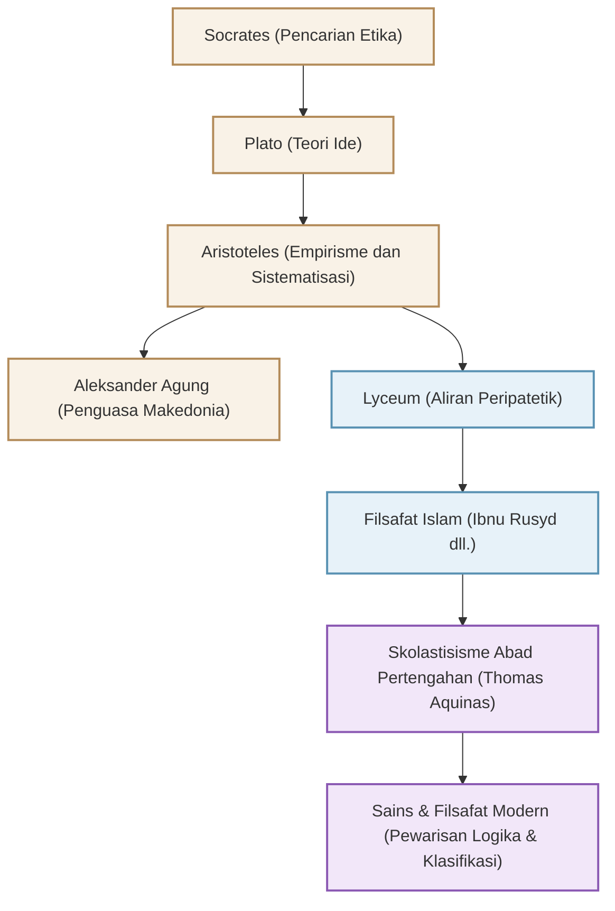

Dikenal sebagai "Bapak Segala Ilmu", filsuf Yunani kuno Aristoteles (384 SM - 322 SM) membangun sistem pengetahuan di dunia Barat. Eksplorasinya tidak hanya terbatas pada filsafat, tetapi juga meluas ke logika, etika, ilmu politik, ilmu alam, biologi, dan puitika, yang secara harfiah mencakup "segala ilmu pengetahuan". Dalam artikel ini, kami akan menjelaskan kehidupan Aristoteles yang penuh gejolak, pemikirannya yang mendalam yang masih relevan hingga saat ini, dan dampak tak terukur yang ia berikan pada sejarah umat manusia.

## 1. Kehidupan Penuh Gejolak dan Pengetahuan

### Masa Muda di Makedonia dan Pendidikan di Akademi
Aristoteles lahir pada tahun 384 SM di Stagira, sebuah kota kecil di wilayah Trakia. Ayahnya menjabat sebagai dokter pribadi untuk Raja Amyntas III dari Makedonia. Latar belakang ini diyakini telah memengaruhi pandangannya terhadap ilmu alam empiris di kemudian hari, serta hubungannya yang kuat dengan keluarga kerajaan Makedonia.

Pada usia 17 tahun, ia pergi ke Athena, pusat intelektual Yunani, dan memasuki "Akademi" yang didirikan oleh filsuf besar Plato. Di sana, ia belajar di bawah bimbingan Plato selama sekitar 20 tahun dan menonjol sebagai murid yang brilian di akademi tersebut. Plato dilaporkan sangat menghargainya dengan menyebutnya sebagai "Pikiran dari Akademi". Namun, ketika gurunya Plato meninggal, Aristoteles meninggalkan Athena dan memperdalam pemikirannya sendiri di Asia Kecil dan tempat-tempat lainnya.

### Dari Guru Pribadi Aleksander Agung hingga Pendirian Lyceum
Sekitar tahun 342 SM, atas undangan Raja Filipus II dari Makedonia, Aristoteles menjadi guru pribadi pangeran yang nantinya akan dikenal sebagai "Aleksander Agung". Hubungan antara filsuf besar ini dan pahlawan muda yang kelak akan membangun kekaisaran dunia ini merupakan salah satu hubungan guru-murid yang paling dramatis dalam sejarah.

Setelah Aleksander naik takhta, Aristoteles kembali ke Athena dan mendirikan sekolahnya sendiri, "Lyceum". Karena ia biasa berdiskusi dengan murid-muridnya sambil berjalan di jalur pejalan kaki (peripatos), aliran pemikirannya kemudian dikenal sebagai "Aliran Peripatetik". Di sinilah ia menulis banyak karya dan menyusun pengetahuannya yang luas.

## 2. Filsafat Empirisme dan Sistematisasi

Pemikiran Aristoteles berawal dari upayanya melampaui dan mengkritisi "Teori Ide" dari gurunya, Plato.

### "Bentuk (Eidos)" dan "Materi (Hyle)"
Sementara Plato percaya bahwa realitas sejati berada di "Dunia Ide" yang terpisah dari dunia empiris ini, Aristoteles menemukan nilai pada dunia realitas itu sendiri. Ia berpendapat bahwa segala sesuatu yang ada terdiri dari "Materi" (bahan) dan "Bentuk" (esensi/wujud). Misalnya, sebuah patung perunggu ada ketika "Bentuk" dari tokoh tertentu diberikan kepada "Materi" yaitu perunggu. Menurutnya, kebenaran tidak bersemayam di Dunia Ide di surga, melainkan di dalam masing-masing benda yang ada di depan mata kita.

### Pembentukan Logika dan "Silogisme"
Salah satu pencapaian terbesarnya adalah sistematisasi logika. Ia merumuskan "Silogisme", yang terkenal dengan contoh: "Semua manusia akan mati", "Socrates adalah manusia", "Oleh karena itu Socrates akan mati", dan menetapkan aturan untuk penalaran yang benar. Konsep ini terus berkuasa sebagai dasar logika selama lebih dari 2000 tahun.

### Etika Teleologi dan Jalan Tengah
Pandangan Aristoteles tentang alam didasarkan pada "Teleologi". Ia percaya bahwa segala sesuatu di alam semesta tumbuh dan berubah menuju "tujuan" masing-masing. Ia mengajarkan bahwa tujuan tertinggi bagi manusia adalah "Kebahagiaan (Eudaimonia)", dan untuk mencapainya, penting bagi kita untuk menggunakan akal sehat dan mempraktikkan kebajikan "Jalan Tengah (Mesotes)", yaitu menghindari hal-hal yang ekstrem. Ia memandang keberanian berada di antara "kecerobohan" dan "kepengecutan", dan keseimbangan yang moderat inilah yang membawa keunggulan bagi manusia.

## 3. Pengaruh Besar yang Membentuk Sejarah Manusia

Warisan intelektual Aristoteles memberikan pengaruh yang tak tertandingi pada sejarah dunia di kemudian hari.

Karya-karyanya hampir lenyap dari dunia Yunani pada akhir Zaman Kuno, namun diterjemahkan ke dalam bahasa Arab di dunia Islam, dan dipelajari secara mendalam oleh para filsuf Islam seperti Ibnu Rusyd (Averroes). Hasil studi di dunia Islam ini kemudian diperkenalkan kembali ke Eropa Barat melalui "Renaisans Abad ke-12".

Pada Abad Pertengahan di Eropa, filsafat Aristoteles menyatu dengan teologi Kristen, dan disempurnakan menjadi sistem intelektual yang luar biasa oleh Thomas Aquinas, penyempurna "Skolastisisme". Bagi masyarakat Abad Pertengahan, Aristoteles bukan sekadar seorang filsuf; memanggilnya "Sang Filsuf (The Philosopher)" sudah cukup merujuk kepadanya dengan otoritas mutlaknya.

Sejak Revolusi Sains Modern (abad ke-17), fisika dan astronomi Aristoteles ditolak oleh tokoh-tokoh seperti Galileo dan Newton. Namun, metode klasifikasi keilmuan yang ia bangun, dasar logika, dan sikap intelektualnya yang "mengamati realitas dan menyusunnya secara sistematis" terus hidup sebagai fondasi sains dan filsafat hingga saat ini.

## Diagram Korelasi dan Perluasan Pengaruh

Diagram berikut menunjukkan garis keturunan intelektual di sekitar Aristoteles dan aliran pengaruhnya.

## Penutup
Warisan "Segala Ilmu" yang ditinggalkan Aristoteles bukan sekadar pengetahuan dari masa lalu. Sikapnya yang selalu bertanya "mengapa?" dan berusaha memahami realitas secara logis serta sistematis menunjukkan bentuk kecerdasan yang sangat dibutuhkan di zaman modern di mana informasi membanjiri kita. Sang pencari pengetahuan tertinggi dari Yunani kuno ini masih terus memberikan panduan pemikiran bagi kita hingga hari ini.
