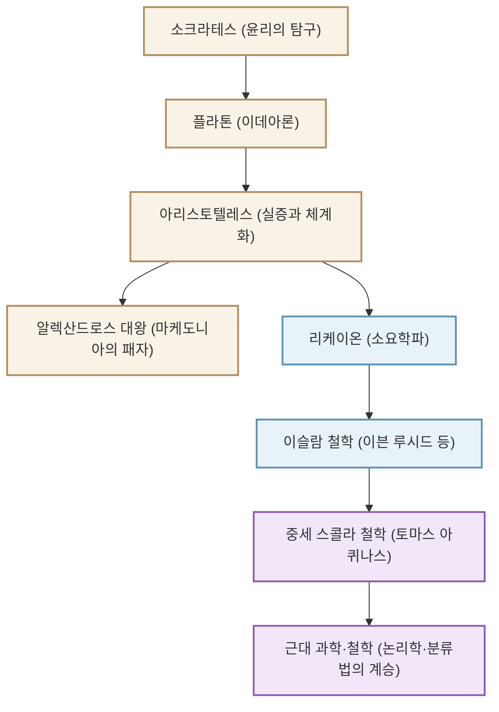

"만학의 아버지"라 불리며 서양 지식의 체계를 구축한 고대 그리스의 철학자 아리스토텔레스(기원전 384년 - 기원전 322년). 그의 탐구는 철학에 그치지 않고 논리학, 윤리학, 정치학, 자연과학, 생물학, 시학에 이르기까지 말 그대로 '모든 학문'에 미쳤습니다. 본 기사에서는 아리스토텔레스의 파란만장한 생애, 현대에도 통하는 깊은 사상, 그리고 인류 역사에 미친 헤아릴 수 없는 영향에 대해 해설합니다.

## 1. 지식과 격동의 생애

### 고향 마케도니아와 아카데메이아에서의 수행
아리스토텔레스는 기원전 384년, 트라키아 지방의 소도시 스타게이라에서 태어났습니다. 아버지는 마케도니아 왕 아뮌타스 3세의 시의(주치의)를 지냈으며, 이러한 출신이 훗날 그의 자연과학적·실증적 시각이나 마케도니아 왕실과의 강한 유대에 영향을 미친 것으로 여겨집니다.

17세 때, 그는 그리스의 지적 중심지인 아테네로 향하여 위대한 철학자 플라톤이 창설한 학원 '아카데메이아'에 입문합니다. 그곳에서 약 20년 동안 플라톤 밑에서 배우며 학원의 수재로 두각을 나타냈습니다. 플라톤은 그를 '학원의 정신'이라 부르며 높이 평가했다고 전해집니다. 그러나 스승인 플라톤이 세상을 떠나자, 아리스토텔레스는 아테네를 떠나 소아시아 등지에서 독자적인 사색을 깊이 해나가게 됩니다.

### 알렉산드로스 대왕의 가정교사에서 리케이온 창설까지
기원전 342년경, 마케도니아 왕 필리포스 2세의 초청으로 아리스토텔레스는 훗날 '알렉산드로스 대왕'이 되는 왕자의 가정교사가 됩니다. 위대한 철학자와 훗날 세계 제국을 건설할 젊은 영웅의 결속은 역사상 가장 드라마틱한 사제 관계 중 하나입니다.

알렉산드로스가 왕위에 오른 후, 아리스토텔레스는 다시 아테네로 돌아와 자신의 학원 '리케이온'을 창설했습니다. 그는 산책로(페리파토스)를 거닐며 제자들과 논의를 나눴기 때문에 그의 학파는 '소요학파'로 불리게 됩니다. 이곳에서 그는 수많은 저작을 집필하고 방대한 지식을 체계화해 나갔습니다.

## 2. 실증과 체계화의 철학

아리스토텔레스의 사상은 스승인 플라톤의 '이데아론'을 비판적으로 극복하는 것에서 시작됩니다.

### '형상(에이도스)'과 '질료(휠레)'
플라톤이 진정한 현실은 경험적인 이 세계와는 다른 '이데아계'에 있다고 생각한 반면, 아리스토텔레스는 현실 세계 자체에서 가치를 찾았습니다. 그는 존재하는 모든 것은 '질료(재료)'와 '형상(본질·형태)'으로 이루어져 있다고 주장했습니다. 예를 들어 동상이라면 청동이라는 '질료'에 특정 인물의 형태라는 '형상'이 주어짐으로써 존재합니다. 진리는 천상의 이데아계에 있는 것이 아니라, 우리 눈앞에 있는 개별 사물 속에 깃들어 있다고 본 것입니다.

### 논리학의 확립과 '삼단논법'
그의 가장 위대한 업적 중 하나는 논리학의 체계화입니다. "모든 사람은 죽는다", "소크라테스는 사람이다", "고로 소크라테스는 죽는다"라는 유명한 '삼단논법(실로기즘)'을 정식화하고 올바른 추론의 규칙을 확립했습니다. 이는 2000년 이상 논리학의 기초로 군림해 왔습니다.

### 목적론과 중용의 윤리학
아리스토텔레스의 자연관은 '목적론'에 바탕을 두고 있습니다. 자연계의 모든 사물은 각각의 '목적'을 향해 생성 변화하고 있다고 생각했습니다. 인간에게 궁극적인 목적은 '행복(에우다이모니아)'이며, 이를 달성하기 위해서는 이성을 발휘하고 극단을 피하는 '중용(메소테스)'의 덕을 실천하는 것이 중요하다고 설파했습니다. 용기는 '만용'과 '겁쟁이'의 중간에 있으며, 적절한 균형이야말로 인간의 탁월성을 가져온다고 여겼습니다.

## 3. 인류의 역사를 형성한 거대한 영향력

아리스토텔레스의 지적 유산은 이후 세계사에서 유례없는 영향력을 행사했습니다.

그의 저작은 고대 말기에 그리스 세계에서 사라질 뻔했지만, 이슬람 세계에서 아랍어로 번역되어 이븐 루시드(아베로에스) 등 이슬람 철학자들에 의해 깊이 연구되었습니다. 이 이슬람권에서의 연구 성과가 12세기 이후 '12세기 르네상스'를 통해 서유럽으로 역수입됩니다.

중세 유럽에서 아리스토텔레스 철학은 기독교 신학과 융합되어, '스콜라 철학'의 완성자인 토마스 아퀴나스에 의해 장대한 지적 체계로 승화되었습니다. 중세 사람들에게 아리스토텔레스는 단순한 한 명의 철학자가 아니라 '철학자(The Philosopher)'라고 부르면 그를 지칭할 정도의 절대적인 권위자였습니다.

근대 과학 혁명(17세기) 이후 갈릴레이나 뉴턴 등에 의해 아리스토텔레스의 물리학과 천문학은 부정되게 됩니다. 그러나 그가 확립한 학문의 분류 방법, 논리학의 기초, 그리고 "현실을 관찰하고 체계화한다"는 지적 태도는 오늘날에 이르기까지 과학과 철학의 기반으로 살아 숨 쉬고 있습니다.

## 상관도와 영향의 확장

아래 그림은 아리스토텔레스를 둘러싼 지적 계보와 영향의 흐름을 나타낸 것입니다.

## 맺음말
아리스토텔레스가 남긴 '만학'의 유산은 단순한 과거의 지식이 아닙니다. 그의 "왜?"라고 질문하고 현실을 논리적이고 체계적으로 이해하려는 태도는, 정보가 넘쳐나는 현대에 더욱 필요한 지성의 모습을 보여주고 있습니다. 고대 그리스가 낳은 궁극의 지식 탐구자는 지금도 우리에게 사고의 이정표를 제시하고 있습니다.
