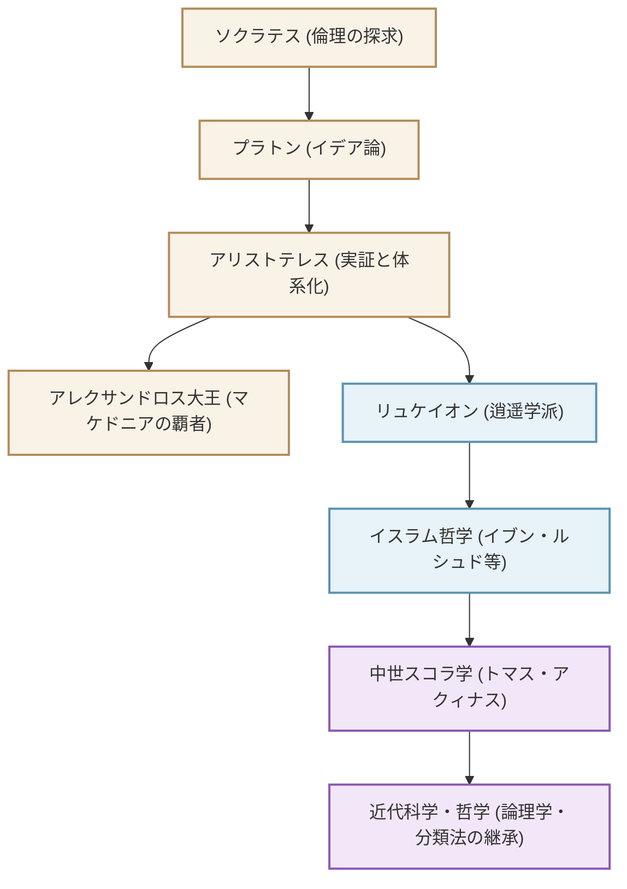

「万学の祖」と称され、西洋における知の体系を築き上げた古代ギリシアの哲学者アリストテレス（紀元前384年 - 紀元前322年）。彼の探求は、哲学にとどまらず、論理学、倫理学、政治学、自然科学、生物学、詩学に至るまで、文字通り「あらゆる学問」に及びました。本記事では、アリストテレスの波乱に満ちた生涯、現代にも通じる深い思想、そして人類の歴史に与えた計り知れない影響について解説します。

## 1. 知と激動の生涯

### 故郷マケドニアとアカデメイアでの修業
アリストテレスは紀元前384年、トラキア地方の小都市スタゲイラに生まれました。父はマケドニア王アミュンタス3世の侍医を務めており、この出自が後の彼の自然科学的・実証的な視点や、マケドニア王室との強い結びつきに影響を与えたと考えられています。

17歳の時、彼はギリシアの知的中心地アテナイへ向かい、偉大なる哲学者プラトンが創設した学園「アカデメイア」に入門します。そこで約20年間にわたりプラトンの下で学び、学園の秀才として頭角を現しました。プラトンは彼を「学園の精神」と呼んで高く評価したと伝えられています。しかし、師プラトンが亡くなると、アリストテレスはアテナイを去り、小アジアなどで独自の思索を深めることになります。

### アレクサンドロス大王の家庭教師からリュケイオンの創設へ
紀元前342年頃、マケドニア王フィリッポス2世の招きにより、アリストテレスは後に「アレクサンドロス大王」となる王子の家庭教師となります。偉大なる哲学者と、後に世界帝国を築く若き英雄の結びつきは、歴史上最もドラマチックな師弟関係の一つです。

アレクサンドロスが王位に就いた後、アリストテレスは再びアテナイに戻り、自身の学園「リュケイオン」を創設しました。彼は散歩道（ペリパトス）を歩きながら弟子たちと議論を交わしたため、彼の学派は「逍遥（しょうよう）学派」と呼ばれるようになります。ここで彼は、数多くの著作を執筆し、膨大な知識を体系化していきました。

## 2. 実証と体系化の哲学

アリストテレスの思想は、師であるプラトンの「イデア論」を批判的に乗り越えるところから始まります。

### 「形相（エイドス）」と「質料（ヒュレー）」
プラトンが、真の現実は経験的なこの世界とは別の「イデア界」にあると考えたのに対し、アリストテレスは現実の世界そのものに価値を見出しました。彼は、存在するすべてのものは「質料（材料）」と「形相（本質・形）」から成り立っていると主張しました。例えば、銅像であれば、青銅という「質料」に、特定の人物の形という「形相」が与えられることで存在しています。真理は天上のイデア界にあるのではなく、私たちの目の前にある個々の事物の中に宿っているとしたのです。

### 論理学の確立と「三段論法」
彼の最も偉大な功績の一つが、論理学の体系化です。「すべての人間は死ぬ」「ソクラテスは人間である」「ゆえにソクラテスは死ぬ」という有名な「三段論法（シロギズム）」を定式化し、正しい推論のルールを確立しました。これは2000年以上にわたり、論理学の基礎として君臨し続けました。

### 目的論と中庸の倫理学
アリストテレスの自然観は「目的論」に基づいています。自然界のすべての事物は、それぞれの「目的」に向かって生成変化していると考えました。人間にとっての究極の目的は「幸福（エウダイモニア）」であり、それを達成するためには理性を働かせ、極端を避ける「中庸（メソテース）」の徳を実践することが重要だと説きました。勇気は「蛮勇」と「臆病」の中間にあり、適度なバランスこそが人間の卓越性をもたらすと考えたのです。

## 3. 人類の歴史を形成した巨大な影響力

アリストテレスの知的遺産は、その後の世界史において比類のない影響力を行使しました。

彼の著作は、古代末期にギリシア世界から失われかけましたが、イスラム世界においてアラビア語に翻訳され、イブン・ルシュド（アヴェロエス）らイスラムの哲学者たちによって深く研究されました。このイスラム圏での研究成果が、12世紀以降の「12世紀ルネサンス」を通じて西ヨーロッパへ逆輸入されます。

中世ヨーロッパにおいて、アリストテレス哲学はキリスト教神学と融合し、「スコラ学」の完成者であるトマス・アクィナスによって壮大な知的体系へと昇華されました。中世の人々にとって、アリストテレスは単なる一哲学者ではなく、「哲学者（The Philosopher）」と呼べば彼を指すほどの絶対的な権威でした。

近代科学革命（17世紀）以降、ガリレオやニュートンらによってアリストテレスの物理学や天文学は否定されることになります。しかし、彼が確立した学問の分類方法、論理学の基礎、そして「現実を観察し、体系化する」という知的態度は、今日に至るまで科学や哲学の基盤として生き続けています。

## 相関図と影響の広がり

以下の図は、アリストテレスを巡る知的系譜と影響の流れを示したものです。

## 終わりに
アリストテレスが残した「万学」の遺産は、単なる過去の知識ではありません。彼の「なぜ？」と問いかけ、現実を論理的かつ体系的に理解しようとする姿勢は、情報が氾濫する現代にこそ必要とされる知性のあり方を示しています。古代ギリシアが産んだ究極の知の探求者は、今なお私たちに思考の道標を与え続けているのです。
