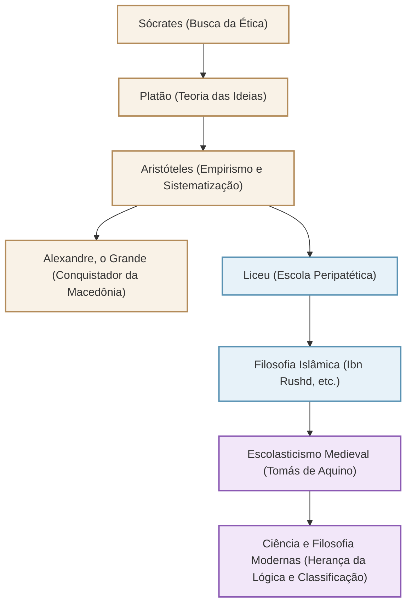

Conhecido como o "Pai de Todas as Ciências" e aquele que construiu o sistema de conhecimento no Ocidente, o filósofo grego antigo Aristóteles (384 a.C. - 322 a.C.). Sua busca não se limitou à filosofia, mas se estendeu literalmente a "todas as disciplinas", desde a lógica, ética, ciência política, ciências naturais, biologia, até a poética. Neste artigo, explicaremos a vida turbulenta de Aristóteles, seus pensamentos profundos que ainda são relevantes hoje e a imensurável influência que ele teve na história humana.

## 1. Conhecimento e uma Vida Turbulenta

### Treinamento em sua terra natal, Macedônia, e na Academia
Aristóteles nasceu em 384 a.C. na pequena cidade de Estagira, na região da Trácia. Seu pai foi médico do rei macedônio Amintas III, e acredita-se que essa origem tenha influenciado sua perspectiva científica natural e empírica posterior, bem como seus fortes laços com a família real macedônia.

Aos 17 anos, ele partiu para Atenas, o centro intelectual da Grécia, e ingressou na "Academia", uma escola fundada pelo grande filósofo Platão. Lá ele estudou sob Platão por cerca de 20 anos e se destacou como um prodígio da escola. Diz-se que Platão o avaliou muito bem, chamando-o de "o intelecto da escola". No entanto, quando seu professor Platão morreu, Aristóteles deixou Atenas para aprofundar suas próprias reflexões na Ásia Menor e em outros lugares.

### De tutor de Alexandre, o Grande, à fundação do Liceu
Por volta de 342 a.C., a convite do rei Filipe II da Macedônia, Aristóteles tornou-se o tutor do príncipe que mais tarde se tornaria "Alexandre, o Grande". O vínculo entre o grande filósofo e o jovem herói que mais tarde construiria um império mundial é um dos relacionamentos mestre-discípulo mais dramáticos da história.

Depois que Alexandre ascendeu ao trono, Aristóteles retornou a Atenas e fundou sua própria escola, o "Liceu". Como ele debatia com seus discípulos enquanto caminhava pelo calçadão (peripatos), sua escola passou a ser conhecida como a escola "Peripatética". Aqui ele escreveu numerosos livros e sistematizou uma vasta quantidade de conhecimento.

## 2. A Filosofia do Empirismo e da Sistematização

O pensamento de Aristóteles começa superando criticamente a "Teoria das Ideias" de seu mestre Platão.

### "Forma (Eidos)" e "Matéria (Hyle)"
Enquanto Platão acreditava que a verdadeira realidade existia no "mundo das Ideias", separado deste mundo empírico, Aristóteles encontrou valor no próprio mundo real. Ele argumentou que tudo o que existe é composto de "matéria (material)" e "forma (essência/forma)". Por exemplo, uma estátua de bronze existe porque uma "forma" de uma pessoa específica é dada à "matéria" do bronze. A verdade não reside no mundo celestial das Ideias, mas reside nas coisas individuais bem na nossa frente.

### O Estabelecimento da Lógica e o "Silogismo"
Uma de suas maiores realizações foi a sistematização da lógica. Ele formulou o famoso "silogismo", como "Todos os homens são mortais", "Sócrates é um homem", "Logo, Sócrates é mortal", estabelecendo as regras do raciocínio correto. Isso reinou supremo como a base da lógica por mais de 2000 anos.

### Teleologia e a Ética da Moderação
A visão de Aristóteles sobre a natureza é baseada na "teleologia". Ele acreditava que todas as coisas no mundo natural são geradas e mudam em direção a seus respectivos "propósitos" (fins). O propósito final dos seres humanos é a "felicidade (Eudaimonia)", e ele pregou que para alcançá-la, é importante exercitar a razão e praticar a virtude da "moderação (Mesotes)", que evita extremos. Ele acreditava que a coragem reside no meio entre a "imprudência" e a "covardia", e que um equilíbrio adequado traz excelência aos seres humanos.

## 3. Uma Enorme Influência que Moldou a História Humana

O legado intelectual de Aristóteles exerceu uma influência inigualável na história mundial subsequente.

Suas obras quase se perderam no mundo grego no final da antiguidade, mas foram traduzidas para o árabe no mundo islâmico e profundamente estudadas por filósofos islâmicos como Ibn Rushd (Averróis). Os resultados dessa pesquisa no mundo islâmico foram reimportados para a Europa Ocidental por meio do "Renascimento do Século XII" e além.

Na Europa medieval, a filosofia aristotélica fundiu-se com a teologia cristã e foi sublimada em um magnífico sistema intelectual por Tomás de Aquino, o aperfeiçoador do "Escolasticismo". Para as pessoas da Idade Média, Aristóteles não era apenas mais um filósofo, mas uma autoridade tão absoluta que chamá-lo de "O Filósofo (The Philosopher)" se referia a ele.

Desde a Revolução Científica moderna (século XVII), a física e a astronomia de Aristóteles foram rejeitadas por Galileu, Newton e outros. No entanto, o método de classificação de disciplinas, os fundamentos da lógica e a atitude intelectual de "observar e sistematizar a realidade" que ele estabeleceu sobreviveram como a base da ciência e da filosofia até hoje.

## Diagrama de Correlação e a Expansão da Influência

O diagrama abaixo mostra a genealogia intelectual em torno de Aristóteles e o fluxo de sua influência.

## Conclusão
O legado das "Todas as Ciências" deixado por Aristóteles não é apenas conhecimento do passado. Sua postura de perguntar "por quê?" e tentar entender a realidade de forma lógica e sistemática nos mostra a forma de inteligência necessária na era atual, onde há uma abundância de informações. O supremo buscador do conhecimento gerado pela Grécia Antiga continua a nos fornecer um guia para o pensamento hoje.
