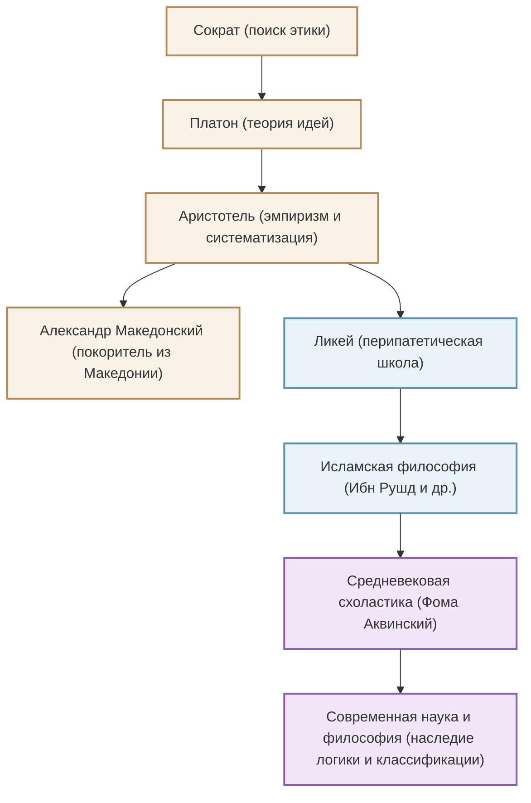

Древнегреческий философ Аристотель (384 г. до н.э. - 322 г. до н.э.), прозванный «отцом всех наук» и заложивший основы системы знаний на Западе. Его исследования не ограничивались философией, а охватывали буквально «все науки», включая логику, этику, политику, естествознание, биологию и поэтику. В этой статье мы расскажем о полной бурных событий жизни Аристотеля, его глубоких идеях, актуальных и в наши дни, и о том неизмеримом влиянии, которое он оказал на историю человечества.

## 1. Жизнь, полная знаний и потрясений

### Родина Македония и обучение в Академии
Аристотель родился в 384 году до н.э. в небольшом городке Стагира во Фракии. Его отец служил придворным врачом македонского царя Аминты III, и считается, что это происхождение повлияло на его последующие естественнонаучные и эмпирические взгляды, а также на прочные связи с македонским царским двором.

В возрасте 17 лет он отправился в интеллектуальный центр Греции Афины и поступил в «Академию», основанную великим философом Платоном. Там он учился под руководством Платона около 20 лет, проявив себя как один из самых выдающихся учеников. Говорят, что Платон высоко ценил его, называя «духом школы». Однако после смерти своего учителя Платона Аристотель покинул Афины и углубил свои самостоятельные философские размышления в Малой Азии и других местах.

### От наставника Александра Македонского к основанию Ликея
Около 342 года до н.э. по приглашению македонского царя Филиппа II Аристотель стал наставником принца, который впоследствии стал «Александром Великим». Связь между великим философом и молодым героем, который позже создаст мировую империю, является одной из самых драматичных отношений учителя и ученика в истории.

После того как Александр взошел на трон, Аристотель вернулся в Афины и основал свою собственную школу «Ликей». Поскольку он вел дискуссии со своими учениками, прогуливаясь по аллеям (перипатам), его школу стали называть «перипатетической». Здесь он написал множество трудов и систематизировал огромный объем знаний.

## 2. Философия эмпиризма и систематизации

Аристотелевская мысль начинается с критического преодоления «теории идей» его учителя Платона.

### «Форма» (Эйдос) и «Материя» (Гюле)
В то время как Платон считал, что истинная реальность находится в «мире идей», отдельном от этого эмпирического мира, Аристотель находил ценность в самом реальном мире. Он утверждал, что все существующее состоит из «материи» (вещества) и «формы» (сущности). Например, бронзовая статуя существует благодаря тому, что бронзовой «материи» придается «форма» конкретного человека. Истина кроется не в небесном мире идей, а в отдельных вещах, находящихся прямо перед нами.

### Основание логики и «Силлогизм»
Одним из его величайших достижений является систематизация логики. Он сформулировал знаменитый «силлогизм» (например: «Все люди смертны», «Сократ - человек», «Следовательно, Сократ смертен») и установил правила правильного вывода. Это оставалось основой логики на протяжении более 2000 лет.

### Телеология и этика золотой середины
Взгляды Аристотеля на природу основаны на «телеологии» (учении о цели). Он считал, что все вещи в природе развиваются и изменяются по направлению к своим «целям». Высшей целью для человека является «счастье» (эвдемония), и для его достижения важно использовать разум и практиковать добродетель «золотой середины» (месотес), избегая крайностей. Смелость, по его мнению, находится между «безрассудством» и «трусостью», и именно правильный баланс приносит человеку совершенство.

## 3. Огромное влияние, сформировавшее историю человечества

Интеллектуальное наследие Аристотеля оказало беспрецедентное влияние на последующую мировую историю.

Его труды едва не были утрачены в греческом мире в конце античности, но были переведены на арабский язык в исламском мире и глубоко изучались исламскими философами, такими как Ибн Рушд (Аверроэс). Результаты этих исследований в исламском мире были возвращены в Западную Европу начиная с 12 века в ходе «Ренессанса XII века».

В средневековой Европе философия Аристотеля слилась с христианским богословием и была возведена Фомой Аквинским, завершителем «схоластики», в грандиозную интеллектуальную систему. Для людей Средневековья Аристотель был не просто философом, а абсолютным авторитетом, на которого указывали, просто говоря «Философ» (The Philosopher).

Со времен научной революции (17 век) физика и астрономия Аристотеля были отвергнуты такими учеными, как Галилей и Ньютон. Однако разработанные им методы классификации наук, основы логики и интеллектуальный подход, заключающийся в «наблюдении и систематизации реальности», продолжают жить как фундамент науки и философии до сегодняшнего дня.

## Диаграмма связей и распространение влияния

На следующей диаграмме показана интеллектуальная родословная и пути влияния, связанные с Аристотелем.

## В заключение
Наследие «всех наук», оставленное Аристотелем, — это не просто знания прошлого. Его подход, заключающийся в том, чтобы задавать вопрос «почему?» и пытаться логически и систематически понять реальность, демонстрирует то состояние интеллекта, которое необходимо именно в нашу эпоху информационного изобилия. Величайший искатель знаний, рожденный Древней Грецией, до сих пор продолжает служить для нас путеводной звездой мышления.
