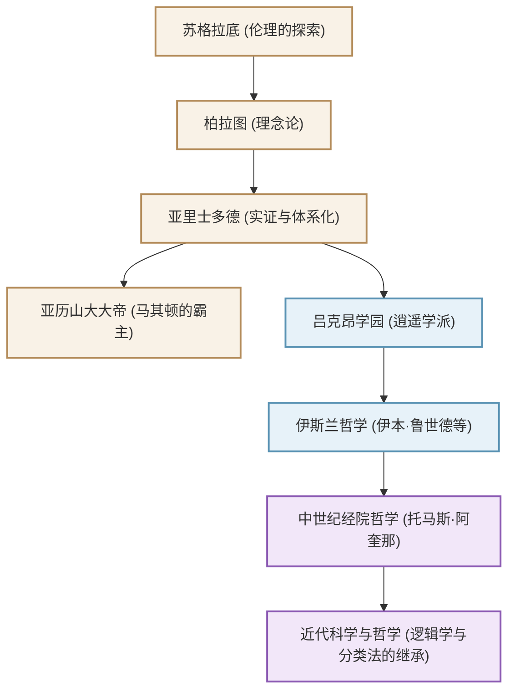

亚里士多德（公元前384年 - 公元前322年）被誉为“万学之祖”，是古希腊哲学家，奠定了西方知识体系的基础。他的探索不仅限于哲学，还延伸至逻辑学、伦理学、政治学、自然科学、生物学和诗学，字面意义上涵盖了“所有学问”。本文将为您解析亚里士多德波澜壮阔的一生、至今依然深远的思想，及其对人类历史产生的不可估量的影响。

## 1. 知识与动荡的一生

### 故乡马其顿与阿卡德米学院的修行
亚里士多德于公元前384年出生在色雷斯地区的小城斯塔吉拉。他的父亲曾担任马其顿国王阿明塔斯三世的御医，这种出身被认为影响了他后来的自然科学和实证主义视角，以及他与马其顿王室之间的紧密联系。

17岁时，他前往希腊的学术中心雅典，进入伟大哲学家柏拉图创立的学园“阿卡德米”（Academy）学习。在那里，他在柏拉图门下学习了约20年，作为学园中的佼佼者崭露头角。据说柏拉图高度评价他，称他为“学园的灵魂”。然而，在导师柏拉图去世后，亚里士多德离开了雅典，在小亚细亚等地深化了自己独特的思想。

### 从亚历山大大帝的家庭教师到吕克昂学园的创立
约在公元前342年，应马其顿国王腓力二世的邀请，亚里士多德成为了后来被称为“亚历山大大帝”的王子的家庭教师。伟大哲学家与后来建立世界帝国的年轻英雄之间的纽带，是历史上最具戏剧性的师生关系之一。

在亚历山大继位后，亚里士多德再次回到雅典，创立了自己的学园“吕克昂”（Lyceum）。因为他常一边在散步道（Peripatos）上漫步，一边与弟子们讨论，他的学派被称为“逍遥学派”（漫步学派）。在这里，他撰写了大量著作，并将庞大的知识系统化。

## 2. 实证与体系化的哲学

亚里士多德的思想始于对他导师柏拉图的“理念论”（Idea论）的批判性超越。

### “形式”（Eidos）与“质料”（Hyle）
柏拉图认为真正的现实存在于脱离经验世界的“理念世界”中，而亚里士多德则在现实世界本身中发现了价值。他主张所有存在的事物都由“质料”（材料）和“形式”（本质、形状）构成。例如，一座铜像之所以存在，是因为青铜这种“质料”被赋予了特定人物形状的“形式”。真理并不在天上的理念世界中，而是存在于我们眼前的一个个具体事物之中。

### 逻辑学的确立与“三段论”
他最伟大的成就之一是逻辑学的体系化。他公式化了著名的“三段论”（Syllogism），例如：“所有人都会死”，“苏格拉底是人”，“所以苏格拉底会死”，并确立了正确推论的规则。在之后的两千多年里，这一直是逻辑学的基础。

### 目的论与中庸的伦理学
亚里士多德的自然观基于“目的论”。他认为自然界的所有事物都在朝着各自的“目的”生成变化。对于人类而言，终极目的是“幸福”（Eudaimonia），为了实现这一目标，他主张发挥理性，践行避免极端的“中庸”（Mesotes）美德。勇气处于“鲁莽”与“怯懦”之间，他认为适度的平衡才能带来人类的卓越。

## 3. 塑造人类历史的巨大影响力

亚里士多德的知识遗产在后来的世界史中发挥了无与伦比的影响力。

他的著作在古代末期曾险些从希腊世界中失传，但在伊斯兰世界中被翻译成阿拉伯语，并被伊本·鲁世德（阿维罗伊）等伊斯兰哲学家深入研究。这些在伊斯兰文化圈的研究成果，通过12世纪以来的“12世纪文艺复兴”重新传入西欧。

在中世纪的欧洲，亚里士多德的哲学与基督教神学相融合，并由“经院哲学”的集大成者托马斯·阿奎那升华为宏大的知识体系。对中世纪的人们来说，亚里士多德不仅仅是一位哲学家，只要提到“哲学家（The Philosopher）”，就绝对是指代他，具有绝对的权威。

近代科学革命（17世纪）以后，伽利略和牛顿等人否定了亚里士多德的物理学和天文学。然而，他确立的学问分类方法、逻辑学基础，以及“观察现实并将其体系化”的学术态度，至今仍是科学和哲学的基础。

## 关系图与影响的扩展

下图展示了围绕亚里士多德的知识谱系和影响流向。

## 结语
亚里士多德留下的“万学”遗产，不仅仅是过去的知识。他追问“为什么？”，并试图逻辑地、体系化地理解现实的态度，正是信息泛滥的现代社会所需要的智慧。这位古希腊诞生的终极知识探索者，至今仍在为我们的思考指引方向。
