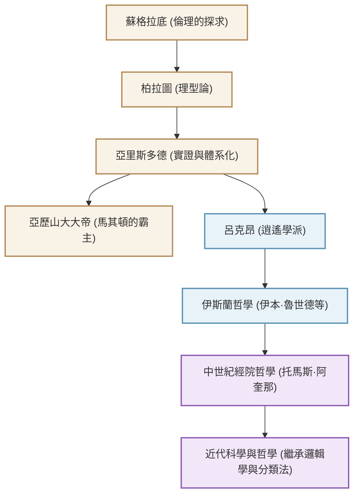

被譽為「萬學之祖」、奠定西方知識體系的古希臘哲學家亞里斯多德（西元前384年 - 西元前322年）。他的探索不僅限於哲學，還涵蓋了邏輯學、倫理學、政治學、自然科學、生物學以及詩學，字面意義上觸及了「所有學問」。本文將解說亞里斯多德波瀾萬丈的一生、至今依然適用的深邃思想，以及對人類歷史產生的無可估量的影響。

## 1. 知識與動盪的一生

### 故鄉馬其頓與學園（Akademia）的修煉
亞里斯多德於西元前384年出生於色雷斯地區的小城斯塔吉拉（Stagira）。他的父親曾擔任馬其頓國王阿敏塔斯三世（Amyntas III）的御醫，這種出身被認為影響了他日後具備自然科學與實證的觀點，以及與馬其頓王室的強烈聯繫。

17歲時，他前往希臘的知識中心雅典，拜入偉大哲學家柏拉圖創立的「學園（Akademia）」。在那裡，他在柏拉圖門下學習了約20年，並作為學園中的才子嶄露頭角。據說柏拉圖對他評價極高，稱他為「學園的精神」。然而，當恩師柏拉圖去世後，亞里斯多德離開了雅典，在小亞細亞等地深化了他獨特的思考。

### 從亞歷山大大帝的家庭教師到呂克昂（Lyceum）的創立
大約在西元前342年，應馬其頓國王腓力二世的邀請，亞里斯多德成為了後來被稱為「亞歷山大大帝」的王子的家庭教師。偉大的哲學家與後來建立世界帝國的年輕英雄之間的結合，是歷史上最具戲劇性的師徒關係之一。

亞歷山大即位後，亞里斯多德再次回到雅典，創立了自己的學園「呂克昂（Lyceum）」。由於他常一邊沿著散步道（Peripatos）漫步一邊與弟子們討論，他的學派因此被稱為「逍遙學派（Peripatetic school）」。在這裡，他撰寫了大量著作，將龐大的知識體系化。

## 2. 實證與體系化的哲學

亞里斯多德的思想，始於對恩師柏拉圖的「理型論（Idea）」進行批判性的超越。

### 「形式（Eidos）」與「質料（Hyle）」
柏拉圖認為真正的現實存在於與經驗世界不同的「理型界」，而亞里斯多德則在現實世界本身中找到了價值。他主張，所有存在的事物都是由「質料（材料）」與「形式（本質・形狀）」所構成。例如，一尊銅像，是因為青銅這種「質料」被賦予了特定人物形狀的「形式」而存在的。真理並不存在於天上的理型界，而是存在於我們眼前個別的事物之中。

### 邏輯學的確立與「三段論」
他最偉大的貢獻之一是邏輯學的體系化。他公式化了著名的「三段論（Syllogism）」：「所有人皆會死」、「蘇格拉底是人」、「因此蘇格拉底會死」，從而確立了正確推論的規則。這在長達兩千多年的時間裡，一直作為邏輯學的基礎佔據統治地位。

### 目的論與中庸的倫理學
亞里斯多德的自然觀基於「目的論」。他認為自然界的所有事物，都在朝著各自的「目的」生成變化。對於人類而言，終極的目的是「幸福（Eudaimonia）」，他主張為了達成這個目的，必須運用理性，實踐避免極端的「中庸（Mesotes）」美德。勇敢處於「魯莽」與「怯懦」之間，適度的平衡才能帶來人類的卓越。

## 3. 塑造人類歷史的巨大影響力

亞里斯多德的知識遺產，在隨後的世界史中發揮了無與倫比的影響力。

他的著作在古代末期曾幾乎從希臘世界中失傳，但在伊斯蘭世界被翻譯成阿拉伯語，並由伊本·魯世德（阿維羅伊）等伊斯蘭哲學家進行了深入研究。這些在伊斯蘭圈的研究成果，透過12世紀以後的「12世紀文藝復興」重新輸入西歐。

在中世紀歐洲，亞里斯多德哲學與基督教神學融合，被「經院哲學」的集大成者托馬斯·阿奎那昇華為宏大的知識體系。對中世紀的人們來說，亞里斯多德不僅僅是一位哲學家，只要稱呼「哲學家（The Philosopher）」，就代表著指代他的絕對權威。

自近代科學革命（17世紀）以來，伽利略和牛頓等人否定了亞里斯多德的物理學和天文學。然而，他確立的學問分類方法、邏輯學基礎，以及「觀察並體系化現實」的知識態度，至今依然作為科學與哲學的基石存續著。

## 關係圖與影響的擴展

下圖展示了圍繞亞里斯多德的知識系譜與影響的流向。

## 結語
亞里斯多德留下的「萬學」遺產，並非單純的過去知識。他不斷提出「為什麼？」並試圖邏輯且體系化地理解現實的態度，正是在這個資訊氾濫的現代最被需要的智慧展現。古希臘孕育出的終極知識探索者，至今仍在為我們提供思考的指路明燈。
