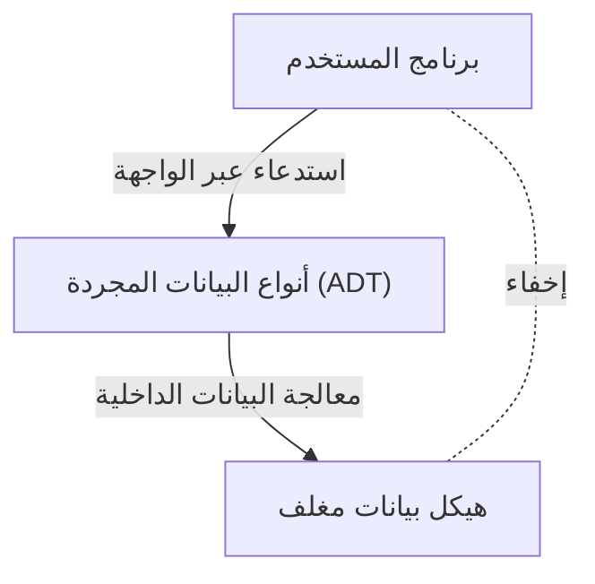

# باربرا ليسكوف: عالمة الحاسوب التي بنت أنواع البيانات المجردة والأنظمة الموزعة

في عالم هندسة البرمجيات، قلة من المطورين لا يعرفون "مبدأ استبدال ليسكوف (Liskov Substitution Principle: LSP)"، وهو أحد مبادئ SOLID. ومع ذلك، لا يُعرف الكثير عن كيف أحدثت باربرا ليسكوف (Barbara Liskov)، التي يحمل المبدأ اسمها، ثورة في تصميم لغات البرمجة والأنظمة الموزعة. في هذا المقال، سنشرح بالتفصيل وبخلفية تقنية رحلتها كواحدة من أوائل النساء في الولايات المتحدة اللواتي حصلن على درجة الدكتوراه في علوم الحاسوب، إلى اختراعها "أنواع البيانات المجردة" التي تشكل أساس البرمجة كائنية التوجه الحديثة، وأبحاثها التي أرست أسس الأنظمة الموزعة.

## 1. الأيام الأولى وميلاد أول امرأة تحصل على درجة الدكتوراه في الولايات المتحدة

ولدت باربرا ليسكوف عام 1939 في كاليفورنيا. أظهرت موهبة استثنائية في الرياضيات والعلوم منذ طفولتها المبكرة، وحصلت على درجة البكالوريوس في الرياضيات من جامعة كاليفورنيا، بيركلي. في ذلك الوقت، كان من النادر جداً أن تدخل النساء مجالات STEM (العلوم والتكنولوجيا والهندسة والرياضيات)، فضلاً عن أن مجال علوم الحاسوب نفسه لم يكن قد تأسس بعد. عندما أرادت الالتحاق بكلية الدراسات العليا في الرياضيات بجامعة برينستون، واجهت عقبة تتمثل في أن برينستون لم تكن تقبل النساء في ذلك الوقت.

ومع ذلك، لم يتوقف شغفها بالاستكشاف عند هذا الحد. بعد العمل في معهد ماساتشوستس للتكنولوجيا (MIT) وأماكن أخرى، التحقت أخيراً بكلية الدراسات العليا في جامعة ستانفورد، حيث درست تحت إشراف جون مكارثي، أحد آباء الذكاء الاصطناعي. في عام 1968، حصلت على درجة الدكتوراه عن بحثها في الذكاء الاصطناعي الذي يركز على نهايات لعبة الشطرنج. سُجل هذا كإنجاز تاريخي، كواحدة من أولى الحالات في الولايات المتحدة التي تحصل فيها امرأة على درجة الدكتوراه في علوم الحاسوب.

## 2. عصر أزمة البرمجيات وأنواع البيانات المجردة

بعد حصولها على الدكتوراه، بدأت ليسكوف العمل كباحثة في شركة MITRE. في ذلك الوقت، كانت صناعة الحوسبة تواجه ما يسمى بـ "أزمة البرمجيات". مع تطور الأجهزة، زاد تعقيد البرمجيات بشكل هائل، وانخفضت قابلية صيانة الكود وإمكانية إعادة استخدامه بشكل كبير. أصبحت البرامج الضخمة عبارة عن شفرات متداخلة (Spaghetti code)، وأصبح من الشائع أن يتسبب تغيير بسيط في أخطاء فادحة في النظام بأكمله.

لمعالجة هذه المشكلة، ركزت ليسكوف على مفهوم تغليف تمثيل البيانات والعمليات عليها. كانت هذه بداية "أنواع البيانات المجردة (Abstract Data Type: ADT)". نوع البيانات المجرد هو تقنية تجمع بين هياكل البيانات والعمليات عليها، مما يسمح بالوصول إليها من الخارج فقط من خلال واجهة. هذا يخفي التنفيذ الداخلي (إخفاء المعلومات)، مما يسمح بتطوير واختبار كل وحدة (module) من البرنامج بشكل مستقل.

## 3. تطوير لغة CLU وتأثيرها على البرمجة كائنية التوجه

بصفتها أستاذة في معهد ماساتشوستس للتكنولوجيا، صممت وطورت ليسكوف لغة برمجة جديدة تسمى "CLU (كلو)" في السبعينيات لإثبات مفهوم أنواع البيانات المجردة الذي اقترحته. يشتق اسم CLU من كلمة "Cluster (عنقود)"، مما يعكس فكرة تجميع البيانات والعمليات عليها في عناقيد.

كانت CLU لغة ثورية وضعت العديد من المفاهيم الأساسية للغات البرمجة الحديثة موضع التنفيذ لأول مرة.
- **المكررات (Iterators):** آلية لمعالجة العناصر بشكل متسلسل دون الاعتماد على التنفيذ الداخلي لهيكل البيانات.
- **معالجة الاستثناءات (Exception Handling):** آلية آمنة تفصل بوضوح مسار المعالجة عند حدوث أخطاء.
- **أساس تعدد الأشكال (Polymorphism):** عمليات عامة من خلال أنواع البيانات المجردة.

كان لهذه الأفكار المبتكرة تأثير هائل في وقت لاحق على تصميم لغات البرمجة كائنية التوجه المعتمدة على نطاق واسع مثل Java و C++ و Python و C#. المفاهيم التي نستخدمها يومياً، مثل الفئات (classes) والتغليف (encapsulation) والواجهات (interfaces)، هي امتداد مباشر للأفكار التي جسدتها ليسكوف من خلال CLU.

## 4. Argus وتحدي الأنظمة الموزعة

في الثمانينيات، تحول اهتمام ليسكوف من البرمجة على حاسوب واحد إلى "الأنظمة الموزعة"، حيث تتعاون أجهزة حاسوب متعددة عبر شبكة. في ذلك الوقت، كانت الأنظمة الموزعة موجودة كنماذج نظرية، لكن التطوير العملي كان صعباً للغاية بسبب تحديات معقدة مثل تأخير الشبكة والأعطال واتساق البيانات.

استجابة لهذا التحدي، طورت لغة البرمجة الموزعة "Argus". كانت الميزة الأبرز لـ Argus هي دمج العمليات المسماة "الحراس (Guardians)" في البيئات الموزعة، ومفهوم "الإجراءات الذرية (Atomic Actions)"، أي المعاملات (transactions)، على مستوى اللغة. أتاح هذا بناء تطبيقات موزعة تحافظ على اتساق البيانات حتى في حالة انقطاع الشبكة أو تعطل العقد.

اليوم، أصبح التسامح مع الأخطاء (fault tolerance) وضمان الاتساق متطلبات أساسية في الحوسبة السحابية وبنية الخدمات المصغرة (microservices) ومعالجة معاملات قواعد البيانات، لكن العديد من النظريات والأطر العملية الأساسية لهذه المتطلبات تعتمد على أبحاث ليسكوف في Argus.

## 5. مبدأ استبدال ليسكوف (LSP) وجوهره

السبب الذي جعل اسم ليسكوف معروفاً على نطاق واسع هو "مبدأ استبدال ليسكوف (Liskov Substitution Principle)"، الذي تم الإعلان عنه في خطاب رئيسي في OOPSLA في عام 1987، وتمت صياغته رياضياً لاحقاً في ورقة بحثية مشتركة مع جانيت وينج (Jeannette Wing). أصبح هذا المبدأ مشهوراً باعتباره حرف "L" في "مبادئ SOLID"، التي تلخص أفضل ممارسات التصميم كائني التوجه.

تعريف LSP هو كما يلي:
"إذا كان S نوعاً فرعياً من T، فيجب أن يكون من الممكن استبدال الكائنات من النوع T في البرنامج بكائنات من النوع S دون تغيير صحة البرنامج."

هذا المبدأ ليس مجرد قاعدة وراثة (inheritance). إنه يعبر عن مفهوم عميق يسمى "الأنواع الفرعية السلوكية (Behavioral Subtyping)". يجب ألا تلتزم الفئة المشتقة (derived class) بواجهة الفئة الأساسية فحسب، بل يجب أن تلتزم أيضاً بـ "السلوك (العقد)" الذي وعدت به الفئة الأساسية. إذا انتهكت الفئة المشتقة عقد الفئة الأساسية (على سبيل المثال، رمي استثناء لا يمكن أن يحدث في الفئة الأساسية، أو انتهاك الشروط المسبقة أو اللاحقة للحالة)، فستواجه الشفرة التي تستخدم تعدد الأشكال أخطاء غير متوقعة.

وسع LSP نظرية أنواع البيانات المجردة وأصبح دليلاً قوياً للتحكم في التعقيد الناتج عن الوراثة. عند تصميم بنية برمجية قوية وقابلة للتوسيع، لا يزال LSP يوجه المطورين كحقيقة عالمية.

## 6. جائزة تورينج والتأثير على الأجيال القادمة

بفضل هذه المساهمات الهائلة، حصلت باربرا ليسكوف على "جائزة تورينج" في عام 2008، والتي تُعرف باسم جائزة نوبل في علوم الحاسوب. كان سبب منح الجائزة هو "مساهماتها العملية والنظرية في أسس لغات البرمجة وتصميم الأنظمة، لا سيما تجريد البيانات، والتسامح مع الأخطاء، والحوسبة الموزعة".

يظل جوهر أبحاثها متجذراً دائماً في منظور عملي: "كيف يمكننا بناء أنظمة معقدة بحيث يسهل على البشر فهمها وتكون آمنة". يستمر أسلوبها في الموازنة بين الصرامة الرياضية والتحديات الهندسية الواقعية في إلهام العديد من الباحثين والمهندسين.

تتغلغل إنجازات باربرا ليسكوف في كل زاوية من الشفرات التي نكتبها يومياً. في كل مرة نغلف فيها متغيراً، أو نحدد واجهة، أو نصمم خدمة مصغرة، فإننا نسير على الدرب الذي مهدته. عندما ننظر إلى الوراء في تاريخ هندسة البرمجيات، لا يسعنا إلا أن ندرك مدى تأثير بصيرتها وإبداعها في تشكيل العالم.
