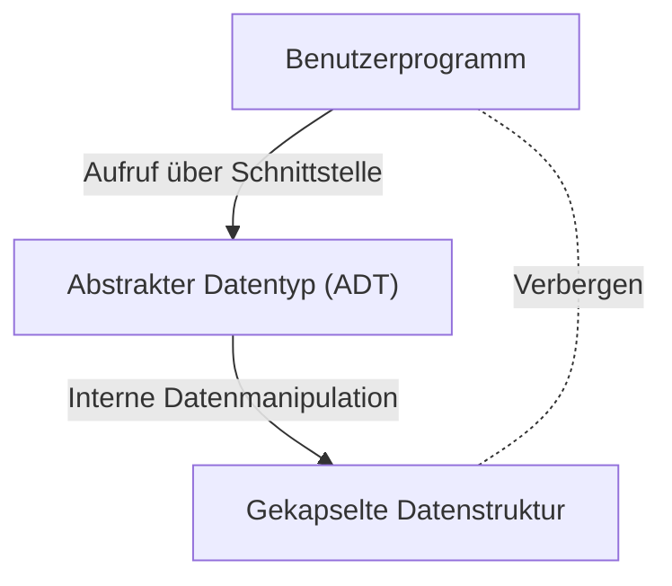

# Barbara Liskov: Die Informatikerin, die abstrakte Datentypen und verteilte Systeme entwickelte

In der Welt des Software-Engineerings gibt es nur wenige Entwickler, die das "Liskovsche Substitutionsprinzip (LSP)", eines der SOLID-Prinzipien, nicht kennen. Doch überraschenderweise ist oft wenig darüber bekannt, welche Transformationen Barbara Liskov, die Namensgeberin, selbst in der Programmiersprachendesign und bei verteilten Systemen bewirkte. In diesem Artikel werden wir ihre Reise als eine der ersten Frauen in den USA mit einem Ph.D. in Informatik, die Erfindung des "abstrakten Datentyps", der das Fundament der modernen objektorientierten Programmierung bildet, und ihre Forschung, die den Grundstein für verteilte Systeme legte, mit technischem Hintergrund detailliert beleuchten.

## 1. Die Anfangsjahre und die Entstehung des ersten weiblichen Ph.D. in den USA

Barbara Liskov wurde 1939 in Kalifornien geboren. Schon in jungen Jahren zeigte sie außergewöhnliches Talent in Mathematik und Naturwissenschaften und erwarb einen Bachelor-Abschluss in Mathematik an der University of California, Berkeley. Damals war es für Frauen äußerst selten, in die MINT-Fächer (Mathematik, Informatik, Naturwissenschaften und Technik) zu gehen, ganz zu schweigen davon, dass das Gebiet der Informatik als akademische Disziplin noch nicht einmal etabliert war. Als sie sich für ein Aufbaustudium in der Mathematikabteilung der Princeton University bewerben wollte, stand sie vor dem Hindernis, dass Princeton zu dieser Zeit keine Frauen zuließ.

Ihr Wissensdurst endete dort jedoch nicht. Nach Stationen wie am Massachusetts Institute of Technology (MIT) ging sie schließlich für ihr Aufbaustudium an die Stanford University und studierte unter der Leitung von John McCarthy, einem der Väter der künstlichen Intelligenz. 1968 promovierte sie mit einer Forschungsarbeit zur künstlichen Intelligenz anhand von Schach-Endspielen. Dies ist als historische Leistung dokumentiert, da sie eines der ersten Beispiele dafür ist, dass eine Frau in den USA in Informatik promovierte.

## 2. Die Ära der Softwarekrise und abstrakte Datentypen

Nach ihrer Promotion begann Liskov als Forscherin bei der MITRE Corporation zu arbeiten. Die damalige Computerindustrie stand vor einer Ära, die als "Softwarekrise" bezeichnet wird. Im Vergleich zur Entwicklung der Hardware nahm die Komplexität der Software explosionsartig zu, und die Wartbarkeit und Wiederverwendbarkeit des Codes nahmen drastisch ab. Riesige Programme verwandelten sich in Spaghetti-Code, und kleine Änderungen verursachten häufig fatale Fehler im gesamten System.

Um dieses Problem zu lösen, konzentrierte sich Liskov auf das Konzept der Kapselung von Datendarstellung und -operationen. Dies war der Beginn des "Abstrakten Datentyps (Abstract Data Type: ADT)". Ein abstrakter Datentyp ist ein Ansatz, der die Struktur von Daten und die Operationen darauf zusammenfasst und den Zugriff von außen nur über eine Schnittstelle zulässt. Dadurch wird die interne Implementierung verborgen (Information Hiding), und jedes Modul des Programms kann unabhängig entwickelt und getestet werden.

## 3. Die Entwicklung der Programmiersprache CLU und der Einfluss auf die Objektorientierung

Um das Konzept der abstrakten Datentypen, das sie selbst vorgeschlagen hatte, zu demonstrieren, entwarf und entwickelte Liskov, nun Professorin am MIT, in den 1970er Jahren eine neue Programmiersprache namens "CLU" (Clu). Der Name CLU leitet sich von "Cluster" ab und spiegelt die Idee wider, Daten und ihre Operationen als Cluster zu gruppieren.

CLU ist eine bahnbrechende Sprache, die viele Konzepte, die für moderne Programmiersprachen unerlässlich sind, zum ersten Mal in die Praxis umsetzte.
- **Iteratoren (Iterators):** Ein Mechanismus zur sequenziellen Verarbeitung von Elementen, ohne von der internen Implementierung der Datenstruktur abhängig zu sein.
- **Ausnahmebehandlung (Exception Handling):** Ein sicherer Mechanismus, der den Verarbeitungsfluss im Fehlerfall klar trennt.
- **Grundlage des Polymorphismus:** Allgemeine Operationen über abstrahierte Datentypen.

Diese innovativen Ideen hatten später einen enormen Einfluss auf das Design weit verbreiteter objektorientierter Programmiersprachen wie Java, C++, Python und C#. Konzepte wie Klassen, Kapselung und Schnittstellen, die wir heute täglich verwenden, sind direkte Erweiterungen der Ideen, die Liskov durch CLU verwirklicht hat.

## 4. Argus und die Herausforderung verteilter Systeme

In den 1980er Jahren verlagerte sich Liskovs Interesse von der Programmierung auf einem einzelnen Computer hin zu "verteilten Systemen", bei denen mehrere Computer über ein Netzwerk zusammenarbeiten. Zu dieser Zeit existierten verteilte Systeme zwar als theoretische Modelle, aber ihre praktische Entwicklung war aufgrund komplexer Probleme wie Netzwerkverzögerungen, Ausfällen und Datenkonsistenz äußerst schwierig.

Um dieses Problem anzugehen, entwickelte sie die verteilte Programmiersprache "Argus". Das wichtigste Merkmal von Argus ist die Integration von "Wächtern (Guardians)"-Prozessen in einer verteilten Umgebung und das Konzept der "atomaren Aktionen (Atomic Actions)", also Transaktionen, auf Sprachebene. Dadurch wurde es möglich, verteilte Anwendungen zu erstellen und dabei die Datenkonsistenz selbst bei Netzwerkausfällen oder Knotenabstürzen aufrechtzuerhalten.

Heute sind Fehlertoleranz (Fault Tolerance) und garantierte Konsistenz Standardanforderungen beim Cloud-Computing, in Microservices-Architekturen und bei der Transaktionsverarbeitung in Datenbanken. Viele der grundlegenden Theorien und praktischen Rahmenbedingungen dafür basieren auf Liskovs Forschung mit Argus.

## 5. Das Liskovsche Substitutionsprinzip (LSP) und sein Wesen

Liskov ist wohl am bekanntesten für das "Liskovsche Substitutionsprinzip (Liskov Substitution Principle)", das sie 1987 in einer Grundsatzrede auf der OOPSLA vorstellte und später in einer gemeinsamen Arbeit mit Jeannette Wing mathematisch formulierte. Dies ist als "L" in den "SOLID-Prinzipien" weit verbreitet, die Best Practices für objektorientiertes Design zusammenfassen.

Die Definition von LSP lautet wie folgt:
"Wenn S ein Subtyp von T ist, dann sollten Objekte des Typs T in einem Programm durch Objekte des Typs S ersetzt werden können, ohne die Korrektheit des Programms zu verändern."

Dieses Prinzip ist nicht nur eine Vererbungsregel. Es drückt das tiefgreifende Konzept des "Verhaltens-Subtypings (Behavioral Subtyping)" aus. Eine abgeleitete Klasse muss nicht nur die Schnittstelle der Basisklasse einhalten, sondern auch das von der Basisklasse versprochene "Verhalten (Vertrag)". Wenn eine abgeleitete Klasse den Vertrag der Basisklasse bricht (z. B. indem sie eine Ausnahme auslöst, die in der Basisklasse nicht auftreten kann, oder indem sie Vor- und Nachbedingungen des Zustands verletzt), wird Code, der Polymorphismus verwendet, auf unerwartete Fehler stoßen.

LSP erweiterte die Theorie der abstrakten Datentypen und wurde zu einem starken Wegweiser für die Kontrolle der durch Vererbung verursachten Komplexität. Beim Entwurf robuster und hochgradig erweiterbarer Softwarearchitekturen leitet LSP Entwickler als universelle Wahrheit weiterhin an.

## 6. Der Gewinn des Turing Awards und der Einfluss auf zukünftige Generationen

Für diese enormen Beiträge erhielt Barbara Liskov 2008 den "Turing Award", der oft als Nobelpreis der Informatik bezeichnet wird. Die Begründung für die Auszeichnung war "für fundamentale Beiträge zu den Grundlagen von Programmiersprachen und Systemdesign, insbesondere im Hinblick auf Datenabstraktion, Fehlertoleranz und verteiltes Rechnen".

Der Kern ihrer Forschung wurzelt immer in der praktischen Perspektive: "Wie können komplexe Systeme so aufgebaut werden, dass sie für Menschen leicht verständlich und sicher sind?" Ihr Stil, ein Gleichgewicht zwischen mathematischer Strenge und den praktischen Herausforderungen des Engineerings zu finden, inspiriert weiterhin viele Forscher und Ingenieure.

Die Leistungen von Barbara Liskov durchdringen jeden Winkel des Codes, den wir täglich schreiben. Jedes Mal, wenn wir eine Variable kapseln, eine Schnittstelle definieren oder einen Microservice entwerfen, gehen wir den Weg, den sie bereitet hat. Wenn wir auf die Geschichte der Softwareentwicklung zurückblicken, können wir nicht anders, als erneut zu erkennen, wie sehr ihre Einsicht und Kreativität die Welt geprägt haben.
