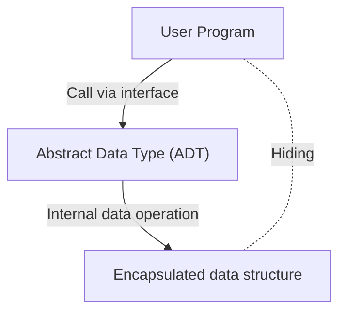

# Barbara Liskov: The Computer Scientist Who Built Abstract Data Types and Distributed Systems

In the world of software engineering, few developers are unfamiliar with the "Liskov Substitution Principle (LSP)", one of the SOLID principles. However, the extent of the transformation brought about by its namesake, Barbara Liskov, in programming language design and distributed systems is surprisingly often unknown. In this article, we delve deeply into her journey as one of the first women in the U.S. to earn a Ph.D. in computer science, her invention of "abstract data types" which form the foundation of modern object-oriented programming, and her research that laid the groundwork for distributed systems, complete with technical background.

## 1. The Dawn and the Birth of the First Female Ph.D. in the U.S.

Barbara Liskov was born in California in 1939. Showing extraordinary talent for mathematics and science from an early age, she earned a bachelor's degree in mathematics from the University of California, Berkeley. At the time, it was extremely rare for women to enter STEM fields (Science, Technology, Engineering, and Mathematics), let alone the fact that the academic field of computer science itself had not yet been established. When she hoped to proceed to graduate school in the mathematics department at Princeton University, she faced the barrier that Princeton did not admit women at the time.

However, her quest for knowledge did not stop there. After working at places like the Massachusetts Institute of Technology (MIT), she eventually entered graduate school at Stanford University, studying under John McCarthy, one of the founding fathers of artificial intelligence. In 1968, she earned her Ph.D. for her research on artificial intelligence centered around chess endgames. This is recorded as a historical achievement, being one of the first instances of a woman earning a Ph.D. in computer science in the United States.

## 2. The Era of the Software Crisis and Abstract Data Types

After obtaining her Ph.D., Liskov began working as a researcher at the MITRE Corporation. The computer industry at the time was facing an era known as the "software crisis". The complexity of software exploded relative to the evolution of hardware, and the maintainability and reusability of code significantly deteriorated. Huge programs became spaghetti code, and a situation where a small change could cause fatal bugs throughout the entire system was rampant.

To address this problem, Liskov focused on the concept of encapsulating data representation and operations. This was the beginning of the "Abstract Data Type (ADT)". An abstract data type is a technique that groups data structures and their operations together, allowing access from the outside only through an interface. This hides the internal implementation (information hiding) and allows each module of a program to be developed and tested independently.

## 3. The Development of the CLU Language and Its Impact on Object-Orientation

Having become a professor at MIT, Liskov designed and developed a new programming language called "CLU" in the 1970s to demonstrate the concept of abstract data types she had advocated. The name CLU is derived from "Cluster", reflecting the philosophy of grouping data and its operations as a cluster.

CLU is an epoch-making language that first put into practical use many concepts essential to modern programming languages.
- **Iterators:** A mechanism to process elements sequentially without depending on the internal implementation of the data structure.
- **Exception Handling:** A safe mechanism that clearly separates the processing flow when an error occurs.
- **Foundation of Polymorphism:** General-purpose operations through abstracted data types.

These innovative ideas later had an immense impact on the design of widely adopted object-oriented programming languages such as Java, C++, Python, and C#. The concepts we use on a daily basis, such as classes, encapsulation, and interfaces, are a direct extension of the ideas Liskov materialized through CLU.

## 4. Argus and the Challenge of Distributed Systems

Entering the 1980s, Liskov's interest shifted from programming on a single computer to "distributed systems", where multiple computers coordinate over a network. While distributed systems existed as theoretical models at the time, practical development was extremely difficult due to complex challenges such as network delays, failures, and data consistency.

In response to this challenge, she developed the distributed programming language "Argus". The most significant feature of Argus is that it integrated processes called "Guardians" and the concept of "Atomic Actions", or transactions, in a distributed environment at the language level. This made it possible to build distributed applications while maintaining data consistency even if network failures or node crashes occurred.

Today, in cloud computing, microservices architectures, and database transaction processing, fault tolerance and consistency guarantees are natural requirements, but much of the underlying theory and practical frameworks are built upon Liskov's research in Argus.

## 5. The Liskov Substitution Principle (LSP) and Its Essence

What made Liskov's name most widely known is the "Liskov Substitution Principle", introduced in a keynote address at OOPSLA in 1987 and later mathematically formulated in a joint paper with Jeannette Wing. This is widely known as the "L" in the "SOLID principles", which summarizes best practices in object-oriented design.

The definition of LSP is as follows:
"If S is a subtype of T, then objects of type T may be replaced with objects of type S without altering any of the desirable properties of the program."

This principle is not just a rule of inheritance. It expresses the deep concept of "Behavioral Subtyping". A derived class must adhere not only to the interface of the base class but also to the "behavior (contract)" promised by the base class. If a derived class breaks the contract of the base class (for example, throwing an exception that cannot occur in the base class, or violating the pre- and post-conditions of the state), code that uses polymorphism will suffer from unexpected bugs.

LSP extended the theory of abstract data types and became a powerful guide to controlling the complexity introduced by inheritance. In designing robust and highly extensible software architectures, LSP continues to guide developers as a universal truth today.

## 6. The Turing Award and Influence on Future Generations

For these immense contributions, Barbara Liskov received the "Turing Award", often referred to as the Nobel Prize of computer science, in 2008. The citation for the award was for "contributions to practical and theoretical foundations of programming language and system design, especially related to data abstraction, fault tolerance, and distributed computing."

The essence of her research is always rooted in the practical perspective of "how to build complex systems safely and in a way that is easy for humans to understand." Her style of balancing mathematical rigor with the practical challenges of engineering continues to inspire many researchers and engineers.

Barbara Liskov's achievements have permeated every corner of the code we write daily. Every time we encapsulate a variable, define an interface, or design a microservice, we are walking the path she forged. Looking back at the history of software engineering, we cannot help but reaffirm how much her insight and creativity have shaped the world.
