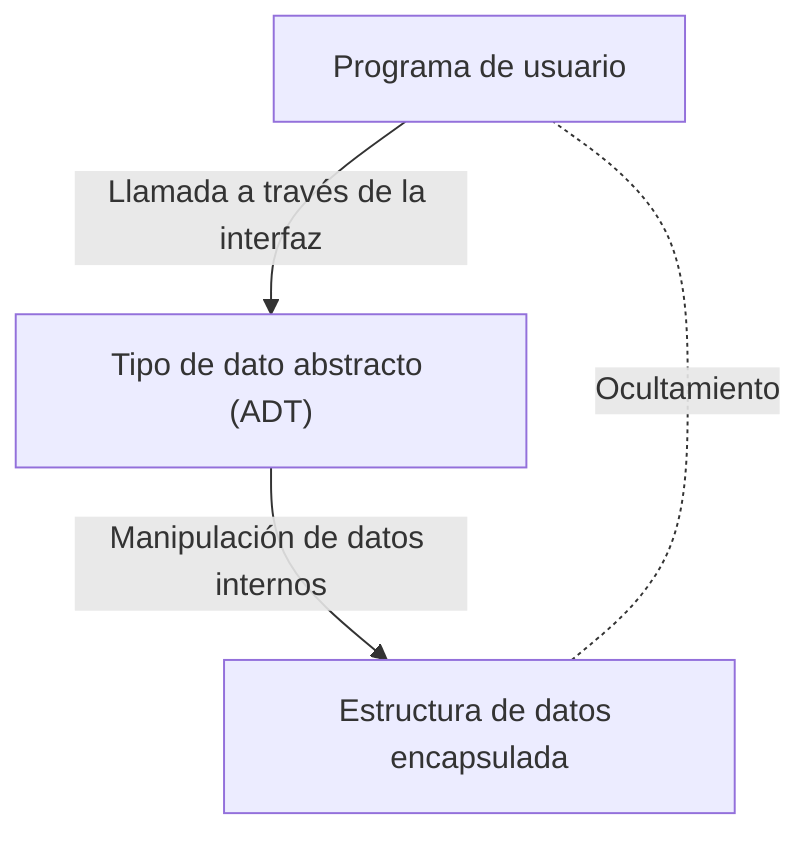

# Barbara Liskov: La científica de la computación que construyó los tipos de datos abstractos y los sistemas distribuidos

En el mundo de la ingeniería de software, pocos desarrolladores desconocen el "Principio de sustitución de Liskov (LSP)", uno de los principios SOLID. Sin embargo, a menudo se desconoce el impacto revolucionario que la propia Barbara Liskov, de quien proviene el nombre, tuvo en el diseño de lenguajes de programación y sistemas distribuidos. Este artículo explora en detalle su trayectoria como una de las primeras mujeres en obtener un doctorado en Ciencias de la Computación en Estados Unidos, la invención de los "tipos de datos abstractos" que forman la base de la programación orientada a objetos moderna, y su investigación que sentó las bases para los sistemas distribuidos, todo ello con su respectivo contexto técnico.

## 1. Los primeros años y el nacimiento del primer doctorado femenino en EE. UU.

Barbara Liskov nació en California en 1939. Mostrando un talento excepcional para las matemáticas y la ciencia desde pequeña, obtuvo su licenciatura en matemáticas en la Universidad de California, Berkeley. En aquella época, era extremadamente raro que las mujeres ingresaran a los campos STEM (ciencia, tecnología, ingeniería y matemáticas), y aún más considerando que la disciplina de la ciencia de la computación aún no estaba establecida. Cuando quiso continuar sus estudios de posgrado en el departamento de matemáticas de la Universidad de Princeton, se topó con el obstáculo de que Princeton no admitía mujeres en ese momento.

Sin embargo, su espíritu de exploración no terminó ahí. Después de trabajar en instituciones como el Instituto Tecnológico de Massachusetts (MIT), finalmente ingresó a la escuela de posgrado en la Universidad de Stanford, donde estudió bajo la supervisión de John McCarthy, uno de los padres de la inteligencia artificial. En 1968, obtuvo su doctorado con una investigación sobre inteligencia artificial basada en los finales de partidas de ajedrez. Esto está registrado como un logro histórico, siendo uno de los primeros casos en que una mujer obtuvo un doctorado en el campo de la ciencia de la computación en los Estados Unidos.

## 2. La era de la crisis del software y los tipos de datos abstractos

Tras obtener su doctorado, Liskov comenzó a trabajar como investigadora en MITRE Corporation. En ese entonces, la industria informática se enfrentaba a una época conocida como la "crisis del software". La complejidad del software crecía explosivamente en comparación con la evolución del hardware, y la mantenibilidad y reutilización del código se habían deteriorado significativamente. Grandes programas se convertían en código espagueti, y era común que un pequeño cambio provocara errores fatales en todo el sistema.

Para abordar este problema, Liskov se centró en el concepto de encapsular la representación y manipulación de datos. Este fue el comienzo de los "tipos de datos abstractos (Abstract Data Type: ADT)". Un tipo de dato abstracto es un enfoque que agrupa la estructura de datos y sus operaciones, permitiendo el acceso externo solo a través de una interfaz. Esto oculta la implementación interna (ocultamiento de información) y permite que cada módulo del programa se desarrolle y pruebe de forma independiente.

## 3. El desarrollo del lenguaje CLU y su impacto en la orientación a objetos

Como profesora en el MIT, Liskov diseñó y desarrolló un nuevo lenguaje de programación llamado "CLU" en la década de 1970 para demostrar el concepto de los tipos de datos abstractos que ella misma había propuesto. El nombre CLU proviene de "Cluster" (Clúster), reflejando la filosofía de agrupar los datos y sus operaciones como un clúster.

CLU fue un lenguaje innovador que implementó de manera práctica y por primera vez muchos conceptos que son indispensables en los lenguajes de programación modernos.
- **Iteradores (Iterators):** Un mecanismo para procesar elementos secuencialmente sin depender de la implementación interna de la estructura de datos.
- **Manejo de excepciones (Exception Handling):** Un mecanismo seguro que separa claramente el flujo de procesamiento cuando ocurre un error.
- **Fundamentos del polimorfismo:** Operaciones genéricas a través de tipos de datos abstraídos.

Estas ideas innovadoras tuvieron una inmensa influencia en el diseño de lenguajes de programación orientados a objetos que más tarde se popularizaron ampliamente, como Java, C++, Python y C#. Conceptos que utilizamos a diario, como clases, encapsulamiento e interfaces, son una extensión directa de las ideas que Liskov materializó a través de CLU.

## 4. Argus y el desafío de los sistemas distribuidos

En la década de 1980, el interés de Liskov pasó de la programación en una sola computadora a los "sistemas distribuidos", donde múltiples computadoras cooperan a través de una red. Aunque en ese momento los sistemas distribuidos existían como modelos teóricos, el desarrollo práctico era extremadamente difícil debido a problemas complejos como la latencia de la red, los fallos y la consistencia de los datos.

Para resolver este desafío, desarrolló el lenguaje de programación distribuido "Argus". La característica principal de Argus fue la integración a nivel de lenguaje de los procesos llamados "Guardianes (Guardians)" en un entorno distribuido y el concepto de "Acciones Atómicas (Atomic Actions)", es decir, transacciones. Esto permitió construir aplicaciones distribuidas manteniendo la consistencia de los datos, incluso en caso de fallos en la red o caídas de nodos.

Hoy en día, en la computación en la nube, las arquitecturas de microservicios y el procesamiento de transacciones de bases de datos, la tolerancia a fallos y la garantía de consistencia son requisitos fundamentales, y gran parte del marco teórico y práctico subyacente se basa en la investigación de Liskov en Argus.

## 5. El principio de sustitución de Liskov (LSP) y su esencia

Lo que ha hecho que el nombre de Liskov sea más conocido es el "Principio de sustitución de Liskov", presentado en su discurso principal en OOPSLA en 1987, y posteriormente formalizado matemáticamente en un artículo conjunto con Jeannette Wing. Esto se ha popularizado ampliamente como la "L" en los principios SOLID, que recopilan las mejores prácticas de diseño orientado a objetos.

La definición de LSP es la siguiente:
"Si S es un subtipo de T, entonces los objetos de tipo T en un programa pueden ser sustituidos por objetos de tipo S sin alterar la corrección de ese programa."

Este principio no es solo una regla sobre herencia. Expresa el profundo concepto de "Subtipificación conductual (Behavioral Subtyping)". Las clases derivadas deben respetar no solo la interfaz de la clase base, sino también el "comportamiento (contrato)" prometido por la clase base. Si una clase derivada rompe el contrato de la clase base (por ejemplo, lanzando una excepción que no podría ocurrir en la clase base o violando las precondiciones y postcondiciones de estado), el código que utiliza el polimorfismo sufrirá errores inesperados.

El LSP expandió la teoría de los tipos de datos abstractos y se convirtió en una guía poderosa para controlar la complejidad introducida por la herencia. Al diseñar arquitecturas de software robustas y altamente extensibles, el LSP sigue guiando a los desarrolladores como una verdad universal.

## 6. Premio Turing y su influencia en las futuras generaciones

Por estas inmensas contribuciones, Barbara Liskov recibió en 2008 el "Premio Turing", considerado el Premio Nobel de las Ciencias de la Computación. El motivo del premio fue por "contribuciones a los fundamentos teóricos y prácticos de los lenguajes de programación y el diseño de sistemas, especialmente relacionadas con la abstracción de datos, la tolerancia a fallos y la computación distribuida".

La esencia de su investigación siempre ha estado arraigada en una perspectiva práctica: "cómo construir sistemas complejos de manera que sean seguros y fáciles de entender para los humanos". Su estilo de equilibrar el rigor matemático con los problemas realistas de la ingeniería continúa inspirando a muchos investigadores e ingenieros.

El legado de Barbara Liskov ha permeado en cada rincón del código que escribimos a diario. Cada vez que encapsulamos una variable, definimos una interfaz o diseñamos un microservicio, estamos caminando por el camino que ella forjó. Al mirar hacia atrás en la historia de la ingeniería de software, no podemos evitar darnos cuenta de cuánto su perspicacia y creatividad han dado forma a nuestro mundo.
