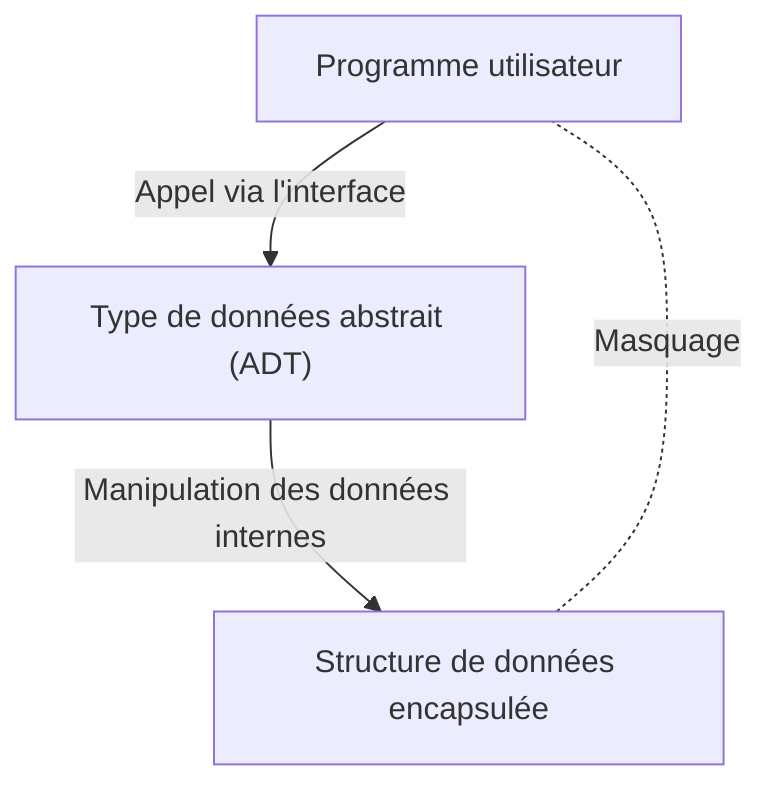

# Barbara Liskov : L'informaticienne qui a conçu les types de données abstraits et les systèmes distribués

Dans le monde de l'ingénierie logicielle, rares sont les développeurs qui ne connaissent pas le "Principe de substitution de Liskov" (Liskov Substitution Principle : LSP), l'un des principes SOLID. Cependant, la manière dont Barbara Liskov, qui a donné son nom à ce principe, a transformé la conception des langages de programmation et les systèmes distribués reste parfois méconnue. Cet article explore son parcours, de son statut de l'une des premières femmes à obtenir un doctorat en informatique aux États-Unis, jusqu'à l'invention des "types de données abstraits" qui constituent la base de la programmation orientée objet moderne, en passant par ses recherches fondatrices sur les systèmes distribués, tout en expliquant le contexte technique en détail.

## 1. Les débuts et l'obtention du premier doctorat féminin aux États-Unis

Barbara Liskov est née en 1939 en Californie. Ayant fait preuve d'un talent exceptionnel pour les mathématiques et les sciences dès son plus jeune âge, elle a obtenu une licence en mathématiques à l'Université de Californie à Berkeley. À l'époque, il était extrêmement rare que des femmes s'orientent vers les domaines STEM (sciences, technologie, ingénierie et mathématiques), sans oublier que l'informatique en tant que discipline académique n'était pas encore établie. Lorsqu'elle a souhaité poursuivre des études supérieures au département de mathématiques de l'Université de Princeton, elle a été confrontée à l'obstacle du refus de Princeton d'admettre des femmes à cette époque.

Cependant, son esprit de recherche ne s'est pas arrêté là. Après avoir travaillé au Massachusetts Institute of Technology (MIT) et ailleurs, elle a finalement intégré l'école d'études supérieures de l'Université de Stanford, où elle a étudié sous la direction de John McCarthy, l'un des pères de l'intelligence artificielle. En 1968, elle a obtenu son doctorat avec une recherche sur l'intelligence artificielle appliquée à la fin de partie aux échecs. Cet événement est inscrit dans l'histoire comme l'un des premiers cas aux États-Unis où une femme obtenait un doctorat dans le domaine de l'informatique.

## 2. L'ère de la crise du logiciel et les types de données abstraits

Après avoir obtenu son doctorat, Liskov a commencé à travailler comme chercheuse à la MITRE Corporation. À cette époque, l'industrie informatique faisait face à ce que l'on appelait la "crise du logiciel". Face à l'évolution du matériel, la complexité des logiciels augmentait de manière explosive, et la maintenabilité ainsi que la réutilisabilité du code se dégradaient considérablement. De vastes programmes se transformaient en code spaghetti, où une simple modification pouvait entraîner des bugs fatals dans l'ensemble du système.

Pour faire face à ce problème, Liskov s'est concentrée sur le concept d'encapsulation de la représentation et de la manipulation des données. C'est le début des "types de données abstraits" (Abstract Data Type : ADT). Un type de données abstrait regroupe la structure des données et les opérations qui s'y appliquent, ne permettant l'accès de l'extérieur qu'à travers une interface. Cela permet de masquer l'implémentation interne (masquage de l'information) et permet à chaque module du programme d'être développé et testé de manière indépendante.

## 3. Le développement du langage CLU et son impact sur l'orienté objet

Devenue professeure au MIT, Liskov a conçu et développé dans les années 1970 un nouveau langage de programmation, "CLU", afin de démontrer le concept de type de données abstrait qu'elle avait elle-même proposé. Le nom CLU vient de "Cluster", reflétant l'idée de regrouper les données et leurs opérations sous forme de clusters.

CLU est un langage révolutionnaire qui a mis en pratique pour la première fois de nombreux concepts aujourd'hui indispensables aux langages de programmation modernes.
- **Itérateurs (Iterators) :** Un mécanisme permettant de traiter les éléments de manière séquentielle sans dépendre de l'implémentation interne de la structure de données.
- **Gestion des exceptions (Exception Handling) :** Un mécanisme sûr séparant clairement le flux d'exécution en cas d'erreur.
- **Bases du polymorphisme :** Des opérations génériques effectuées via des types de données abstraits.

Ces idées novatrices ont eu par la suite une influence considérable sur la conception de langages de programmation orientés objet très répandus, tels que Java, C++, Python ou C#. Les concepts que nous utilisons quotidiennement, comme les classes, l'encapsulation et les interfaces, sont le prolongement direct des idées matérialisées par Liskov à travers CLU.

## 4. Argus et le défi des systèmes distribués

Au début des années 1980, l'intérêt de Liskov s'est déplacé de la programmation sur un seul ordinateur vers les "systèmes distribués", où plusieurs ordinateurs collaborent via un réseau. Bien qu'à l'époque les systèmes distribués existaient sous forme de modèles théoriques, le développement pratique était extrêmement difficile en raison de problèmes complexes liés à la latence du réseau, aux pannes et à la cohérence des données.

Face à ce défi, elle a développé le langage de programmation distribuée "Argus". La caractéristique majeure d'Argus est l'intégration au niveau du langage des processus appelés "gardiens" (Guardians) et des "actions atomiques" (Atomic Actions), c'est-à-dire des transactions, dans un environnement distribué. Cela a permis de construire des applications distribuées tout en maintenant la cohérence des données, même en cas de pannes de réseau ou de plantages de nœuds.

Aujourd'hui, la tolérance aux pannes (fault tolerance) et la garantie de cohérence sont devenues des exigences standard dans le cloud computing, les architectures de microservices et le traitement des transactions des bases de données. Bon nombre des théories fondamentales et des cadres pratiques de ces technologies reposent sur les recherches menées par Liskov avec Argus.

## 5. Le principe de substitution de Liskov (LSP) et son essence

Ce qui a le plus popularisé le nom de Liskov est le "Principe de substitution de Liskov", présenté lors de son discours d'ouverture à OOPSLA en 1987, et mathématiquement formalisé par la suite dans un article rédigé conjointement avec Jeannette Wing. Ce principe est largement connu sous le nom du "L" des principes SOLID, un ensemble de meilleures pratiques en matière de conception orientée objet.

La définition du LSP est la suivante :
"Si S est un sous-type de T, alors les objets de type T dans un programme doivent pouvoir être remplacés par des objets de type S sans modifier l'exactitude du programme."

Ce principe n'est pas une simple règle d'héritage. Il exprime le concept profond de "sous-typage comportemental" (Behavioral Subtyping). Une classe dérivée doit respecter non seulement l'interface de la classe de base, mais aussi le "comportement (contrat)" promis par celle-ci. Si une classe dérivée enfreint le contrat de la classe de base (par exemple, en levant une exception qui ne peut pas se produire dans la classe de base, ou en violant des préconditions ou postconditions d'état), le code utilisant le polymorphisme rencontrera des bugs inattendus.

Le LSP a étendu la théorie des types de données abstraits et est devenu un guide puissant pour contrôler la complexité induite par l'héritage. Dans la conception d'architectures logicielles robustes et hautement évolutives, le LSP continue de guider les développeurs comme une vérité universelle.

## 6. Le prix Turing et son influence sur la nouvelle génération

Pour ces immenses contributions, Barbara Liskov a reçu en 2008 le "Prix Turing", souvent considéré comme le prix Nobel de l'informatique. La raison de l'attribution du prix était ses "contributions pratiques et théoriques aux fondements des langages de programmation et à la conception des systèmes, en particulier l'abstraction des données, la tolérance aux pannes et l'informatique distribuée".

L'essence de ses recherches s'enracine toujours dans une perspective pratique : "Comment construire de manière sûre des systèmes complexes qui soient compréhensibles par les humains ?". Son style, qui équilibre rigueur mathématique et défis réalistes de l'ingénierie, continue d'inspirer de nombreux chercheurs et ingénieurs.

L'héritage de Barbara Liskov imprègne les moindres recoins du code que nous écrivons chaque jour. Chaque fois que nous encapsulons une variable, définissons une interface ou concevons un microservice, nous marchons sur la voie qu'elle a tracée. En repensant à l'histoire de l'ingénierie logicielle, nous ne pouvons que constater à quel point sa clairvoyance et sa créativité ont façonné le monde.
