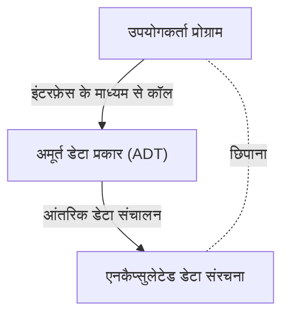

# बारबरा लिस्कोव: अमूर्त डेटा प्रकार और वितरित प्रणाली बनाने वाली कंप्यूटर वैज्ञानिक

सॉफ्टवेयर इंजीनियरिंग की दुनिया में, बहुत कम डेवलपर होंगे जो SOLID सिद्धांतों में से एक 'लिस्कोव प्रतिस्थापन सिद्धांत (Liskov Substitution Principle: LSP)' को नहीं जानते होंगे। हालाँकि, बहुत से लोग यह नहीं जानते कि बारबरा लिस्कोव, जिनके नाम पर इस सिद्धांत का नाम रखा गया है, ने स्वयं प्रोग्रामिंग भाषा डिजाइन और वितरित प्रणालियों में कैसा बदलाव लाया। इस लेख में, हम एक तकनीकी पृष्ठभूमि के साथ उनके जीवन को विस्तार से समझेंगे, संयुक्त राज्य अमेरिका में कंप्यूटर विज्ञान में पीएचडी प्राप्त करने वाली पहली महिलाओं में से एक होने से लेकर, 'अमूर्त डेटा प्रकारों (Abstract Data Types)' के उनके आविष्कार तक, जो आधुनिक ऑब्जेक्ट-ओरिएंटेड प्रोग्रामिंग की नींव है, और उनके उस शोध तक जिसने वितरित प्रणालियों (Distributed Systems) की नींव रखी।

## 1. शुरुआती दिन और अमेरिका की पहली महिला पीएचडी का जन्म

बारबरा लिस्कोव का जन्म 1939 में कैलिफोर्निया में हुआ था। बचपन से ही गणित और विज्ञान में असाधारण प्रतिभा दिखाने वाली, उन्होंने कैलिफोर्निया विश्वविद्यालय, बर्कले से गणित में स्नातक की उपाधि प्राप्त की। उस समय, महिलाओं का STEM (विज्ञान, प्रौद्योगिकी, इंजीनियरिंग, गणित) क्षेत्रों में जाना अत्यंत दुर्लभ था, और कंप्यूटर विज्ञान का शैक्षणिक क्षेत्र भी उस समय तक स्थापित नहीं हुआ था। जब उन्होंने प्रिंसटन विश्वविद्यालय के गणित विभाग के स्नातक स्कूल में प्रवेश लेना चाहा, तो उन्हें एक बाधा का सामना करना पड़ा: उस समय प्रिंसटन महिलाओं को प्रवेश नहीं देता था।

हालाँकि, उनकी खोज की भावना वहीं नहीं रुकी। मैसाचुसेट्स इंस्टीट्यूट ऑफ टेक्नोलॉजी (MIT) सहित अन्य संस्थानों में काम करने के बाद, उन्होंने अंततः स्टैनफोर्ड विश्वविद्यालय के स्नातक स्कूल में प्रवेश लिया और कृत्रिम बुद्धिमत्ता के जनकों में से एक जॉन मैकार्थी के मार्गदर्शन में अध्ययन किया। 1968 में, उन्होंने शतरंज के एंडगेम पर आधारित कृत्रिम बुद्धिमत्ता पर शोध के लिए पीएचडी प्राप्त की। इसे एक ऐतिहासिक उपलब्धि के रूप में दर्ज किया गया है क्योंकि वह संयुक्त राज्य अमेरिका में कंप्यूटर विज्ञान के क्षेत्र में पीएचडी प्राप्त करने वाली पहली महिलाओं में से एक थीं।

## 2. सॉफ्टवेयर संकट का युग और अमूर्त डेटा प्रकार

अपनी पीएचडी प्राप्त करने के बाद, लिस्कोव ने MITRE Corporation में एक शोधकर्ता के रूप में काम करना शुरू किया। उस समय कंप्यूटर उद्योग को 'सॉफ्टवेयर संकट (Software Crisis)' नामक युग का सामना करना पड़ रहा था। हार्डवेयर के विकास के साथ सॉफ्टवेयर की जटिलता बहुत तेजी से बढ़ी, जिससे कोड की मेंटेनेबिलिटी और पुन: प्रयोज्यता (Reusability) में भारी गिरावट आई। विशाल प्रोग्राम स्पेगेटी कोड में बदल रहे थे, और एक छोटा सा बदलाव भी पूरे सिस्टम में घातक बग पैदा कर सकता था।

इस समस्या से निपटने के लिए, लिस्कोव ने डेटा प्रतिनिधित्व और संचालन को इनकैप्सुलेट (Encapsulate) करने की अवधारणा पर ध्यान केंद्रित किया। यहीं से 'अमूर्त डेटा प्रकार (Abstract Data Type: ADT)' की शुरुआत हुई। अमूर्त डेटा प्रकार एक ऐसी विधि है जो डेटा की संरचना और उस पर होने वाले संचालन को एक साथ लाती है, और बाहरी दुनिया को केवल इंटरफेस के माध्यम से इसे एक्सेस करने की अनुमति देती है। यह आंतरिक कार्यान्वयन (सूचना छिपाना) को छुपाता है और प्रोग्राम के प्रत्येक मॉड्यूल को स्वतंत्र रूप से विकसित और परीक्षण करने की अनुमति देता है।

## 3. CLU भाषा का विकास और ऑब्जेक्ट-ओरिएंटेड पर प्रभाव

अमूर्त डेटा प्रकार की अपनी अवधारणा को प्रदर्शित करने के लिए, MIT में प्रोफेसर लिस्कोव ने 1970 के दशक में एक नई प्रोग्रामिंग भाषा, 'CLU' (क्लू) को डिज़ाइन और विकसित किया। CLU नाम 'क्लस्टर (Cluster)' से आया है और यह डेटा और उसके संचालन को क्लस्टर के रूप में समूहित करने के विचार को दर्शाता है।

CLU एक युगांतकारी भाषा है जिसने आधुनिक प्रोग्रामिंग भाषाओं के लिए आवश्यक कई अवधारणाओं को पहली बार व्यावहारिक रूप दिया:
- **इटरेटर्स (Iterators):** डेटा संरचना के आंतरिक कार्यान्वयन पर निर्भर किए बिना तत्वों को क्रमिक रूप से संसाधित करने का एक तंत्र।
- **अपवाद प्रबंधन (Exception Handling):** एक सुरक्षित तंत्र जो त्रुटि होने पर प्रोसेसिंग फ्लो को स्पष्ट रूप से अलग करता है।
- **पॉलीमॉर्फिज्म का आधार (Basis of Polymorphism):** अमूर्त डेटा प्रकारों के माध्यम से सामान्य संचालन।

इन अभिनव विचारों ने बाद में जावा, C++, पायथन और C# जैसी व्यापक रूप से लोकप्रिय ऑब्जेक्ट-ओरिएंटेड प्रोग्रामिंग भाषाओं के डिजाइन पर बहुत प्रभाव डाला। कक्षाएं (Classes), एनकैप्सुलेशन (Encapsulation) और इंटरफेस (Interfaces) जैसी अवधारणाएं जिनका हम दैनिक उपयोग करते हैं, लिस्कोव द्वारा CLU के माध्यम से साकार किए गए विचारों का प्रत्यक्ष विस्तार हैं।

## 4. Argus और वितरित प्रणालियों की चुनौती

1980 के दशक में, लिस्कोव की रुचि एक कंप्यूटर पर प्रोग्रामिंग से हटकर 'वितरित प्रणालियों (Distributed Systems)' की ओर चली गई, जहाँ कई कंप्यूटर नेटवर्क के माध्यम से सहयोग करते हैं। उस समय, हालांकि वितरित प्रणालियाँ सैद्धांतिक मॉडल के रूप में मौजूद थीं, लेकिन नेटवर्क विलंब, विफलता और डेटा स्थिरता (Consistency) जैसी जटिल चुनौतियों के कारण व्यावहारिक विकास अत्यंत कठिन था।

इस चुनौती के जवाब में, उन्होंने वितरित प्रोग्रामिंग भाषा 'Argus' विकसित की। Argus की सबसे बड़ी विशेषता यह थी कि इसने वितरित वातावरण में 'गार्जियन (Guardians)' नामक प्रक्रियाओं और 'परमाणु क्रिया (Atomic Actions)', यानी लेनदेन (Transactions) की अवधारणा को भाषा के स्तर पर एकीकृत किया। इससे नेटवर्क विफलता या नोड क्रैश होने पर भी डेटा स्थिरता बनाए रखते हुए वितरित एप्लिकेशन बनाना संभव हो गया।

आज, क्लाउड कंप्यूटिंग, माइक्रोसर्विसेज आर्किटेक्चर और डेटाबेस ट्रांजेक्शन प्रोसेसिंग में, फॉल्ट टॉलरेंस (Fault Tolerance) और स्थिरता की गारंटी एक आम आवश्यकता बन गई है, लेकिन इसके अंतर्निहित सिद्धांतों और व्यावहारिक रूपरेखाओं का अधिकांश हिस्सा लिस्कोव के Argus के शोध पर आधारित है।

## 5. लिस्कोव प्रतिस्थापन सिद्धांत (LSP) और इसका सार

लिस्कोव को संभवतः 'लिस्कोव प्रतिस्थापन सिद्धांत (Liskov Substitution Principle)' के लिए सबसे अधिक जाना जाता है, जिसे 1987 में OOPSLA के मुख्य भाषण में प्रस्तुत किया गया था और बाद में जीनेट विंग के साथ एक संयुक्त पेपर में गणितीय रूप से तैयार किया गया था। इसे ऑब्जेक्ट-ओरिएंटेड डिजाइन के सर्वोत्तम प्रथाओं को सारांशित करने वाले 'SOLID सिद्धांतों' के 'L' के रूप में व्यापक रूप से जाना जाता है।

LSP की परिभाषा इस प्रकार है:
"यदि S, T का एक उपप्रकार (Subtype) है, तो प्रोग्राम में जहाँ भी T प्रकार के ऑब्जेक्ट का उपयोग किया जाता है, उसे प्रोग्राम की शुद्धता को बदले बिना S प्रकार के ऑब्जेक्ट से बदला जा सकना चाहिए।"

यह सिद्धांत केवल विरासत (Inheritance) का नियम नहीं है। यह 'व्यवहार उपप्रकार (Behavioral Subtyping)' की गहरी अवधारणा को व्यक्त करता है। व्युत्पन्न कक्षा (Derived Class) को न केवल आधार कक्षा (Base Class) के इंटरफेस का पालन करना चाहिए, बल्कि आधार कक्षा द्वारा वादा किए गए 'व्यवहार (अनुबंध)' का भी सम्मान करना चाहिए। यदि व्युत्पन्न कक्षा आधार कक्षा के अनुबंध को तोड़ती है (उदाहरण के लिए, ऐसे अपवाद को फेंकना जो आधार कक्षा में नहीं हो सकता, स्थिति की पूर्व- और पोस्ट-शर्तों का उल्लंघन करना आदि), तो पॉलीमॉर्फिज्म का उपयोग करने वाले कोड को अप्रत्याशित बग का सामना करना पड़ेगा।

LSP ने अमूर्त डेटा प्रकारों के सिद्धांत का विस्तार किया और विरासत द्वारा लाई गई जटिलता को नियंत्रित करने के लिए एक शक्तिशाली मार्गदर्शक बन गया। मजबूत और अत्यधिक विस्तार योग्य (Scalable) सॉफ्टवेयर आर्किटेक्चर डिजाइन करने में, LSP अभी भी डेवलपर्स का मार्गदर्शन करने वाली एक सार्वभौमिक सच्चाई है।

## 6. ट्यूरिंग अवार्ड जीतना और भावी पीढ़ियों पर प्रभाव

इन महान योगदानों के कारण, बारबरा लिस्कोव को 2008 में 'ट्यूरिंग अवार्ड' से सम्मानित किया गया, जिसे कंप्यूटर विज्ञान का नोबेल पुरस्कार कहा जाता है। पुरस्कार का कारण "प्रोग्रामिंग भाषाओं और सिस्टम डिज़ाइन की नींव, विशेष रूप से डेटा एब्स्ट्रैक्शन, फॉल्ट टॉलरेंस और वितरित कंप्यूटिंग में व्यावहारिक और सैद्धांतिक योगदान" था।

उनके शोध का सार हमेशा इस व्यावहारिक दृष्टिकोण में निहित रहा है कि "जटिल प्रणालियों को कैसे बनाया जाए ताकि वे मनुष्यों के लिए समझने में आसान और सुरक्षित हों।" गणितीय कठोरता (Mathematical Rigor) और इंजीनियरिंग की वास्तविक चुनौतियों को संतुलित करने की उनकी शैली कई शोधकर्ताओं और इंजीनियरों को प्रेरित करती रहती है।

बारबरा लिस्कोव की उपलब्धियां हमारे द्वारा प्रतिदिन लिखे जाने वाले कोड के हर कोने में व्याप्त हैं। हर बार जब हम किसी चर (Variable) को इनकैप्सुलेट करते हैं, इंटरफ़ेस को परिभाषित करते हैं, या माइक्रोसर्विस को डिज़ाइन करते हैं, तो हम उस पथ पर चल रहे होते हैं जो उन्होंने प्रशस्त किया था। सॉफ्टवेयर इंजीनियरिंग के इतिहास को देखते हुए, यह महसूस किए बिना नहीं रहा जा सकता कि उनकी अंतर्दृष्टि और रचनात्मकता ने दुनिया को कितना आकार दिया है।
