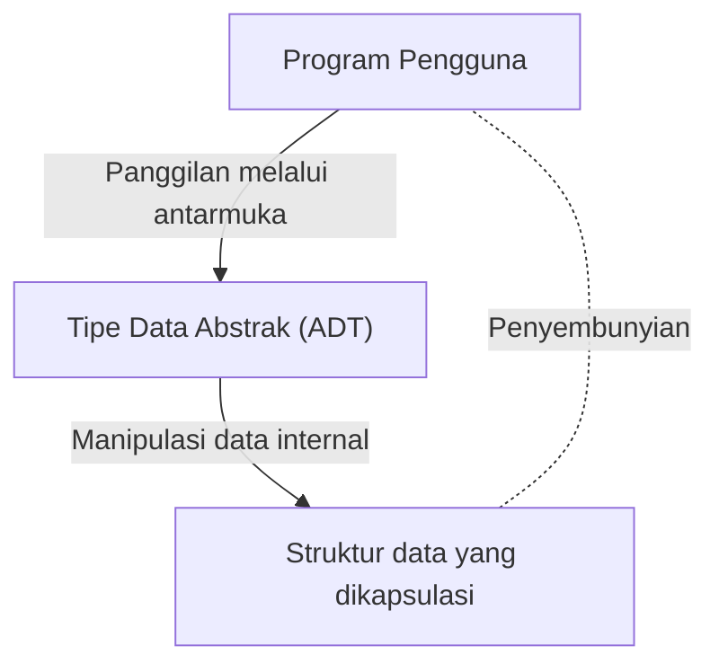

# Barbara Liskov: Ilmuwan Komputer yang Membangun Tipe Data Abstrak dan Sistem Terdistribusi

Dalam dunia rekayasa perangkat lunak, hanya sedikit pengembang yang tidak mengetahui "Prinsip Substitusi Liskov (Liskov Substitution Principle: LSP)", yang merupakan salah satu dari prinsip SOLID. Namun, asal usul nama tersebut, Barbara Liskov sendiri, tentang transformasi apa yang dibawanya dalam desain bahasa pemrograman dan sistem terdistribusi, terkadang tidak begitu diketahui. Artikel ini akan menjelaskan secara mendetail, dengan latar belakang teknis, perjalanan beliau sebagai salah satu wanita pertama di Amerika Serikat yang meraih gelar Ph.D. dalam ilmu komputer, penemuan "Tipe Data Abstrak" yang membentuk fondasi dari pemrograman berorientasi objek modern, hingga penelitian yang meletakkan dasar bagi sistem terdistribusi.

## 1. Masa Awal dan Kelahiran Ph.D. Wanita Pertama di AS

Barbara Liskov lahir pada tahun 1939 di California. Menunjukkan bakat luar biasa dalam matematika dan sains sejak usia dini, ia meraih gelar sarjana matematika dari University of California, Berkeley. Pada masa itu, sangat jarang bagi seorang wanita untuk mengejar bidang STEM (Sains, Teknologi, Teknik, dan Matematika), apalagi bidang ilmu komputer itu sendiri belum sepenuhnya mapan. Ketika ia ingin melanjutkan ke sekolah pascasarjana di departemen matematika Princeton University, ia menghadapi hambatan bahwa Princeton tidak menerima mahasiswa wanita pada waktu itu.

Namun, semangat pencariannya tidak berhenti di situ. Setelah bekerja di tempat-tempat seperti Massachusetts Institute of Technology (MIT), ia akhirnya masuk sekolah pascasarjana di Stanford University dan belajar di bawah bimbingan John McCarthy, salah satu bapak kecerdasan buatan. Pada tahun 1968, ia meraih gelar doktor untuk penelitian tentang kecerdasan buatan dengan fokus pada endgame permainan catur. Hal ini dicatat sebagai pencapaian bersejarah, menjadi salah satu contoh pertama di Amerika Serikat di mana seorang wanita meraih gelar doktor di bidang ilmu komputer.

## 2. Era Krisis Perangkat Lunak dan Tipe Data Abstrak

Setelah memperoleh gelar Ph.D., Liskov mulai bekerja sebagai peneliti di MITRE Corporation. Industri komputer pada saat itu sedang menghadapi era yang disebut "Krisis Perangkat Lunak". Kompleksitas perangkat lunak meledak dibandingkan dengan evolusi perangkat keras, yang secara signifikan menurunkan pemeliharaan dan penggunaan kembali kode. Program-program raksasa berubah menjadi kode spageti, dan sedikit perubahan dapat menyebabkan bug fatal di seluruh sistem.

Untuk mengatasi masalah ini, Liskov memusatkan perhatian pada konsep pengkapsulan representasi dan manipulasi data. Inilah awal mula "Tipe Data Abstrak (Abstract Data Type: ADT)". Tipe data abstrak adalah sebuah pendekatan yang menggabungkan struktur data dan operasi di atasnya ke dalam satu kesatuan, sehingga hanya dapat diakses dari luar melalui sebuah antarmuka (interface). Hal ini menyembunyikan implementasi internal (penyembunyian informasi) dan memungkinkan setiap modul dari sebuah program untuk dikembangkan dan diuji secara independen.

## 3. Pengembangan Bahasa CLU dan Pengaruhnya terhadap Orientasi Objek

Setelah menjadi profesor di MIT, Liskov merancang dan mengembangkan bahasa pemrograman baru bernama "CLU" pada tahun 1970-an untuk mendemonstrasikan konsep tipe data abstrak yang diusulkannya. Nama CLU berasal dari "Cluster", mencerminkan filosofi pengelompokan data dan operasinya ke dalam klaster.

CLU merupakan bahasa perintis yang pertama kali mempraktikkan banyak konsep yang esensial untuk bahasa pemrograman modern.
- **Iterators (Iterator):** Mekanisme untuk memproses elemen secara berurutan tanpa bergantung pada implementasi internal struktur data.
- **Exception Handling (Penanganan Pengecualian):** Mekanisme aman yang memisahkan aliran kontrol saat terjadi kesalahan dengan jelas.
- **Dasar Polimorfisme:** Operasi umum (generik) melalui tipe data yang diabstraksi.

Ide-ide inovatif ini kemudian memberikan pengaruh yang sangat besar pada desain bahasa pemrograman berorientasi objek yang populer, seperti Java, C++, Python, dan C#. Konsep seperti kelas, pengkapsulan, dan antarmuka yang kita gunakan sehari-hari merupakan perpanjangan langsung dari ide-ide yang diwujudkan Liskov melalui CLU.

## 4. Argus dan Tantangan Sistem Terdistribusi

Memasuki tahun 1980-an, minat Liskov beralih dari pemrograman pada satu komputer ke "sistem terdistribusi", di mana beberapa komputer berkolaborasi melalui jaringan. Meskipun sistem terdistribusi pada saat itu telah ada sebagai model teoretis, pengembangan praktisnya sangat sulit karena masalah kompleks seperti latensi jaringan, kegagalan, dan konsistensi data.

Untuk mengatasi tantangan ini, ia mengembangkan bahasa pemrograman terdistribusi "Argus". Fitur terpenting dari Argus adalah penggabungan proses yang disebut "Guardians" dalam lingkungan terdistribusi dengan konsep "Atomic Actions" atau transaksi, pada tingkat bahasa. Hal ini memungkinkan pengembangan aplikasi terdistribusi sambil menjaga konsistensi data, bahkan jika terjadi kegagalan jaringan atau kerusakan node (node crash).

Saat ini, toleransi kesalahan (fault tolerance) dan jaminan konsistensi telah menjadi persyaratan standar dalam komputasi awan (cloud computing), arsitektur layanan mikro (microservices), dan pemrosesan transaksi basis data. Namun, sebagian besar kerangka teori dan praktis yang mendasarinya berakar pada penelitian Liskov di Argus.

## 5. Prinsip Substitusi Liskov (LSP) dan Esensinya

Nama Liskov paling banyak dikenal melalui "Prinsip Substitusi Liskov (Liskov Substitution Principle)", yang dipresentasikan dalam pidato utama di OOPSLA pada tahun 1987, dan kemudian dirumuskan secara matematis dalam makalah kolaboratif dengan Jeannette Wing. Prinsip ini dikenal luas sebagai huruf "L" dari "Prinsip SOLID", yang merangkum praktik terbaik dalam desain berorientasi objek.

Definisi LSP adalah sebagai berikut.
"Jika S adalah subtipe dari T, maka objek bertipe T dalam sebuah program dapat digantikan dengan objek bertipe S tanpa mengubah kebenaran sifat dari program tersebut."

Prinsip ini bukan sekadar aturan pewarisan biasa. Ini mengekspresikan konsep mendalam tentang "Subtipe Perilaku (Behavioral Subtyping)". Sebuah kelas turunan tidak hanya harus mematuhi antarmuka kelas dasar, tetapi juga harus mematuhi "perilaku (kontrak)" yang dijanjikan oleh kelas dasar. Jika sebuah kelas turunan melanggar kontrak kelas dasar (misalnya, melemparkan pengecualian yang tidak mungkin terjadi di kelas dasar, atau melanggar prakondisi dan pascakondisi dari suatu keadaan (state)), maka kode yang memanfaatkan polimorfisme akan mengalami bug yang tidak terduga.

LSP memperluas teori tipe data abstrak dan telah menjadi panduan yang kuat untuk mengendalikan kompleksitas yang ditimbulkan oleh pewarisan. Dalam merancang arsitektur perangkat lunak yang tangguh dan mudah diperluas (scalable), LSP tetap menjadi kebenaran universal yang membimbing para pengembang hingga hari ini.

## 6. Penghargaan Turing dan Pengaruh terhadap Generasi Penerus

Berkat berbagai kontribusi besar ini, Barbara Liskov menerima "Turing Award", yang sering disebut sebagai Penghargaan Nobel di bidang ilmu komputer, pada tahun 2008. Alasan penganugerahan tersebut adalah untuk "kontribusi praktis dan teoretis pada dasar-dasar bahasa pemrograman dan desain sistem, khususnya pada abstraksi data, toleransi kesalahan (fault tolerance), dan komputasi terdistribusi."

Esensi dari penelitiannya selalu berakar pada perspektif praktis mengenai "bagaimana sistem yang kompleks dapat dibangun dengan aman dan mudah dipahami oleh manusia." Gayanya yang menyeimbangkan antara ketelitian matematis dan masalah praktis dalam rekayasa (engineering) terus memberikan inspirasi bagi banyak peneliti dan insinyur.

Pencapaian Barbara Liskov telah meresap ke setiap sudut kode yang kita tulis setiap hari. Setiap kali kita mengenkapsulasi variabel, mendefinisikan antarmuka, dan merancang layanan mikro (microservices), kita sedang melangkah di jalan yang telah dirintisnya. Saat melihat kembali sejarah rekayasa perangkat lunak, kita tidak bisa untuk tidak menyadari betapa dalam wawasan dan kreativitasnya telah membentuk dunia.
