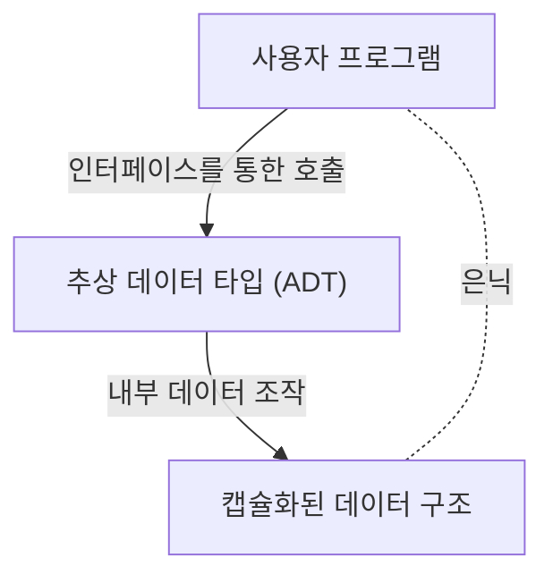

# 바바라 리스코프: 추상 데이터 타입과 분산 시스템을 구축한 컴퓨터 과학자

소프트웨어 엔지니어링 세계에서 SOLID 원칙 중 하나인 '리스코프 치환 원칙(Liskov Substitution Principle: LSP)'을 모르는 개발자는 드물 것입니다. 하지만 그 이름의 유래인 바바라 리스코프(Barbara Liskov) 자신이 프로그래밍 언어 설계나 분산 시스템에서 어떠한 변혁을 가져왔는지에 대해서는 의외로 잘 알려져 있지 않은 경우가 있습니다. 본 기사에서는 미국 최초의 여성 컴퓨터 과학 Ph.D. 중 한 명으로서의 그녀의 행보부터 현대 객체 지향 프로그래밍의 근간을 이루는 '추상 데이터 타입'의 발명, 그리고 분산 시스템의 초석을 다진 연구까지 기술적 배경과 함께 상세히 해설합니다.

## 1. 여명기와 미국 최초의 여성 Ph.D. 탄생

바바라 리스코프는 1939년 캘리포니아주에서 태어났습니다. 어린 시절부터 수학과 과학에 비범한 재능을 보였던 그녀는 캘리포니아 대학교 버클리에서 수학 학사 학위를 취득했습니다. 당시 여성이 STEM(과학, 기술, 공학, 수학) 분야로 진출하는 것은 극히 드문 일이었고, 하물며 컴퓨터 과학이라는 학문 영역 자체가 아직 확립되지 않은 시대였습니다. 그녀가 프린스턴 대학교 수학과 대학원에 진학을 희망했을 때, 당시 프린스턴은 여성의 입학을 허용하지 않는다는 장벽에 직면하게 됩니다.

하지만 그녀의 탐구심은 거기서 멈추지 않았습니다. 메사추세츠 공과대학교(MIT) 등에서의 직장을 거쳐, 마침내 스탠포드 대학교 대학원에 진학하여 인공지능의 아버지 중 한 명인 존 매카시의 지도 아래 수학합니다. 1968년, 그녀는 체스 엔드게임을 주제로 한 인공지능 연구로 박사 학위를 취득했습니다. 이는 미국에서 여성이 컴퓨터 과학 분야에서 박사 학위를 취득한 최초의 사례 중 하나로 역사적인 위업으로 기록되어 있습니다.

## 2. 소프트웨어 위기의 시대와 추상 데이터 타입

박사 학위를 취득한 리스코프는 마이터(MITRE) 코퍼레이션에서 연구원으로 일하기 시작합니다. 당시 컴퓨터 업계는 '소프트웨어 위기'라 불리는 시대에 직면해 있었습니다. 하드웨어의 진화에 비해 소프트웨어의 복잡성이 폭발적으로 증가하여 코드의 유지보수성이나 재사용성이 현저히 떨어지고 있었습니다. 거대한 프로그램은 스파게티 코드가 되었고, 약간의 변경이 시스템 전체에 치명적인 버그를 일으키는 상황이 만연했습니다.

이 문제에 대처하기 위해 리스코프는 데이터의 표현과 조작을 캡슐화하는 개념에 주목했습니다. 이것이 '추상 데이터 타입(Abstract Data Type: ADT)'의 시작입니다. 추상 데이터 타입이란 데이터의 구조와 그에 대한 조작을 하나로 묶어, 외부에서는 인터페이스를 통해서만 접근할 수 있도록 하는 기법입니다. 이를 통해 내부 구현을 숨기고(정보 은닉), 프로그램의 각 모듈이 독립적으로 개발 및 테스트될 수 있게 됩니다.

## 3. CLU 언어의 개발과 객체 지향에 미친 영향

MIT 교수가 된 리스코프는 자신이 제창한 추상 데이터 타입의 개념을 입증하기 위해 1970년대에 새로운 프로그래밍 언어 'CLU(클루)'를 설계하고 개발했습니다. CLU라는 이름은 '클러스터(Cluster)'에서 유래했으며, 데이터와 그 조작을 클러스터로 그룹화한다는 사상을 반영하고 있습니다.

CLU는 현대 프로그래밍 언어에 필수적인 많은 개념을 처음으로 실용화한 획기적인 언어입니다.
- **이터레이터 (Iterators):** 데이터 구조의 내부 구현에 의존하지 않고 요소를 순차적으로 처리하는 메커니즘.
- **예외 처리 (Exception Handling):** 에러 발생 시 처리 흐름을 명확히 분리하는 안전한 메커니즘.
- **다형성의 기초:** 추상화된 데이터 타입을 통한 범용적인 조작.

이러한 혁신적인 아이디어는 이후 Java, C++, Python, C# 등 널리 보급된 객체 지향 프로그래밍 언어의 설계에 지대한 영향을 미쳤습니다. 우리가 일상적으로 사용하는 클래스나 캡슐화, 인터페이스 같은 개념은 리스코프가 CLU를 통해 구현한 아이디어의 직접적인 연장선상에 있습니다.

## 4. Argus와 분산 시스템을 향한 도전

1980년대에 들어서면서 리스코프의 관심은 단일 컴퓨터 상에서의 프로그래밍에서 여러 컴퓨터가 네트워크를 통해 협조하는 '분산 시스템'으로 옮겨갑니다. 당시 분산 시스템은 이론적 모델로는 존재했지만, 네트워크의 지연이나 장애, 데이터 정합성 등의 복잡한 과제로 인해 실용적인 개발은 매우 어려웠습니다.

그녀는 이 과제에 대응하기 위해 분산 프로그래밍 언어 'Argus'를 개발했습니다. Argus의 가장 큰 특징은 분산 환경에서의 '가디언(Guardians)'이라 불리는 프로세스와 '원자적 액션(Atomic Actions)' 즉 트랜잭션의 개념을 언어 수준에서 통합했다는 점입니다. 이로 인해 네트워크 장애나 노드 충돌이 발생해도 데이터 정합성을 유지하면서 분산 애플리케이션을 구축할 수 있게 되었습니다.

오늘날 클라우드 컴퓨팅이나 마이크로서비스 아키텍처, 데이터베이스 트랜잭션 처리에서 장애 허용성(내결함성)이나 정합성 보장은 당연한 요구사항이 되었지만, 그 기반이 되는 이론이나 실천적 틀의 상당수는 리스코프의 Argus 연구가 초석이 되었습니다.

## 5. 리스코프 치환 원칙(LSP)과 그 본질

리스코프의 이름을 가장 널리 알린 것은 1987년 OOPSLA 기조연설에서 발표되고 이후 자넷 윙과의 공동 논문으로 수학적으로 공식화된 '리스코프 치환 원칙(Liskov Substitution Principle)'입니다. 이는 객체 지향 설계의 모범 사례를 정리한 'SOLID 원칙'의 'L'로 널리 보급되어 있습니다.

LSP의 정의는 다음과 같습니다.
「만약 S가 T의 서브타입이라면, 프로그램에서 T 타입의 객체가 사용되는 곳은 프로그램의 정확성을 변경하지 않고 S 타입의 객체로 치환할 수 있어야 한다.」

이 원칙은 단순한 상속 규칙이 아닙니다. '행위적 서브타이핑(Behavioral Subtyping)'이라는 깊은 개념을 표현하고 있습니다. 파생 클래스는 기본 클래스의 인터페이스뿐만 아니라 기본 클래스가 약속한 '행위(계약)'도 지켜야 합니다. 만약 파생 클래스가 기본 클래스의 계약을 위반하면(예를 들어 기본 클래스에서는 발생할 수 없는 예외를 던지거나, 상태의 사전·사후 조건을 침해하는 등) 다형성을 이용하는 코드는 예기치 않은 버그에 직면하게 됩니다.

LSP는 추상 데이터 타입의 이론을 확장하여 상속이 초래하는 복잡성을 제어하기 위한 강력한 이정표가 되었습니다. 견고하고 확장성 높은 소프트웨어 아키텍처를 설계하는 데 있어 LSP는 지금도 보편적인 진리로서 개발자를 안내하고 있습니다.

## 6. 튜링상 수상과 후학들에게 미친 영향

이러한 지대한 공헌으로 바바라 리스코프는 2008년 컴퓨터 과학계의 노벨상이라 불리는 '튜링상'을 수상했습니다. 수상 이유는 "프로그래밍 언어와 시스템 설계의 기초, 특히 데이터 추상화, 내결함성, 분산 컴퓨팅에 대한 실천적이고 이론적인 공헌"이었습니다.

그녀의 연구 본질은 항상 '어떻게 하면 복잡한 시스템을 인간이 이해하기 쉽고 안전하게 구축할 수 있을까'라는 실용적인 관점에 뿌리를 두고 있습니다. 수학적 엄밀함과 엔지니어링의 현실적 과제 사이에서 균형을 맞추는 그녀의 스타일은 많은 연구자와 엔지니어에게 지속적인 영감을 주고 있습니다.

바바라 리스코프의 업적은 우리가 일상적으로 작성하는 코드 구석구석에 스며들어 있습니다. 변수를 캡슐화하고, 인터페이스를 정의하고, 마이크로서비스를 설계할 때마다 우리는 그녀가 개척한 길을 걷고 있는 것입니다. 소프트웨어 엔지니어링의 역사를 되돌아볼 때, 그녀의 통찰력과 창조성이 세상을 얼마나 형성해 왔는지 다시금 깨닫지 않을 수 없습니다.
