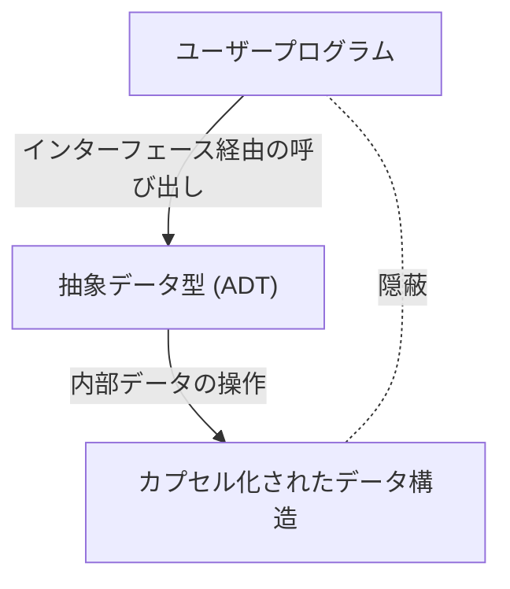

# バーバラ・リスコフ：抽象データ型と分散システムを築いた計算機科学者

ソフトウェアエンジニアリングの世界において、SOLID原則の一つである「リスコフの置換原則 (Liskov Substitution Principle: LSP)」を知らない開発者は少ないでしょう。しかし、その名前の由来であるバーバラ・リスコフ（Barbara Liskov）自身が、プログラミング言語設計や分散システムにおいてどのような変革をもたらしたかについては、意外と知られていないことがあります。本記事では、米国初の女性コンピュータサイエンスPh.D.の一人としての彼女の歩みから、現代のオブジェクト指向プログラミングの根幹をなす「抽象データ型」の発明、そして分散システムの礎を築いた研究までを、技術的な背景を交えて詳細に解説します。

## 1. 黎明期と米国初の女性Ph.D.の誕生

バーバラ・リスコフは1939年、カリフォルニア州に生まれました。幼少期から数学や科学に対して非凡な才能を示していた彼女は、カリフォルニア大学バークレー校で数学の学士号を取得しました。当時、女性がSTEM分野（科学・技術・工学・数学）に進むことは極めて稀であり、ましてやコンピュータサイエンスという学問領域自体がまだ確立されていない時代でした。彼女がプリンストン大学の数学科の大学院へ進学を希望した際、当時のプリンストンは女性の入学を認めていないという障壁に直面します。

しかし、彼女の探求心はそこで途絶えることはありませんでした。マサチューセッツ工科大学 (MIT) などでの職を経て、最終的にスタンフォード大学の大学院に進学し、人工知能の父の一人であるジョン・マッカーシーの指導の下で学びます。1968年、彼女はチェスのエンドゲームを題材にした人工知能に関する研究で博士号を取得しました。これは、アメリカにおいて女性がコンピュータサイエンス分野で博士号を取得した最初の例の一つとして、歴史的な偉業として記録されています。

## 2. ソフトウェア危機の時代と抽象データ型

博士号を取得したリスコフは、MITREコーポレーションで研究者として働き始めます。当時のコンピュータ業界は「ソフトウェア危機」と呼ばれる時代に直面していました。ハードウェアの進化に対してソフトウェアの複雑性が爆発的に増加し、コードの保守性や再利用性が著しく低下していたのです。巨大なプログラムはスパゲッティコード化し、少しの変更がシステム全体に致命的なバグを引き起こす状況が蔓延していました。

この問題に対処するため、リスコフはデータの表現と操作をカプセル化する概念に着目しました。これが「抽象データ型 (Abstract Data Type: ADT)」の始まりです。抽象データ型とは、データの構造とそれに対する操作をひとまとめにし、外部からはインターフェースを通じてのみアクセスできるようにする手法です。これにより、内部の実装を隠蔽（情報隠蔽）し、プログラムの各モジュールが独立して開発・テストできるようになります。

## 3. CLU言語の開発とオブジェクト指向への影響

MITの教授となったリスコフは、自らが提唱した抽象データ型の概念を実証するため、1970年代に新しいプログラミング言語「CLU（クルー）」を設計・開発しました。CLUという名前は「Cluster（クラスター）」に由来し、データとその操作をクラスターとしてグループ化するという思想を反映しています。

CLUは、現代のプログラミング言語に不可欠な多くの概念を初めて実用化した画期的な言語です。
- **イテレータ (Iterators):** データ構造の内部実装に依存せずに要素を順次処理する仕組み。
- **例外処理 (Exception Handling):** エラー発生時の処理フローを明確に分離する安全な機構。
- **ポリモーフィズムの基礎:** 抽象化されたデータ型を通じた汎用的な操作。

これらの革新的なアイデアは、後にJava、C++、Python、C#など、広く普及したオブジェクト指向プログラミング言語の設計に絶大な影響を与えました。私たちが日常的に利用しているクラスやカプセル化、インターフェースといった概念は、リスコフがCLUを通じて具現化したアイデアの直接的な延長線上にあります。

## 4. Argusと分散システムへの挑戦

1980年代に入ると、リスコフの関心は単一のコンピュータ上でのプログラミングから、複数のコンピュータがネットワークを通じて協調する「分散システム」へと移ります。当時、分散システムは理論的なモデルとしては存在していたものの、ネットワークの遅延や障害、データの整合性といった複雑な課題により、実用的な開発は極めて困難でした。

彼女はこの課題に対して、分散プログラミング言語「Argus」を開発しました。Argusの最大の特徴は、分散環境における「ガーディアン (Guardians)」と呼ばれるプロセスと、「アトミックアクション (Atomic Actions)」すなわちトランザクションの概念を言語レベルで統合した点にあります。これにより、ネットワーク障害やノードのクラッシュが発生しても、データの整合性を維持しながら分散アプリケーションを構築することが可能になりました。

今日、クラウドコンピューティングやマイクロサービスアーキテクチャ、データベースのトランザクション処理において、障害耐性（フォールトトレランス）や整合性の保証は当たり前の要求となっていますが、その基盤となる理論や実践的な枠組みの多くは、リスコフのArgusにおける研究が礎となっています。

## 5. リスコフの置換原則 (LSP) とその本質

リスコフの名前を最も広く知らしめているのが、1987年にOOPSLAの基調講演で発表され、後にジャネット・ウィングとの共同論文で数学的に定式化された「リスコフの置換原則 (Liskov Substitution Principle)」です。これは、オブジェクト指向設計のベストプラクティスをまとめた「SOLID原則」の「L」として広く普及しています。

LSPの定義は以下のようなものです。
「もし S が T のサブタイプであれば、プログラム中で T 型のオブジェクトが使われている箇所は、プログラムの正当性を変えることなく S 型のオブジェクトで置き換えることができるべきである。」

この原則は、単なる継承のルールではありません。「振る舞いのサブタイピング (Behavioral Subtyping)」という深い概念を表現しています。派生クラスは、基底クラスのインターフェースだけでなく、基底クラスが約束した「振る舞い（契約）」をも守らなければなりません。もし派生クラスが基底クラスの契約を破る（例えば、基底クラスでは起こり得ない例外を投げる、状態の事前・事後条件を侵害するなど）と、ポリモーフィズムを利用するコードは予期せぬバグに見舞われます。

LSPは、抽象データ型の理論を拡張し、継承がもたらす複雑性を制御するための強力な道標となりました。堅牢で拡張性の高いソフトウェアアーキテクチャを設計する上で、LSPは今なお普遍的な真理として開発者を導いています。

## 6. チューリング賞の受賞と後進への影響

これらの多大な貢献により、バーバラ・リスコフは2008年にコンピュータサイエンス界のノーベル賞と称される「チューリング賞」を受賞しました。授賞理由は「プログラミング言語とシステム設計の基礎、特にデータの抽象化、フォールトトレランス、分散コンピューティングへの実践的および理論的な貢献」というものでした。

彼女の研究の本質は、常に「いかにして複雑なシステムを人間が理解しやすく、安全に構築できるか」という実用的な視点に根ざしています。数学的な厳密さとエンジニアリングの現実的な課題のバランスをとる彼女のスタイルは、多くの研究者やエンジニアにインスピレーションを与え続けています。

バーバラ・リスコフの功績は、私たちが日常的に書くコードの隅々にまで浸透しています。変数をカプセル化し、インターフェースを定義し、マイクロサービスを設計するたびに、私たちは彼女が切り拓いた道を歩んでいるのです。ソフトウェアエンジニアリングの歴史を振り返るとき、彼女の洞察力と創造性がどれほど世界を形作ってきたかを再認識せずにはいられません。
