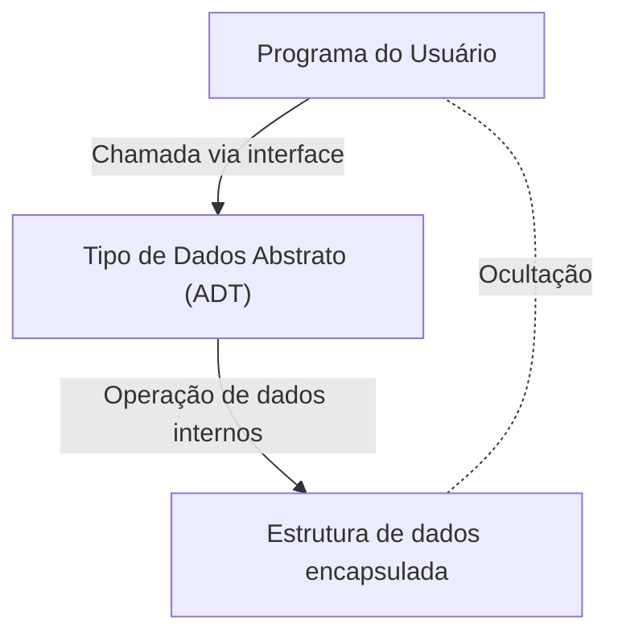

# Barbara Liskov: A Cientista da Computação que Construiu os Tipos de Dados Abstratos e Sistemas Distribuídos

No mundo da engenharia de software, poucos desenvolvedores desconhecem o "Princípio da Substituição de Liskov (Liskov Substitution Principle: LSP)", um dos princípios SOLID. No entanto, o que surpreendentemente não é tão conhecido são as transformações que a própria Barbara Liskov, de quem o nome se origina, trouxe no design de linguagens de programação e em sistemas distribuídos. Neste artigo, detalharemos sua jornada como uma das primeiras mulheres a obter um Ph.D. em Ciência da Computação nos EUA, a invenção do "Tipo de Dados Abstrato", que forma a base da programação orientada a objetos moderna, e suas pesquisas que estabeleceram as bases dos sistemas distribuídos, com o devido contexto técnico.

## 1. O Alvorecer e o Nascimento da Primeira Mulher com Ph.D. nos EUA

Barbara Liskov nasceu na Califórnia em 1939. Desde cedo, demonstrando um talento excepcional para matemática e ciências, ela obteve seu diploma de bacharel em matemática pela Universidade da Califórnia, Berkeley. Naquela época, era extremamente raro mulheres ingressarem nas áreas STEM (Ciência, Tecnologia, Engenharia e Matemática), sem mencionar que o próprio campo da ciência da computação ainda não estava estabelecido. Quando ela quis se matricular na pós-graduação no departamento de matemática da Universidade de Princeton, enfrentou a barreira de que Princeton não aceitava mulheres na época.

No entanto, seu espírito de investigação não parou por aí. Após trabalhar em lugares como o Instituto de Tecnologia de Massachusetts (MIT), ela finalmente ingressou na pós-graduação da Universidade de Stanford, onde estudou sob a orientação de John McCarthy, um dos pais da inteligência artificial. Em 1968, ela obteve seu doutorado em uma pesquisa sobre inteligência artificial focada nos finais de jogos de xadrez. Isso é registrado como um feito histórico, sendo um dos primeiros casos de uma mulher obtendo um doutorado na área de ciência da computação nos Estados Unidos.

## 2. A Era da Crise do Software e os Tipos de Dados Abstratos

Após obter seu doutorado, Liskov começou a trabalhar como pesquisadora na MITRE Corporation. A indústria de computadores da época enfrentava uma era chamada de "crise do software". Em contraste com a evolução do hardware, a complexidade do software havia aumentado explosivamente, e a manutenibilidade e a reutilização do código haviam diminuído significativamente. Programas gigantescos se tornavam código espaguete, e a situação em que uma pequena mudança causava bugs fatais em todo o sistema era predominante.

Para resolver esse problema, Liskov focou no conceito de encapsulamento da representação e manipulação de dados. Este foi o início do "Tipo de Dados Abstrato (Abstract Data Type: ADT)". O tipo de dados abstrato é uma técnica que agrupa a estrutura de dados e suas operações, permitindo acesso externo apenas por meio de uma interface. Isso oculta a implementação interna (ocultação de informações) e permite que cada módulo do programa seja desenvolvido e testado independentemente.

## 3. Desenvolvimento da Linguagem CLU e o Impacto na Orientação a Objetos

Tornando-se professora no MIT, Liskov projetou e desenvolveu uma nova linguagem de programação, a "CLU", na década de 1970, para demonstrar o conceito de tipos de dados abstratos que ela propôs. O nome CLU deriva de "Cluster", refletindo a filosofia de agrupar dados e suas operações como um cluster.

A CLU foi uma linguagem inovadora que, pela primeira vez, colocou em prática muitos conceitos essenciais nas linguagens de programação modernas.
- **Iteradores (Iterators):** Um mecanismo para processar elementos sequencialmente sem depender da implementação interna da estrutura de dados.
- **Tratamento de Exceções (Exception Handling):** Um mecanismo seguro que separa claramente o fluxo de processamento quando ocorre um erro.
- **Base do Polimorfismo:** Operações de uso geral por meio de tipos de dados abstraídos.

Essas ideias inovadoras tiveram mais tarde uma enorme influência no design de linguagens de programação orientadas a objetos amplamente populares, como Java, C++, Python e C#. Os conceitos de classes, encapsulamento e interfaces que usamos diariamente são extensões diretas das ideias que Liskov materializou por meio da CLU.

## 4. Argus e o Desafio dos Sistemas Distribuídos

Na década de 1980, o interesse de Liskov mudou da programação em um único computador para "sistemas distribuídos", onde vários computadores colaboram por meio de uma rede. Naquela época, embora os sistemas distribuídos existissem como modelos teóricos, o desenvolvimento prático era extremamente difícil devido a desafios complexos como latência de rede, falhas e consistência de dados.

Para resolver esse desafio, ela desenvolveu a linguagem de programação distribuída "Argus". A maior característica do Argus foi a integração em nível de linguagem de processos chamados "Guardiões (Guardians)" em um ambiente distribuído e o conceito de "Ações Atômicas (Atomic Actions)", ou seja, transações. Isso tornou possível construir aplicativos distribuídos mantendo a consistência dos dados, mesmo que ocorressem falhas de rede ou travamentos de nós.

Hoje, em computação em nuvem, arquitetura de microsserviços e processamento de transações de banco de dados, a tolerância a falhas e a garantia de consistência tornaram-se requisitos óbvios, mas muitas de suas bases teóricas e estruturas práticas estão fundamentadas na pesquisa de Liskov sobre o Argus.

## 5. Princípio da Substituição de Liskov (LSP) e Sua Essência

O que tornou o nome de Liskov mais amplamente conhecido é o "Princípio da Substituição de Liskov (Liskov Substitution Principle)", apresentado em um discurso na OOPSLA em 1987 e, mais tarde, formulado matematicamente em um artigo em coautoria com Jeannette Wing. Ele é amplamente difundido como o "L" dos "Princípios SOLID", que resumem as melhores práticas do design orientado a objetos.

A definição do LSP é a seguinte:
"Se S é um subtipo de T, então os objetos do tipo T em um programa podem ser substituídos por objetos do tipo S sem alterar as propriedades desejáveis desse programa."

Esse princípio não é apenas uma regra de herança. Ele expressa o conceito profundo de "Subtipagem Comportamental (Behavioral Subtyping)". A classe derivada deve obedecer não apenas à interface da classe base, mas também ao "comportamento (contrato)" prometido por ela. Se a classe derivada quebrar o contrato da classe base (por exemplo, lançando uma exceção que não ocorreria na classe base, ou violando as pré-condições e pós-condições de estado), o código que utiliza polimorfismo enfrentará bugs inesperados.

O LSP expandiu a teoria dos tipos de dados abstratos e se tornou um poderoso guia para controlar a complexidade trazida pela herança. Na concepção de arquiteturas de software robustas e altamente escaláveis, o LSP continua a guiar os desenvolvedores como uma verdade universal.

## 6. O Prêmio Turing e o Impacto nas Novas Gerações

Por essas imensas contribuições, Barbara Liskov recebeu o "Prêmio Turing", muitas vezes chamado de Prêmio Nobel da Ciência da Computação, em 2008. O motivo da premiação foram suas "contribuições práticas e teóricas aos fundamentos das linguagens de programação e design de sistemas, especialmente em relação à abstração de dados, tolerância a falhas e computação distribuída".

A essência de sua pesquisa está sempre enraizada na perspectiva prática de "como os humanos podem construir sistemas complexos de forma mais compreensível e segura". Seu estilo de equilibrar o rigor matemático e os desafios realistas da engenharia continua a inspirar muitos pesquisadores e engenheiros.

As conquistas de Barbara Liskov permeiam todos os cantos do código que escrevemos todos os dias. Toda vez que encapsulamos uma variável, definimos uma interface ou projetamos um microsserviço, estamos caminhando pelo caminho que ela desbravou. Ao refletirmos sobre a história da engenharia de software, é impossível não reconhecer novamente o quanto sua visão e criatividade moldaram o mundo.
