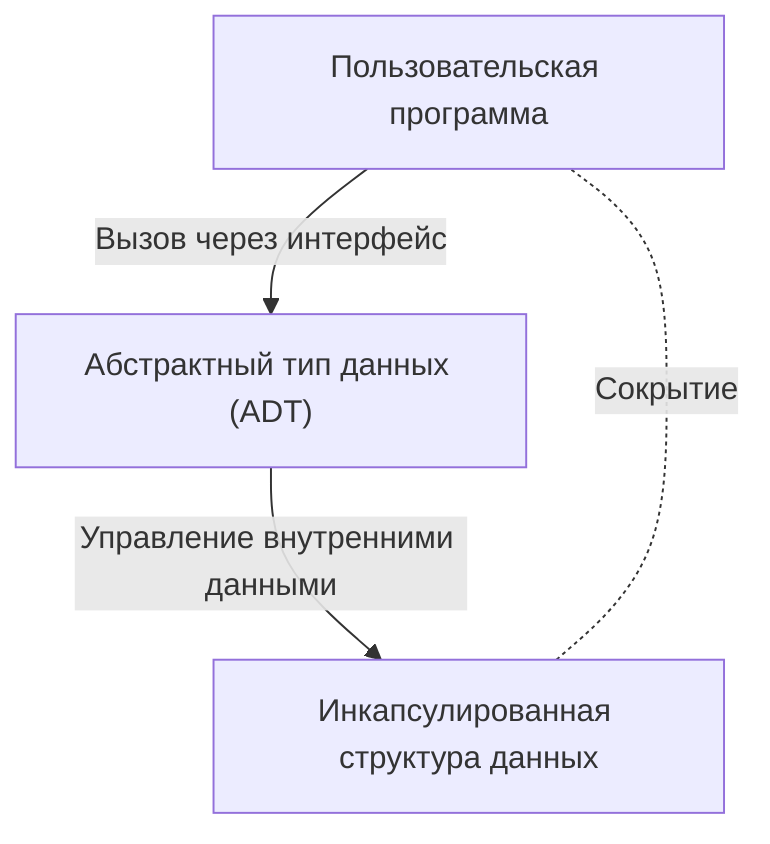

# Барбара Лисков: Ученый в области информатики, создавшая абстрактные типы данных и распределенные системы

В мире программной инженерии мало кто из разработчиков не знает о «Принципе подстановки Лисков (Liskov Substitution Principle: LSP)», одном из принципов SOLID. Однако удивительно мало известно о том, как сама Барбара Лисков (Barbara Liskov), в честь которой он назван, произвела революцию в проектировании языков программирования и распределенных системах. В этой статье мы подробно рассмотрим её путь, начиная с получения одной из первых в США степени доктора философии (Ph.D.) по информатике среди женщин, до изобретения «абстрактных типов данных», лежащих в основе современного объектно-ориентированного программирования, и исследований, заложивших фундамент распределенных систем, включая технический контекст.

## 1. Ранние годы и рождение одной из первых женщин с Ph.D. в США

Барбара Лисков родилась в 1939 году в Калифорнии. С ранних лет проявляя незаурядные способности к математике и естественным наукам, она получила степень бакалавра математики в Калифорнийском университете в Беркли. В то время женщины крайне редко выбирали сферу STEM (наука, технологии, инженерия, математика), а информатика как академическая дисциплина еще не сформировалась. Когда она захотела поступить в аспирантуру на математический факультет Принстонского университета, то столкнулась с тем, что Принстон в то время не принимал женщин.

Однако ее стремление к знаниям на этом не угасло. Поработав в Массачусетском технологическом институте (MIT) и других местах, она в итоге поступила в аспирантуру Стэнфордского университета, где училась под руководством Джона Маккарти, одного из отцов искусственного интеллекта. В 1968 году она получила докторскую степень (Ph.D.) за исследования в области искусственного интеллекта на тему эндшпиля в шахматах. Это вошло в историю как один из первых случаев получения женщиной докторской степени по информатике в США.

## 2. Эпоха кризиса программного обеспечения и абстрактные типы данных

Получив степень доктора, Лисков начала работать исследователем в корпорации MITRE. В то время компьютерная индустрия столкнулась с эпохой, названной «кризисом программного обеспечения». Сложность программного обеспечения росла взрывными темпами по сравнению с развитием аппаратного обеспечения, а удобство сопровождения и возможность повторного использования кода значительно снижались. Огромные программы превращались в спагетти-код, где малейшее изменение могло вызвать фатальные ошибки во всей системе.

Чтобы решить эту проблему, Лисков сосредоточилась на концепции инкапсуляции представления и управления данными. Это стало началом «абстрактных типов данных (Abstract Data Type: ADT)». Абстрактный тип данных — это метод объединения структуры данных и операций над ней, при котором доступ извне возможен только через интерфейс. Это позволяет скрыть внутреннюю реализацию (сокрытие информации) и дает возможность разрабатывать и тестировать каждый модуль программы независимо.

## 3. Разработка языка CLU и влияние на объектно-ориентированное программирование

Став профессором в MIT, Лисков в 1970-х годах спроектировала и разработала новый язык программирования «CLU» для демонстрации предложенной ею концепции абстрактных типов данных. Название CLU происходит от слова «Cluster» (кластер) и отражает идею группировки данных и операций над ними в кластеры.

CLU стал новаторским языком, впервые внедрившим на практике многие концепции, необходимые для современных языков программирования.
- **Итераторы (Iterators):** Механизм последовательной обработки элементов без зависимости от внутренней реализации структуры данных.
- **Обработка исключений (Exception Handling):** Безопасный механизм, четко отделяющий поток управления при возникновении ошибки.
- **Основы полиморфизма:** Универсальные операции посредством абстрагированных типов данных.

Эти инновационные идеи впоследствии оказали огромное влияние на проектирование таких широко распространенных объектно-ориентированных языков, как Java, C++, Python и C#. Понятия, которые мы используем повседневно, такие как классы, инкапсуляция и интерфейсы, являются прямым продолжением идей, воплощенных Лисков в языке CLU.

## 4. Argus и вызовы распределенных систем

В 1980-х годах интерес Лисков сместился от программирования на отдельном компьютере к «распределенным системам», где множество компьютеров взаимодействуют через сеть. Хотя в то время распределенные системы существовали в виде теоретических моделей, практическая разработка была крайне сложной из-за сетевых задержек, сбоев и проблем с целостностью данных.

В ответ на этот вызов она разработала язык распределенного программирования «Argus». Главной особенностью Argus стала интеграция на уровне языка концепции процессов, называемых «опекунами (Guardians)», и «атомарных действий (Atomic Actions)», то есть транзакций в распределенной среде. Это позволило создавать распределенные приложения с сохранением целостности данных даже в случае сбоев сети или падения узлов.

Сегодня гарантии отказоустойчивости (fault tolerance) и целостности данных стали стандартным требованием в облачных вычислениях, микросервисной архитектуре и обработке транзакций в базах данных, но многие теоретические и практические основы для них были заложены в исследованиях Лисков в рамках проекта Argus.

## 5. Принцип подстановки Лисков (LSP) и его суть

Имя Лисков наиболее широко известно благодаря «Принципу подстановки Лисков (Liskov Substitution Principle)», представленному в программном докладе на конференции OOPSLA в 1987 году и позже математически формализованному в совместной статье с Дженнет Уинг. Он широко известен как буква «L» в принципах «SOLID», обобщающих лучшие практики объектно-ориентированного проектирования.

Определение LSP звучит следующим образом:
«Если S является подтипом T, то объекты типа T в программе могут быть заменены объектами типа S без изменения желаемых свойств программы.»

Этот принцип не является просто правилом наследования. Он выражает глубокую концепцию «поведенческого субтипирования (Behavioral Subtyping)». Производный класс должен соблюдать не только интерфейс базового класса, но и «поведение (контракт)», обещанное базовым классом. Если производный класс нарушает контракт базового (например, генерирует исключения, которые не могут возникнуть в базовом классе, или нарушает пред- и постусловия состояния), то код, использующий полиморфизм, столкнется с непредвиденными ошибками.

LSP расширил теорию абстрактных типов данных и стал мощным ориентиром для управления сложностью, возникающей при наследовании. При проектировании надежной и масштабируемой архитектуры программного обеспечения LSP по-прежнему направляет разработчиков как универсальная истина.

## 6. Премия Тьюринга и влияние на новые поколения

За эти выдающиеся заслуги Барбара Лисков в 2008 году была удостоена премии Тьюринга, которую часто называют «Нобелевской премией в области информатики». Причина присуждения премии звучала как: «За вклад в практические и теоретические основы проектирования языков программирования и систем, особенно в области абстракции данных, отказоустойчивости и распределенных вычислений».

Суть её исследований всегда коренилась в практической перспективе: «как создать сложные системы безопасными и понятными для человека». Её стиль, балансирующий между математической строгостью и реальными инженерными задачами, продолжает вдохновлять многих исследователей и инженеров.

Достижения Барбары Лисков пронизывают каждый уголок кода, который мы пишем повседневно. Каждый раз, когда мы инкапсулируем переменные, определяем интерфейсы или проектируем микросервисы, мы идем по пути, проложенному ею. Оглядываясь на историю программной инженерии, невозможно не осознать заново, насколько сильно ее проницательность и креативность сформировали наш мир.
