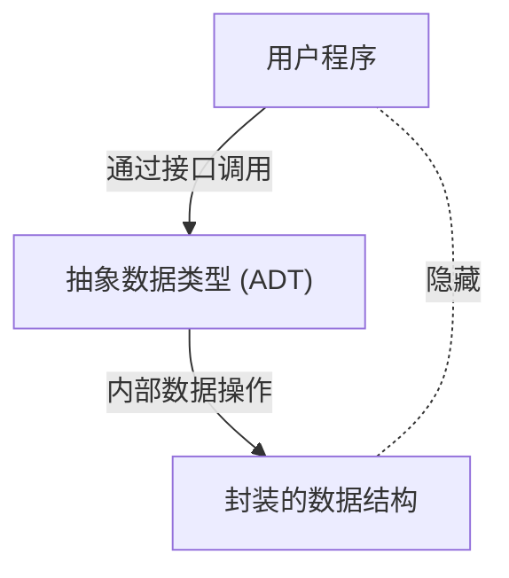

# 芭芭拉·利斯科夫：开创抽象数据类型与分布式系统的计算机科学家

在软件工程的世界里，很少有开发者不知道SOLID原则之一的“里氏替换原则 (Liskov Substitution Principle: LSP)”。然而，这个名字的由来——芭芭拉·利斯科夫（Barbara Liskov）本人在编程语言设计和分布式系统方面带来了怎样的变革，却出人意料地鲜为人知。本文将结合技术背景，详细解说她作为美国首批获得计算机科学博士学位的女性之一的历程，她发明的构成现代面向对象编程基础的“抽象数据类型”，以及她为分布式系统奠定基础的研究。

## 1. 黎明期与美国首批女性Ph.D.的诞生

芭芭拉·利斯科夫于1939年出生在加利福尼亚州。从小她就在数学和科学方面展现出非凡的天赋，并在加州大学伯克利分校获得了数学学士学位。当时，女性进入STEM（科学、技术、工程、数学）领域是非常罕见的，更不用说计算机科学这个学科领域本身在当时还未完全确立。当她希望进入普林斯顿大学数学系研究生院进修时，她面临着当时的普林斯顿不接受女性入学的障碍。

然而，她的探索精神并没有因此中断。在麻省理工学院 (MIT) 等地工作后，她最终进入斯坦福大学研究生院，在人工智能之父之一的约翰·麦卡锡的指导下学习。1968年，她凭借关于以国际象棋残局为题材的人工智能研究获得了博士学位。这作为美国女性在计算机科学领域获得博士学位的首批案例之一，被作为历史性的伟业记录下来。

## 2. 软件危机时代与抽象数据类型

获得博士学位后，利斯科夫开始在MITRE公司作为研究员工作。当时的计算机行业正面临被称为“软件危机”的时代。相对于硬件的进化，软件的复杂性呈爆炸式增长，代码的可维护性和可重用性显著下降。庞大的程序变成了意大利面条式代码，微小的修改就会在整个系统中引起致命错误的状况蔓延开来。

为了应对这个问题，利斯科夫将目光投向了封装数据表示和操作的概念。这就是“抽象数据类型 (Abstract Data Type: ADT)”的开端。抽象数据类型是指将数据结构及其操作组合在一起，使得外部只能通过接口进行访问的方法。通过这种方式，隐藏内部实现（信息隐藏），程序的各个模块就可以独立地进行开发和测试。

## 3. CLU语言的开发及其对面向对象的影响

成为MIT教授的利斯科夫，为了验证自己提出的抽象数据类型概念，在20世纪70年代设计并开发了一种新的编程语言“CLU”。CLU这个名字来源于“Cluster（集群）”，反映了将数据及其操作作为集群进行分组的思想。

CLU是一门首次将许多对现代编程语言至关重要的概念实用化的划时代语言。
- **迭代器 (Iterators):** 不依赖数据结构内部实现而顺序处理元素的机制。
- **异常处理 (Exception Handling):** 在发生错误时明确分离处理流程的安全机制。
- **多态的基础:** 通过抽象数据类型进行的通用操作。

这些创新的想法，后来对Java、C++、Python、C#等广泛普及的面向对象编程语言的设计产生了巨大的影响。我们日常使用的类、封装、接口等概念，正是利斯科夫通过CLU具体化的想法的直接延伸。

## 4. Argus与对分布式系统的挑战

进入20世纪80年代，利斯科夫的兴趣从在单一计算机上编程，转移到了通过网络协同多台计算机的“分布式系统”。当时，虽然分布式系统作为理论模型已经存在，但由于网络延迟、故障、数据一致性等复杂问题，其实用化开发极其困难。

针对这一挑战，她开发了分布式编程语言“Argus”。Argus最大的特点在于，在语言层面整合了分布式环境中的“守卫者 (Guardians)”进程和“原子操作 (Atomic Actions)”即事务的概念。这使得即使发生网络故障或节点崩溃，也能在保持数据一致性的同时构建分布式应用程序。

如今，在云计算、微服务架构、数据库的事务处理中，容错性（Fault Tolerance）和一致性保证已成为理所当然的要求，但其作为基础的理论和实践框架，很多都是以利斯科夫在Argus中的研究为基石的。

## 5. 里氏替换原则 (LSP) 及其本质

让利斯科夫的名字最为人所知的是1987年在OOPSLA主题演讲中发表，后来与周以真（Jeannette Wing）共同撰写的论文中进行数学公式化的“里氏替换原则 (Liskov Substitution Principle)”。这作为总结了面向对象设计最佳实践的“SOLID原则”中的“L”而被广泛普及。

LSP的定义如下：
“如果 S 是 T 的子类型，那么在程序中使用 T 类型对象的地方，应该可以在不改变程序正确性的情况下用 S 类型的对象进行替换。”

这个原则不仅仅是继承的规则。它表达了“行为子类型化 (Behavioral Subtyping)”的深刻概念。派生类不仅要遵守基类的接口，还必须遵守基类所承诺的“行为（契约）”。如果派生类打破了基类的契约（例如，抛出基类中不可能发生的异常，违反状态的前置/后置条件等），那么使用多态的代码就会遭遇意料之外的错误。

LSP扩展了抽象数据类型的理论，成为了控制继承带来的复杂性的强大路标。在设计稳健且高可扩展性的软件架构时，LSP至今仍作为普遍的真理指引着开发者。

## 6. 图灵奖的获得与对后辈的影响

凭借这些巨大贡献，芭芭拉·利斯科夫在2008年获得了被誉为计算机科学界诺贝尔奖的“图灵奖”。获奖理由是“对编程语言和系统设计基础的实践和理论贡献，特别是在数据抽象、容错和分布式计算方面”。

她的研究本质，始终根植于“如何构建让人们易于理解且安全的复杂系统”这一实用视角。她在数学的严密性与工程学的现实挑战之间取得平衡的风格，持续不断地给许多研究人员和工程师带来灵感。

芭芭拉·利斯科夫的功绩，渗透到了我们日常编写代码的每一个角落。每一次我们封装变量、定义接口、设计微服务，我们都是走在由她开辟的道路上。回顾软件工程的历史，我们不禁会重新认识到，她的洞察力和创造力塑造了怎样的世界。
