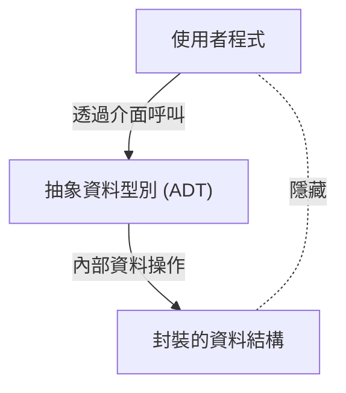

# 芭芭拉·利斯科夫：奠定抽象資料型別與分散式系統的計算機科學家

在軟體工程領域，鮮少有開發者不知道 SOLID 原則之一的「利斯科夫替換原則 (Liskov Substitution Principle: LSP)」。然而，對於該名稱由來的芭芭拉·利斯科夫 (Barbara Liskov) 本人，在程式語言設計與分散式系統上帶來了什麼樣的變革，卻意外地不為人知。本文將從她作為美國首批獲得計算機科學博士學位的女性之一的歷程出發，詳細解說她發明現代物件導向程式設計基礎的「抽象資料型別」，以及奠定分散式系統基礎的研究，並交織相關的技術背景。

## 1. 黎明期與美國首批女性博士的誕生

芭芭拉·利斯科夫於 1939 年出生於加州。她從小就展現出對數學與科學的非凡天賦，並在加州大學柏克萊分校獲得數學學士學位。當時，女性進入 STEM（科學、技術、工程、數學）領域極為罕見，更何況計算機科學這個學科領域本身在當時尚未完全確立。當她希望進入普林斯頓大學數學系研究所就讀時，卻面臨了當時普林斯頓不招收女性的障礙。

然而，她的探求心並未因此中斷。在麻省理工學院 (MIT) 等地工作後，她最終進入史丹佛大學研究所，在人工智慧之父之一的約翰·麥卡錫 (John McCarthy) 的指導下學習。1968 年，她以國際象棋殘局為題材的人工智慧研究獲得了博士學位。作為美國首批在計算機科學領域獲得博士學位的女性之一，這被記錄為一項歷史性的偉業。

## 2. 軟體危機時代與抽象資料型別

獲得博士學位後，利斯科夫開始在 MITRE 公司擔任研究員。當時的電腦產業正面臨被稱為「軟體危機」的時代。相較於硬體的進化，軟體的複雜性呈爆炸性成長，程式碼的可維護性與可重複使用性顯著下降。龐大的程式變成了義大利麵條式程式碼 (Spaghetti code)，微小的修改往往會在整個系統中引發致命的錯誤，這種情況非常普遍。

為了解決這個問題，利斯科夫著眼於將資料表示與操作進行封裝的概念。這就是「抽象資料型別 (Abstract Data Type: ADT)」的起源。抽象資料型別是將資料結構及其相關操作整合在一起，使得外部只能透過介面來進行存取的手法。這使得內部實作得以隱藏（資訊隱藏），並讓程式的各個模組能夠獨立開發與測試。

## 3. CLU 語言的開發與對物件導向的影響

成為 MIT 教授的利斯科夫，為了驗證自己提出的抽象資料型別概念，在 1970 年代設計並開發了一種新的程式語言「CLU」。CLU 這個名字源自「Cluster（叢集）」，反映了將資料與其操作作為一個叢集進行分組的思想。

CLU 是一種劃時代的語言，首次將現代程式語言中不可或缺的許多概念實用化。
- **迭代器 (Iterators):** 不依賴資料結構內部實作，循序處理元素的機制。
- **例外處理 (Exception Handling):** 在發生錯誤時，明確分離處理流程的安全機制。
- **多型基礎 (Polymorphism):** 透過抽象化資料型別進行通用操作。

這些創新的想法對後來廣泛普及的物件導向程式語言（如 Java、C++、Python、C# 等）的設計產生了深遠的影響。我們日常使用的類別、封裝、介面等概念，都是利斯科夫透過 CLU 具體實現之想法的直接延伸。

## 4. Argus 與對分散式系統的挑戰

進入 1980 年代，利斯科夫的關注點從單一電腦上的程式設計，轉移到了多台電腦透過網路協作的「分散式系統」。當時，分散式系統雖然作為理論模型存在，但由於網路延遲、故障、資料一致性等複雜問題，實用化開發極為困難。

針對這個挑戰，她開發了分散式程式語言「Argus」。Argus 最大的特點是，在語言層面上整合了分散式環境中稱為「守護者 (Guardians)」的行程，以及「原子操作 (Atomic Actions)」（即交易）的概念。這使得即使發生網路故障或節點崩潰，也能在維持資料一致性的同時建構分散式應用程式。

如今，在雲端運算、微服務架構、資料庫交易處理中，容錯性 (Fault tolerance) 與一致性保證已成為理所當然的要求，但其基礎理論與實踐框架的許多部分，都是奠基於利斯科夫在 Argus 中的研究。

## 5. 利斯科夫替換原則 (LSP) 及其本質

讓利斯科夫的名字廣為人知的，是 1987 年在 OOPSLA 主題演講中發表，後來與珍妮特·溫 (Jeannette Wing) 在共同論文中進行數學公式化的「利斯科夫替換原則 (Liskov Substitution Principle)」。這作為總結了物件導向設計最佳實踐的「SOLID 原則」中的「L」而廣泛普及。

LSP 的定義如下：
「如果 S 是 T 的子型別，那麼在程式中使用 T 型別物件的地方，應該要在不改變程式正確性的情況下，能夠被 S 型別的物件替換。」

這個原則不僅僅是繼承的規則，它還表達了「行為子型別 (Behavioral Subtyping)」的深刻概念。衍生類別不僅要遵守基礎類別的介面，還必須遵守基礎類別所承諾的「行為（契約）」。如果衍生類別破壞了基礎類別的契約（例如，拋出基礎類別中不可能發生的例外，或侵犯狀態的事前/事後條件等），使用多型的程式碼就會遭遇意想不到的錯誤。

LSP 擴展了抽象資料型別的理論，成為控制繼承所帶來之複雜性的強大指引。在設計堅固且具高擴充性的軟體架構時，LSP 至今仍作為普遍的真理引導著開發者。

## 6. 榮獲圖靈獎與對後輩的影響

由於這些巨大的貢獻，芭芭拉·利斯科夫於 2008 年榮獲了被譽為計算機科學界諾貝爾獎的「圖靈獎」。獲獎理由是「對程式語言和系統設計基礎，特別是資料抽象化、容錯與分散式運算的實踐和理論貢獻」。

她研究的本質始終植根於「如何讓複雜的系統易於人類理解並安全地建構」的實用觀點。她平衡了數學的嚴謹性與工程上現實挑戰的風格，持續啟發著許多研究人員與工程師。

芭芭拉·利斯科夫的功績，已經滲透到我們日常撰寫的程式碼的每個角落。每當我們封裝變數、定義介面、設計微服務時，我們都在沿著她開闢的道路前進。回顧軟體工程的歷史，我們不禁要重新認知她的洞察力與創造力是如何塑造了這個世界。
