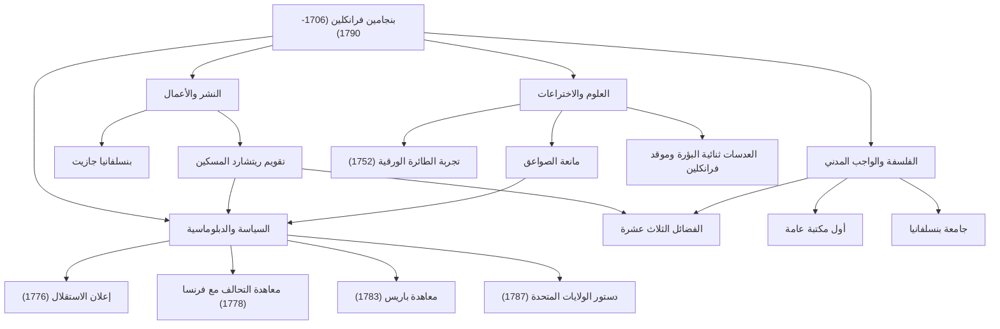

عند سماع اسم بنجامين فرانكلين (1706-1790)، قد يتبادر إلى ذهن الكثيرين في البداية الصورة اللطيفة المرسومة على ورقة الـ 100 دولار أمريكي. ومع ذلك، لا يمكن حصر شخصيته الحقيقية في الإطار السياسي لـ "الأب المؤسس". طابع، كاتب، عالم، مخترع، دبلوماسي، وفيلسوف — كان فرانكلين "عبقرياً شاملاً" (بوليماث) نادراً ترك بصمة تاريخية في كل مجال.

في هذا المقال، نتعمق في حياة فرانكلين الحافلة بالأحداث، والذي بنى نفسه من الصفر ليضع أسس الأمة الأمريكية، وفلسفة الحياة التي مارسها، وتأثيره الهائل الذي لا يزال مستمراً حتى يومنا هذا.

## شباب عصامي ونجاح في صناعة الطباعة

في عام 1706، وُلد فرانكلين في بوسطن بمستعمرة ماساتشوستس، كطفل خامس عشر لعائلة فقيرة تدير عملاً في صناعة الصابون والشموع. وبسبب الظروف المالية للعائلة، انتهى تعليمه المدرسي الرسمي بعد عامين فقط، لكن فضوله الفكري منقطع النظير لم يتلاشَ أبداً. انغمس في القراءة من خلال التعلم الذاتي وصقل مهاراته في الكتابة أثناء عمله كمتدرب في مطبعة شقيقه الأكبر.

بعد اصطدامه مع شقيقه في سن السابعة عشرة، هرب فرانكلين من بوسطن ووصل إلى فيلادلفيا. بدأ من الصفر، وبرز من خلال اجتهاده الطبيعي وسرعة بديهته، حتى أسس مطبعته الخاصة في النهاية. أصبحت صحيفة "بنسلفانيا جازيت" التي كان ينشرها واحدة من أكثر الصحف قراءة في المستعمرات. علاوة على ذلك، أصبح "تقويم ريتشارد المسكين" (Poor Richard's Almanack)، الذي كتبه فرانكلين بنفسه والمزين بالحكم والمعرفة العملية، من أكثر الكتب مبيعاً بشكل غير مسبوق. وبفضل هذا النجاح، حقق الاستقلال المالي في سن مبكرة.

## كعالم ومخترع كشف أسرار الكهرباء

بعد تحقيقه النجاح كرجل أعمال، تحول اهتمام فرانكلين إلى العلوم الطبيعية. وهو مشهور بشكل خاص بأبحاثه حول "الكهرباء". في عام 1752، أجرى "تجربة الطائرة الورقية" المحفوفة بالمخاطر خلال عاصفة رعدية، ليثبت أن البرق هو في الواقع كهرباء. بناءً على هذا الاكتشاف، اخترع "مانعة الصواعق"، منقذاً العديد من المباني والأرواح البشرية من الحرائق.

لم تقتصر مواهبه على النظرية فحسب؛ بل تجلت أيضاً بشكل كامل في الاختراعات العملية. "موقد فرانكلين" الذي يدفئ الغرفة بأكملها بكفاءة، والعدسات "ثنائية البؤرة"، وحتى آلة موسيقية تسمى "أرمونيكا الزجاج" — لقد جلب إلى الحياة سلسلة من الأفكار لإثراء حياة الناس. ومما يثير الدهشة، وإيماناً منه بأن "الاختراعات يجب أن تخدم الناس"، فإنه لم يحصل أبداً على براءات اختراع لأي منها، بل أعادها مجاناً إلى المجتمع.

## الأب المؤسس والمهارات الدبلوماسية العبقرية

مع تزايد الزخم نحو استقلال أمريكا، احتل فرانكلين مركز الصدارة في التاريخ كسياسي ودبلوماسي. كأحد أعضاء لجنة صياغة إعلان الاستقلال (1776)، دعم توماس جفرسون ولعب دوراً حاسماً في تدوين المُثُل الأمريكية.

ومع ذلك، ربما كان أعظم إنجاز سياسي له هو مفاوضاته الدبلوماسية في فرنسا خلال الحرب الثورية. في السبعينيات من عمره، سافر فرانكلين إلى باريس وسحر الطبقة الراقية الفرنسية بذكائه وفكاهته وسلوكه البسيط والراقي في الوقت ذاته. من خلال جهوده، تم توقيع معاهدة التحالف مع فرنسا في عام 1778، ونجح في تأمين الدعم الحاسم من الجيش الفرنسي. ليس من المبالغة القول إن استقلال أمريكا كان مستحيلاً لولا ذلك. وبعد ذلك، أنجز مفاوضات معاهدة باريس (1783) مع بريطانيا العظمى وقدم مساهمات كبيرة كوسيط في صياغة دستور الولايات المتحدة (1787).

## الفضائل الثلاث عشرة وإرثه للأجيال القادمة

إن السبب الذي يجعل فرانكلين يحظى بتقدير كبير حتى اليوم لا يكمن فقط في إنجازاته ولكن أيضاً في "فلسفة حياته" العملية. في العشرينيات من عمره، وضع خطة ليصبح إنساناً مثالياً من الناحية الأخلاقية، وأسس "الفضائل الثلاث عشرة".

1. **الاعتدال** (Temperance)
2. **الصمت** (Silence)
3. **النظام** (Order)
4. **العزم** (Resolution)
5. **الاقتصاد** (Frugality)
6. **الاجتهاد** (Industry)
7. **الإخلاص** (Sincerity)
8. **العدل** (Justice)
9. **الوسطية** (Moderation)
10. **النظافة** (Cleanliness)
11. **الطمأنينة** (Tranquility)
12. **العفة** (Chastity)
13. **التواضع** (Humility)

بدلاً من محاولة الالتزام بها جميعاً في وقت واحد، ركز على فضيلة واحدة كل أسبوع واحتفظ بسجل في دفتر ملاحظاته للتقييم الذاتي المستمر. يمكن القول إن موقف التهذيب الذاتي المستمر هذا هو رائد مفهوم المساعدة الذاتية (self-help)، مما أثر على عدد لا يحصى من الأفراد.

## الخلاصة: حياة تجسد الروح العامة

توفي بنجامين فرانكلين في عام 1790 عن عمر يناهز 84 عاماً، لكن المكتبة، وقسم الإطفاء، والمستشفى، والجامعة (الآن جامعة بنسلفانيا) التي أسسها في فيلادلفيا لا تزال تعمل كأساس للمجتمع اليوم.

إن روحه، التي يمثلها الاقتباس: "أروع شيء يمكنك القيام به لشخص ما هو مساعدته ليكون قادراً على فعل شيء لنفسه"، هي رمز للبراغماتية والديمقراطية المتجذرة في أمريكا. رحلته من طفل حرفي فقير إلى إرساء أسس أمة يمكن اعتبارها واحدة من أعظم النماذج التي يحتذى بها في تاريخ البشرية، دامجاً ببراعة الطموح الذي لا ينضب مع الخدمة العامة.

### [رسم بياني] إنجازات ومسار بنجامين فرانكلين

يوضح الرسم البياني التالي إنجازات فرانكلين الرئيسية في مجالات مختلفة وارتباطاتها.

