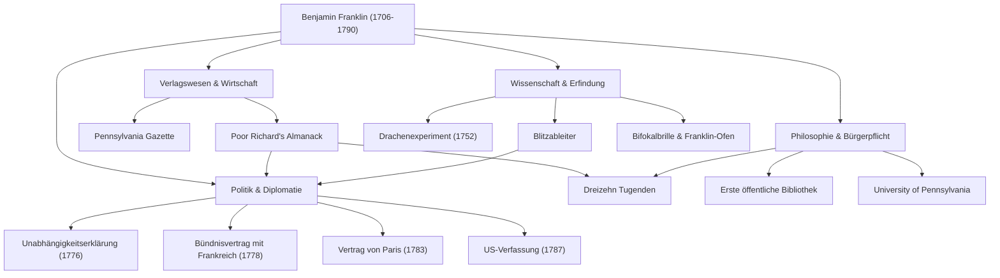

Wenn man den Namen Benjamin Franklin (1706–1790) hört, denken viele Menschen vielleicht zuerst an das sanfte Porträt auf dem 100-Dollar-Schein der USA. Seine wahre Natur lässt sich jedoch nicht in den politischen Rahmen eines "Gründervaters" zwängen. Drucker, Schriftsteller, Wissenschaftler, Erfinder, Diplomat und Philosoph — Franklin war ein seltenes "Universalgenie" (Universalgelehrter), das in jedem Bereich historische Spuren hinterlassen hat.

In diesem Artikel tauchen wir tief in das bewegte Leben Franklins ein, der sich aus dem Nichts hocharbeitete, um den Grundstein der amerikanischen Nation zu legen, in die Lebensphilosophie, die er praktizierte, und in seinen immensen Einfluss, der bis heute anhält.

## Eine autodidaktische Jugend und der Erfolg im Druckgewerbe

Im Jahr 1706 wurde Franklin in Boston, in der Kolonie Massachusetts, als 15. Kind einer armen Familie geboren, die einen Seifen- und Kerzenherstellungsbetrieb führte. Aufgrund der finanziellen Lage der Familie endete seine formelle Schulbildung nach nur zwei Jahren, aber seine unvergleichliche intellektuelle Neugier ging nie verloren. Er vertiefte sich im Selbststudium ins Lesen und verfeinerte seine Schreibfähigkeiten, während er als Lehrling in der Druckerei seines älteren Bruders arbeitete.

Nachdem er im Alter von 17 Jahren mit seinem Bruder aneinandergeraten war, floh Franklin aus Boston und kam in Philadelphia an. Er begann mittellos, fiel jedoch durch seinen natürlichen Fleiß und seine schnelle Auffassungsgabe auf und gründete schließlich seine eigene Druckerei. Die von ihm herausgegebene "Pennsylvania Gazette" wurde zu einer der meistgelesenen Zeitungen in den Kolonien. Darüber hinaus wurde "Poor Richard's Almanack" (Der Almanach des armen Richard), von Franklin selbst verfasst und gespickt mit Maximen und praktischer Lebensweisheit, zu einem beispiellosen Bestseller. Mit diesem Erfolg erlangte er schon in jungen Jahren finanzielle Unabhängigkeit.

## Als Wissenschaftler und Erfinder, der die Geheimnisse der Elektrizität entschlüsselte

Nachdem er als Geschäftsmann erfolgreich war, wandte sich Franklins Interesse den Naturwissenschaften zu. Besonders berühmt ist er für seine Forschungen zur "Elektrizität". Im Jahr 1752 führte er bei einem Gewitter das lebensgefährliche "Drachenexperiment" durch und bewies damit, dass Blitze eigentlich Elektrizität sind. Basierend auf dieser Entdeckung erfand er den "Blitzableiter" und rettete so viele Gebäude und Menschenleben vor dem Feuer.

Seine Talente beschränkten sich nicht auf die Theorie; sie zeigten sich auch in praktischen Erfindungen. Der "Franklin-Ofen", der einen ganzen Raum effizient heizte, "Bifokalbrillen" und sogar ein Musikinstrument namens "Glasharmonika" — er erweckte eine Reihe von Ideen zum Leben, um das Leben der Menschen zu bereichern. Erstaunlicherweise meldete er in dem Glauben, dass "Erfindungen den Menschen dienen sollten", für keine davon Patente an, sondern gab sie der Gesellschaft kostenlos zurück.

## Gründervater und geniales diplomatisches Geschick

Als die Dynamik für die amerikanische Unabhängigkeit zunahm, trat Franklin als Politiker und Diplomat ins Zentrum der Geschichte. Als eines der Mitglieder des Ausschusses zur Ausarbeitung der Unabhängigkeitserklärung (1776) unterstützte er Thomas Jefferson und spielte eine entscheidende Rolle bei der Kodifizierung amerikanischer Ideale.

Seine größte politische Errungenschaft waren jedoch wahrscheinlich seine diplomatischen Verhandlungen in Frankreich während des Unabhängigkeitskrieges. Im Alter von über 70 Jahren reiste Franklin nach Paris und bezauberte die französische High Society mit seiner Intelligenz, seinem Humor und seinem einfachen, aber raffinierten Auftreten. Durch seine Bemühungen wurde 1778 der Bündnisvertrag mit Frankreich unterzeichnet, der erfolgreich die entscheidende Unterstützung des französischen Militärs sicherte. Es ist keine Übertreibung zu sagen, dass die amerikanische Unabhängigkeit ohne dies unmöglich gewesen wäre. Anschließend schloss er die Verhandlungen zum Vertrag von Paris (1783) mit Großbritannien ab und leistete als Vermittler bei der Ausarbeitung der Verfassung der Vereinigten Staaten (1787) bedeutende Beiträge.

## Die dreizehn Tugenden und das Erbe für spätere Generationen

Der Grund, warum Franklin heute noch so hoch geschätzt wird, liegt nicht nur in seinen Erfolgen, sondern auch in seiner praktischen "Lebensphilosophie". In seinen 20ern entwarf er einen Plan, um ein moralisch perfekter Mensch zu werden, und stellte die "Dreizehn Tugenden" auf.

1. **Mäßigung** (Temperance)
2. **Schweigen** (Silence)
3. **Ordnung** (Order)
4. **Entschlossenheit** (Resolution)
5. **Sparsamkeit** (Frugality)
6. **Fleiß** (Industry)
7. **Aufrichtigkeit** (Sincerity)
8. **Gerechtigkeit** (Justice)
9. **Mäßigung im Handeln** (Moderation)
10. **Reinlichkeit** (Cleanliness)
11. **Gemütsruhe** (Tranquility)
12. **Keuschheit** (Chastity)
13. **Demut** (Humility)

Anstatt zu versuchen, all diese gleichzeitig einzuhalten, konzentrierte er sich jede Woche auf eine Tugend und führte Aufzeichnungen in seinem Notizbuch für eine kontinuierliche Selbstbewertung. Diese Haltung der ständigen Selbstkultivierung kann als Vorreiter der Selbsthilfe angesehen werden, die unzählige Menschen beeinflusst hat.

## Fazit: Ein Leben, das den Bürgersinn verkörpert

Benjamin Franklin verstarb 1790 im Alter von 84 Jahren, aber die Bibliothek, die Feuerwehr, das Krankenhaus und die Universität (heute University of Pennsylvania), die er in Philadelphia gründete, fungieren bis heute als Fundament der Gesellschaft.

Sein Geist, repräsentiert durch das Zitat: "Das Wunderbarste, was Sie für jemanden tun können, ist ihm zu helfen, etwas für sich selbst tun zu können", ist ein Symbol des Pragmatismus und der Demokratie, die an der Wurzel Amerikas fließen. Sein Weg vom Kind eines armen Handwerkers zur Grundsteinlegung einer Nation kann als eines der größten Vorbilder der Menschheitsgeschichte angesehen werden, das unaufhörlichen Ehrgeiz brillant mit dem Dienst an der Öffentlichkeit verschmolz.

### [Diagramm] Benjamin Franklins Erfolge und Lebensweg

Das folgende Diagramm zeigt Franklins wichtigste Errungenschaften in verschiedenen Bereichen und deren Zusammenhänge.

