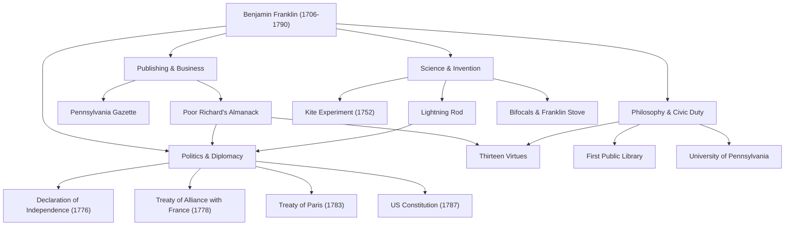

When hearing the name Benjamin Franklin (1706–1790), many people might first think of the gentle portrait on the United States 100-dollar bill. However, his true character cannot be contained within the political framework of a "Founding Father." A printer, writer, scientist, inventor, diplomat, and philosopher—Franklin was a rare "polymath" who left a historical footprint in every field.

In this article, we delve deep into the eventful life of Franklin, who built himself up from nothing to lay the foundation of the American nation, the life philosophy he practiced, and the immense influence that continues to this day.

## A Self-Made Youth and Success in the Printing Business

In 1706, Franklin was born in Boston, in the Massachusetts colony, as the 15th child of a poor family running a soap and candle manufacturing business. Due to family finances, his formal schooling ended after only two years, but his unparalleled intellectual curiosity was never lost. He immersed himself in reading through self-study and honed his writing skills while working as an apprentice in his older brother's printing shop.

Clashing with his brother at the age of 17, Franklin ran away from Boston and arrived in Philadelphia. Starting with nothing, he stood out through his natural diligence and quick wit, eventually establishing his own printing shop. The "Pennsylvania Gazette," which he published, became one of the most widely read newspapers in the colonies. Furthermore, "Poor Richard's Almanack," written by Franklin himself and sprinkled with maxims and practical wisdom, became an unprecedented bestseller. With this success, he achieved financial independence at a young age.

## As a Scientist and Inventor Who Unlocked the Secrets of Electricity

After achieving success as a businessman, Franklin's interest turned to natural science. He is especially famous for his research on "electricity." In 1752, he conducted the life-risking "kite experiment" by flying a kite in a thunderstorm, proving that lightning is actually electricity. Based on this discovery, he invented the "lightning rod," saving many buildings and human lives from fire.

His talents were not limited to theory; they were also fully demonstrated in practical inventions. The "Franklin stove" that efficiently heated an entire room, "bifocal" lenses, and even a musical instrument called the "glass armonica"—he brought to life a succession of ideas to enrich people's lives. Amazingly, under the belief that "inventions should serve the people," he never obtained patents for any of these, returning them freely to society.

## Founding Father and Genius Diplomatic Skills

As the momentum for American independence grew, Franklin took center stage in history as a politician and diplomat. As one of the drafting committee members for the Declaration of Independence (1776), he supported Thomas Jefferson and played a crucial role in codifying American ideals.

However, his greatest political achievement was likely his diplomatic negotiations in France during the Revolutionary War. Already in his 70s, Franklin traveled to Paris and charmed French high society with his intelligence, humor, and simple yet refined demeanor. Through his efforts, the Treaty of Alliance with France was signed in 1778, successfully securing decisive support from the French military. It is no exaggeration to say that American independence would have been impossible without it. He subsequently concluded negotiations for the Treaty of Paris (1783) with Great Britain and made significant contributions as a mediator in the drafting of the United States Constitution (1787).

## The Thirteen Virtues and Legacy for Later Generations

The reason Franklin is still highly regarded today lies not only in his achievements but also in his practical "life philosophy." In his 20s, he devised a plan to become a morally perfect human being, establishing the "Thirteen Virtues."

1. **Temperance**
2. **Silence**
3. **Order**
4. **Resolution**
5. **Frugality**
6. **Industry**
7. **Sincerity**
8. **Justice**
9. **Moderation**
10. **Cleanliness**
11. **Tranquility**
12. **Chastity**
13. **Humility**

Rather than trying to observe all of these at once, he focused on one virtue each week and kept a record in his notebook for continuous self-evaluation. This attitude of ongoing self-cultivation can be said to be the pioneer of self-help, influencing countless individuals.

## Conclusion: A Life Embodying Public Spirit

Benjamin Franklin passed away in 1790 at the age of 84, but the library, fire department, hospital, and university (now the University of Pennsylvania) he established in Philadelphia continue to function as the foundation of society today.

His spirit, represented by the quote, "The best thing you can do for someone is to help them learn how to help themselves," is a symbol of the pragmatism and democracy that flow at the root of America. His journey from the child of a poor artisan to laying the foundation of a nation can be considered one of the greatest role models in human history, brilliantly fusing unceasing ambition with public service.

### [Diagram] Benjamin Franklin's Achievements and Trajectory

The following diagram shows Franklin's major achievements in various fields and their connections.

