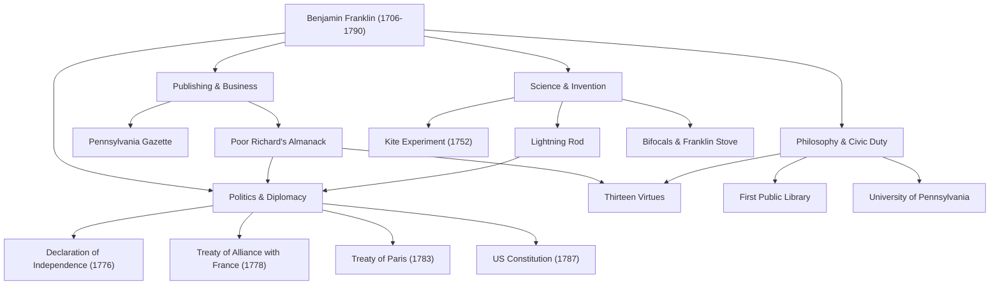

Cuando se escucha el nombre de Benjamin Franklin (1706–1790), muchas personas pueden pensar primero en el amable retrato del billete de 100 dólares de los Estados Unidos. Sin embargo, su verdadera figura no puede ser contenida en el marco político de un "Padre Fundador". Impresor, escritor, científico, inventor, diplomático y filósofo: Franklin fue un "genio universal" (polímata) excepcional que dejó una huella histórica en todos los campos.

En este artículo, profundizamos en la agitada vida de Franklin, quien se construyó desde cero para sentar las bases de la nación estadounidense, la filosofía de vida que practicó y su enorme influencia que continúa hasta hoy.

## Juventud Autodidacta y Éxito en la Industria de la Impresión

En 1706, Franklin nació en Boston, en la colonia de Massachusetts, como el decimoquinto hijo de una familia pobre que dirigía un negocio de fabricación de jabón y velas. Debido a las finanzas familiares, su educación escolar formal terminó después de solo dos años, pero su curiosidad intelectual sin igual nunca se perdió. Se sumergió en la lectura de forma autodidacta y perfeccionó sus habilidades de escritura mientras trabajaba como aprendiz en la imprenta de su hermano mayor.

Chocando con su hermano a la edad de 17 años, Franklin huyó de Boston y llegó a Filadelfia. Comenzando sin dinero, se destacó por su diligencia natural y su ingenio rápido, y finalmente estableció su propia imprenta. La "Pennsylvania Gazette", que publicó, se convirtió en uno de los periódicos más leídos en las colonias. Además, el "Poor Richard's Almanack" (Almanaque del Pobre Richard), escrito por el propio Franklin y salpicado de máximas y sabiduría práctica, se convirtió en un éxito de ventas sin precedentes. Con este éxito, logró la independencia financiera a una edad temprana.

## Como Científico e Inventor que Descifró la Electricidad

Después de lograr el éxito como hombre de negocios, el interés de Franklin se dirigió a las ciencias naturales. Es especialmente famoso por su investigación sobre la "electricidad". En 1752, realizó el arriesgado "experimento de la cometa" volando una cometa en una tormenta eléctrica, demostrando que los rayos son en realidad electricidad. Basándose en este descubrimiento, inventó el "pararrayos", salvando muchos edificios y vidas humanas de los incendios.

Sus talentos no se limitaron a la teoría, sino que también se demostraron plenamente en inventos prácticos. La "estufa Franklin" que calentaba eficientemente una habitación entera, los lentes "bifocales" e incluso un instrumento musical llamado "armónica de cristal": dio vida a una sucesión de ideas para enriquecer la vida de las personas. Sorprendentemente, bajo la creencia de que "las invenciones deben servir a las personas", nunca obtuvo patentes para ninguna de ellas y las devolvió gratuitamente a la sociedad.

## Padre Fundador y Geniales Habilidades Diplomáticas

A medida que crecía el impulso por la independencia de los Estados Unidos, Franklin ocupó el centro de la historia como político y diplomático. Como uno de los miembros del comité de redacción de la Declaración de Independencia (1776), apoyó a Thomas Jefferson y desempeñó un papel crucial en la codificación de los ideales estadounidenses.

Sin embargo, su mayor logro político fueron probablemente sus negociaciones diplomáticas en Francia durante la Guerra de Independencia. Con más de 70 años, Franklin viajó a París y encantó a la alta sociedad francesa con su inteligencia, humor y su comportamiento sencillo pero refinado. Gracias a sus esfuerzos, se firmó el Tratado de Alianza con Francia en 1778, asegurando con éxito el apoyo decisivo del ejército francés. No es exagerado decir que la independencia estadounidense habría sido imposible sin él. Posteriormente concluyó las negociaciones para el Tratado de París (1783) con Gran Bretaña e hizo importantes contribuciones como mediador en la redacción de la Constitución de los Estados Unidos (1787).

## Las Trece Virtudes y su Legado para las Generaciones Posteriores

La razón por la que Franklin sigue siendo muy valorado en la actualidad radica no solo en sus logros, sino también en su "filosofía de vida" práctica. A los 20 años, ideó un plan para convertirse en un ser humano moralmente perfecto, estableciendo las "Trece Virtudes".

1. **Templanza**
2. **Silencio**
3. **Orden**
4. **Resolución**
5. **Frugalidad**
6. **Industria**
7. **Sinceridad**
8. **Justicia**
9. **Moderación**
10. **Limpieza**
11. **Tranquilidad**
12. **Castidad**
13. **Humildad**

En lugar de tratar de observar todas estas a la vez, se centró en una virtud cada semana y mantuvo un registro en su cuaderno para una autoevaluación continua. Esta actitud de auto-cultivo continuo se puede decir que es la pionera de la autoayuda, influyendo en innumerables personas.

## Conclusión: Una Vida que Encarna el Espíritu Público

Benjamin Franklin falleció en 1790 a la edad de 84 años, pero la biblioteca, el departamento de bomberos, el hospital y la universidad (ahora la Universidad de Pensilvania) que estableció en Filadelfia continúan funcionando como la base de la sociedad actual.

Su espíritu, representado por la frase: "Lo más maravilloso que puedes hacer por alguien es ayudarle a poder hacer algo por sí mismo", es un símbolo del pragmatismo y la democracia que fluyen en la raíz de los Estados Unidos. Su viaje de ser hijo de un artesano pobre a sentar las bases de una nación puede considerarse uno de los modelos a seguir más grandes de la historia humana, fusionando brillantemente una ambición incesante con el servicio público.

### [Diagrama] Logros y Trayectoria de Benjamin Franklin

El siguiente diagrama muestra los principales logros de Franklin en varios campos y sus conexiones.

