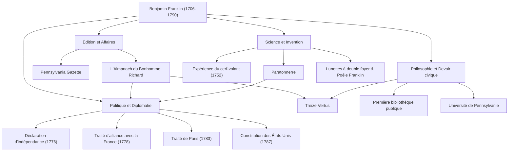

Lorsque l'on entend le nom de Benjamin Franklin (1706–1790), beaucoup de gens pensent d'abord au doux portrait figurant sur le billet de 100 dollars américain. Cependant, sa véritable nature ne peut être contenue dans le cadre politique d'un "Père fondateur". Imprimeur, écrivain, scientifique, inventeur, diplomate et philosophe — Franklin était un "polymathe" (génie universel) rare qui a laissé une empreinte historique dans tous les domaines.

Dans cet article, nous plongeons au cœur de la vie mouvementée de Franklin, parti de rien pour jeter les bases de la nation américaine, de la philosophie de vie qu'il a pratiquée, et de son immense influence qui perdure encore aujourd'hui.

## Une jeunesse d'autodidacte et le succès dans l'imprimerie

En 1706, Franklin naît à Boston, dans la colonie du Massachusetts. Il est le 15ème enfant d'une famille pauvre qui fabrique des savons et des bougies. En raison des difficultés financières de sa famille, son éducation scolaire formelle s'achève au bout de deux ans seulement, mais sa curiosité intellectuelle inégalée ne s'éteint jamais. Il se plonge dans la lecture en autodidacte et perfectionne ses talents d'écriture tout en travaillant comme apprenti dans l'imprimerie de son frère aîné.

En conflit avec son frère à l'âge de 17 ans, Franklin s'enfuit de Boston et arrive à Philadelphie. Partant de rien, il se distingue par son assiduité naturelle et sa vivacité d'esprit, finissant par créer sa propre imprimerie. La "Pennsylvania Gazette", qu'il publie, devient l'un des journaux les plus lus des colonies. De plus, "L'Almanach du Bonhomme Richard" (Poor Richard's Almanack), écrit par Franklin lui-même et parsemé de maximes et de sagesse pratique, devient un best-seller sans précédent. Grâce à ce succès, il accède à l'indépendance financière très jeune.

## Le scientifique et inventeur qui a percé les secrets de l'électricité

Après avoir réussi en tant qu'homme d'affaires, l'intérêt de Franklin se tourne vers les sciences naturelles. Il est particulièrement célèbre pour ses recherches sur "l'électricité". En 1752, il réalise sa dangereuse "expérience du cerf-volant" pendant un orage, prouvant ainsi que la foudre est de l'électricité. Fort de cette découverte, il invente le "paratonnerre", sauvant de nombreux bâtiments et vies humaines des incendies.

Ses talents ne se limitent pas à la théorie ; ils s'expriment aussi pleinement dans des inventions pratiques. Le "poêle Franklin" qui chauffe efficacement une pièce entière, les verres "à double foyer", et même un instrument de musique appelé "armonica de verre" — il donne vie à une succession d'idées pour enrichir la vie des gens. Étonnamment, convaincu que "les inventions doivent servir le peuple", il ne dépose aucun brevet pour ces créations, les offrant gratuitement à la société.

## Père fondateur et talent diplomatique de génie

À mesure que l'élan pour l'indépendance américaine grandit, Franklin occupe le devant de la scène historique en tant qu'homme politique et diplomate. En tant que membre du comité de rédaction de la Déclaration d'indépendance (1776), il soutient Thomas Jefferson et joue un rôle crucial dans la formulation des idéaux américains.

Cependant, son plus grand accomplissement politique réside sans doute dans ses négociations diplomatiques en France pendant la guerre d'Indépendance. À plus de 70 ans, Franklin se rend à Paris et charme la haute société française par son intelligence, son humour et ses manières simples mais raffinées. Grâce à ses efforts, le traité d'alliance avec la France est signé en 1778, garantissant avec succès le soutien décisif de l'armée française. Il n'est pas exagéré de dire que l'indépendance américaine aurait été impossible sans cela. Il mène ensuite à bien les négociations du traité de Paris (1783) avec la Grande-Bretagne et contribue grandement en tant que médiateur à la rédaction de la Constitution des États-Unis (1787).

## Les treize vertus et son héritage pour les générations futures

Si Franklin est toujours très estimé aujourd'hui, ce n'est pas seulement pour ses réalisations, mais aussi pour sa "philosophie de vie" pratique. Dans sa vingtaine, il conçoit un plan pour devenir un être humain moralement parfait, établissant les "Treize Vertus".

1. **Tempérance**
2. **Silence**
3. **Ordre**
4. **Résolution**
5. **Frugalité**
6. **Industrie (Travail)**
7. **Sincérité**
8. **Justice**
9. **Modération**
10. **Propreté**
11. **Tranquillité**
12. **Chasteté**
13. **Humilité**

Au lieu d'essayer de les respecter toutes en même temps, il se concentre sur une vertu chaque semaine et tient un registre dans son carnet pour une auto-évaluation continue. Cette attitude de perfectionnement personnel continu peut être considérée comme la pionnière du développement personnel, influençant d'innombrables personnes.

## Conclusion : Une vie incarnant l'esprit public

Benjamin Franklin s'éteint en 1790 à l'âge de 84 ans, mais la bibliothèque, la caserne de pompiers, l'hôpital et l'université (aujourd'hui l'Université de Pennsylvanie) qu'il a fondés à Philadelphie continuent de fonctionner comme les fondations de la société actuelle.

Son esprit, représenté par la citation : "La plus belle chose que vous puissiez faire pour quelqu'un, c'est de l'aider à pouvoir faire quelque chose par lui-même", est un symbole du pragmatisme et de la démocratie qui coulent aux racines de l'Amérique. Son parcours, d'enfant de modeste artisan à bâtisseur d'une nation, peut être considéré comme l'un des plus grands modèles de l'histoire humaine, fusionnant brillamment une ambition incessante avec le service public.

### [Schéma] Les réalisations et la trajectoire de Benjamin Franklin

Le schéma suivant montre les principales réalisations de Franklin dans divers domaines et leurs liens.

