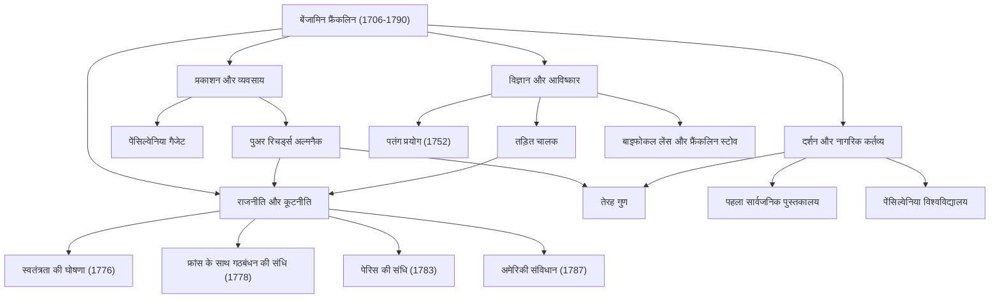

जब बेंजामिन फ्रैंकलिन (1706-1790) का नाम सुना जाता है, तो कई लोगों को सबसे पहले संयुक्त राज्य अमेरिका के 100 डॉलर के बिल पर छपे सौम्य चित्र की याद आ सकती है। हालाँकि, उनका वास्तविक स्वरूप "संस्थापक पिता" (Founding Father) के राजनीतिक ढांचे तक सीमित नहीं है। प्रिंटर, लेखक, वैज्ञानिक, आविष्कारक, राजनयिक और दार्शनिक - फ्रैंकलिन एक विरले "बहुमुखी प्रतिभा" (Polymath) थे, जिन्होंने हर क्षेत्र में एक ऐतिहासिक छाप छोड़ी।

इस लेख में, हम फ्रैंकलिन के घटनापूर्ण जीवन की गहराई में उतरते हैं, जिन्होंने शून्य से उठकर अमेरिकी राष्ट्र की नींव रखी, उनके द्वारा अपनाए गए जीवन दर्शन और उनके उस अपार प्रभाव को समझते हैं जो आज भी कायम है।

## एक स्व-निर्मित युवा और प्रिंटिंग व्यवसाय में सफलता

1706 में, फ्रैंकलिन का जन्म मैसाचुसेट्स कॉलोनी के बोस्टन में एक गरीब परिवार के 15वें बच्चे के रूप में हुआ था, जो साबुन और मोमबत्ती बनाने का व्यवसाय चलाते थे। पारिवारिक आर्थिक तंगी के कारण, उनकी औपचारिक स्कूली शिक्षा केवल दो साल बाद समाप्त हो गई, लेकिन उनकी अद्वितीय बौद्धिक जिज्ञासा कभी खत्म नहीं हुई। उन्होंने स्व-अध्ययन के माध्यम से खुद को पढ़ने में डुबो दिया और अपने बड़े भाई की प्रिंटिंग की दुकान में अपरेंटिस के रूप में काम करते हुए अपने लेखन कौशल को निखारा।

17 साल की उम्र में अपने भाई से अनबन के बाद, फ्रैंकलिन बोस्टन से भाग गए और फिलाडेल्फिया पहुंचे। बिना कुछ लिए शुरुआत करते हुए, वे अपनी स्वाभाविक लगन और हाजिरजवाबी के माध्यम से उभरे और अंततः अपनी खुद की प्रिंटिंग की दुकान स्थापित की। उनके द्वारा प्रकाशित "पेंसिल्वेनिया गैजेट" कॉलोनियों में सबसे ज्यादा पढ़े जाने वाले समाचार पत्रों में से एक बन गया। इसके अलावा, फ्रैंकलिन द्वारा स्वयं लिखा गया "पुअर रिचर्ड्स अल्मनैक" (Poor Richard's Almanack), जो कहावतों और व्यावहारिक ज्ञान से भरा था, एक अभूतपूर्व बेस्टसेलर बन गया। इस सफलता के साथ, उन्होंने कम उम्र में ही वित्तीय स्वतंत्रता प्राप्त कर ली।

## एक वैज्ञानिक और आविष्कारक के रूप में जिसने बिजली के रहस्यों को सुलझाया

एक व्यवसायी के रूप में सफलता प्राप्त करने के बाद, फ्रैंकलिन की रुचि प्राकृतिक विज्ञान की ओर मुड़ गई। वे विशेष रूप से "बिजली" पर अपने शोध के लिए प्रसिद्ध हैं। 1752 में, उन्होंने आंधी के दौरान पतंग उड़ाकर जान जोखिम में डालने वाला "पतंग प्रयोग" किया, जिससे यह साबित हुआ कि आकाशीय बिजली वास्तव में विद्युत (electricity) ही है। इस खोज के आधार पर, उन्होंने "तड़ित चालक" (lightning rod) का आविष्कार किया, जिससे कई इमारतों और मानव जीवन को आग से बचाया गया।

उनकी प्रतिभा केवल सिद्धांत तक सीमित नहीं थी; इसे व्यावहारिक आविष्कारों में भी पूरी तरह से प्रदर्शित किया गया था। "फ्रैंकलिन स्टोव" जो कुशलतापूर्वक पूरे कमरे को गर्म करता था, "बाइफोकल" लेंस, और यहां तक कि "ग्लास आर्मोनिका" नामक एक संगीत वाद्ययंत्र—उन्होंने लोगों के जीवन को समृद्ध करने के लिए विचारों की एक श्रृंखला को जीवन में उतारा। आश्चर्यजनक रूप से, इस विश्वास के तहत कि "आविष्कार लोगों की सेवा के लिए होने चाहिए," उन्होंने इनमें से किसी के लिए भी पेटेंट प्राप्त नहीं किया, बल्कि उन्हें समाज को मुफ्त में लौटा दिया।

## संस्थापक पिता और प्रतिभाशाली राजनयिक कौशल

जैसे-जैसे अमेरिकी स्वतंत्रता की गति बढ़ी, फ्रैंकलिन ने एक राजनेता और राजनयिक के रूप में इतिहास के केंद्र में कदम रखा। स्वतंत्रता की घोषणा (1776) के लिए मसौदा समिति के सदस्यों में से एक के रूप में, उन्होंने थॉमस जेफरसन का समर्थन किया और अमेरिकी आदर्शों को संहिताबद्ध करने में महत्वपूर्ण भूमिका निभाई।

हालाँकि, उनकी सबसे बड़ी राजनीतिक उपलब्धि संभवतः क्रांतिकारी युद्ध के दौरान फ्रांस में उनकी कूटनीतिक बातचीत थी। 70 वर्ष से अधिक उम्र के होने के बावजूद, फ्रैंकलिन ने पेरिस की यात्रा की और अपनी बुद्धिमत्ता, हास्य और सरल लेकिन परिष्कृत व्यवहार से फ्रांसीसी उच्च समाज को मंत्रमुग्ध कर दिया। उनके प्रयासों से, 1778 में फ्रांस के साथ गठबंधन की संधि पर हस्ताक्षर किए गए, जिससे फ्रांसीसी सेना से निर्णायक समर्थन सफलतापूर्वक प्राप्त हुआ। यह कहना अतिशयोक्ति नहीं होगी कि इसके बिना अमेरिकी स्वतंत्रता असंभव होती। इसके बाद उन्होंने ग्रेट ब्रिटेन के साथ पेरिस की संधि (1783) के लिए बातचीत संपन्न की और संयुक्त राज्य अमेरिका के संविधान (1787) का मसौदा तैयार करने में एक मध्यस्थ के रूप में महत्वपूर्ण योगदान दिया।

## तेरह गुण और आने वाली पीढ़ियों के लिए विरासत

आज भी फ्रैंकलिन का बहुत सम्मान किए जाने का कारण न केवल उनकी उपलब्धियों में बल्कि उनके व्यावहारिक "जीवन दर्शन" में भी निहित है। अपने 20 के दशक में, उन्होंने नैतिक रूप से एक आदर्श इंसान बनने की योजना बनाई और "तेरह गुणों" (Thirteen Virtues) की स्थापना की।

1. **संयम** (Temperance)
2. **मौन** (Silence)
3. **व्यवस्था** (Order)
4. **संकल्प** (Resolution)
5. **मितव्ययता** (Frugality)
6. **परिश्रम** (Industry)
7. **ईमानदारी** (Sincerity)
8. **न्याय** (Justice)
9. **اعتدال** / संयम (Moderation)
10. **स्वच्छता** (Cleanliness)
11. **शांति** (Tranquility)
12. **शुद्धता** (Chastity)
13. **विनम्रता** (Humility)

इन सभी को एक साथ पालन करने की कोशिश करने के बजाय, उन्होंने हर हफ्ते एक गुण पर ध्यान केंद्रित किया और निरंतर आत्म-मूल्यांकन के लिए अपनी नोटबुक में रिकॉर्ड रखा। निरंतर आत्म-सुधार के इस दृष्टिकोण को स्व-सहायता (self-help) का प्रणेता कहा जा सकता है, जिसने अनगिनत व्यक्तियों को प्रभावित किया है।

## निष्कर्ष: सार्वजनिक भावना का प्रतीक जीवन

बेंजामिन फ्रैंकलिन का 1790 में 84 वर्ष की आयु में निधन हो गया, लेकिन फिलाडेल्फिया में उनके द्वारा स्थापित पुस्तकालय, फायर विभाग, अस्पताल और विश्वविद्यालय (अब पेंसिल्वेनिया विश्वविद्यालय) आज भी समाज की नींव के रूप में काम कर रहे हैं।

उनकी भावना, जो इस उद्धरण द्वारा प्रस्तुत की जाती है: "सबसे अद्भुत काम जो आप किसी के लिए कर सकते हैं, वह है उन्हें अपने लिए कुछ करने में सक्षम होने में मदद करना," उस व्यावहारिकता और लोकतंत्र का प्रतीक है जो अमेरिका की जड़ों में बहती है। एक गरीब कारीगर के बच्चे से लेकर एक राष्ट्र की नींव रखने तक की उनकी यात्रा को मानव इतिहास में सबसे महान रोल मॉडल में से एक माना जा सकता है, जिसने निरंतर महत्वाकांक्षा और सार्वजनिक सेवा का शानदार ढंग से विलय किया।

### [आरेख] बेंजामिन फ्रैंकलिन की उपलब्धियां और जीवन पथ

निम्नलिखित आरेख विभिन्न क्षेत्रों में फ्रैंकलिन की प्रमुख उपलब्धियों और उनके संबंधों को दर्शाता है।

