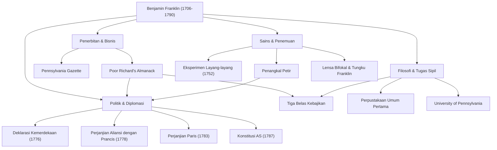

Mendengar nama Benjamin Franklin (1706–1790), banyak orang mungkin pertama kali membayangkan potret lembut yang tergambar pada uang kertas 100 dolar Amerika Serikat. Namun, sosok aslinya tidak dapat dibatasi hanya dalam bingkai politik seorang "Bapak Pendiri". Pencetak, penulis, ilmuwan, penemu, diplomat, dan filsuf — Franklin adalah seorang "polimatik" (jenius universal) langka yang meninggalkan jejak sejarah di setiap bidang.

Dalam artikel ini, kita akan menggali lebih dalam kehidupan Franklin yang penuh warna, yang membangun dirinya dari nol hingga meletakkan dasar bangsa Amerika, filosofi hidup yang ia praktikkan, dan pengaruh besarnya yang terus berlanjut hingga hari ini.

## Masa Muda Autodidak dan Kesuksesan di Industri Percetakan

Pada tahun 1706, Franklin lahir di Boston, koloni Massachusetts, sebagai anak ke-15 dari keluarga miskin yang menjalankan bisnis pembuatan sabun dan lilin. Karena masalah keuangan keluarga, pendidikan sekolah formalnya berakhir hanya dalam dua tahun, tetapi rasa ingin tahu intelektualnya yang tak tertandingi tidak pernah hilang. Ia membenamkan dirinya dalam membaca secara otodidak dan mengasah kemampuan menulisnya sambil bekerja sebagai magang di toko percetakan milik kakak laki-lakinya.

Berbenturan dengan kakaknya pada usia 17 tahun, Franklin melarikan diri dari Boston dan tiba di Philadelphia. Memulai tanpa uang, ia menonjol karena kerajinan alami dan kecerdasannya yang cepat tanggap, akhirnya mendirikan toko percetakannya sendiri. "Pennsylvania Gazette", yang diterbitkannya, menjadi salah satu surat kabar yang paling banyak dibaca di koloni. Selain itu, "Poor Richard's Almanack" (Almanak Richard Miskin), yang ditulis oleh Franklin sendiri dan ditaburi pepatah serta kebijaksanaan praktis, menjadi buku laris yang belum pernah ada sebelumnya. Dengan kesuksesan ini, ia mencapai kemandirian finansial di usia muda.

## Sebagai Ilmuwan dan Penemu yang Mengungkap Rahasia Listrik

Setelah meraih kesuksesan sebagai pengusaha, minat Franklin beralih ke ilmu alam. Ia sangat terkenal dengan penelitiannya tentang "listrik". Pada tahun 1752, ia melakukan "eksperimen layang-layang" yang mempertaruhkan nyawa di tengah badai petir, membuktikan bahwa petir sebenarnya adalah listrik. Berdasarkan penemuan ini, ia menciptakan "penangkal petir", menyelamatkan banyak bangunan dan nyawa manusia dari kebakaran.

Bakatnya tidak terbatas pada teori; bakat tersebut juga ditunjukkan sepenuhnya dalam penemuan praktis. "Tungku Franklin" yang secara efisien memanaskan seluruh ruangan, lensa "bifokal" (fokus ganda), dan bahkan alat musik yang disebut "armonika kaca" — ia mewujudkan serangkaian ide untuk memperkaya kehidupan masyarakat. Hebatnya, di bawah keyakinan bahwa "penemuan harus melayani rakyat", ia tidak pernah mematenkan satu pun penemuan tersebut, mengembalikannya secara gratis kepada masyarakat.

## Bapak Pendiri dan Kemampuan Diplomatik yang Jenius

Seiring dengan meningkatnya momentum kemerdekaan Amerika, Franklin mengambil peran utama dalam sejarah sebagai politisi dan diplomat. Sebagai salah satu anggota komite penyusunan Deklarasi Kemerdekaan (1776), ia mendukung Thomas Jefferson dan memainkan peran penting dalam merumuskan cita-cita Amerika.

Namun, pencapaian politik terbesarnya kemungkinan adalah negosiasi diplomatiknya di Prancis selama Perang Kemerdekaan. Di usia lebih dari 70 tahun, Franklin melakukan perjalanan ke Paris dan memikat masyarakat kelas atas Prancis dengan kecerdasannya, selera humornya, dan perilakunya yang sederhana namun halus. Melalui upayanya, Perjanjian Aliansi dengan Prancis ditandatangani pada tahun 1778, berhasil mengamankan dukungan yang menentukan dari militer Prancis. Tidak berlebihan untuk mengatakan bahwa kemerdekaan Amerika akan mustahil tanpanya. Ia kemudian menyimpulkan negosiasi untuk Perjanjian Paris (1783) dengan Inggris dan memberikan kontribusi yang signifikan sebagai mediator dalam penyusunan Konstitusi Amerika Serikat (1787).

## Tiga Belas Kebajikan dan Warisan untuk Generasi Selanjutnya

Alasan mengapa Franklin masih sangat dihargai hingga saat ini tidak hanya terletak pada pencapaiannya, tetapi juga pada "filosofi hidup" praktisnya. Pada usia 20-an, ia merancang rencana untuk menjadi manusia yang sempurna secara moral, menetapkan "Tiga Belas Kebajikan".

1. **Kesederhanaan** (Temperance)
2. **Keheningan** (Silence)
3. **Ketertiban** (Order)
4. **Keteguhan hati** (Resolution)
5. **Kehematan** (Frugality)
6. **Kerajinan** (Industry)
7. **Ketulusan** (Sincerity)
8. **Keadilan** (Justice)
9. **Pengendalian diri** (Moderation)
10. **Kebersihan** (Cleanliness)
11. **Ketenangan** (Tranquility)
12. **Kesucian** (Chastity)
13. **Kerendahan hati** (Humility)

Alih-alih mencoba mematuhi semuanya sekaligus, ia berfokus pada satu kebajikan setiap minggu dan membuat catatan di buku catatannya untuk evaluasi diri yang berkelanjutan. Sikap pembinaan diri yang terus-menerus ini dapat dikatakan sebagai pelopor pengembangan diri (self-help), yang memengaruhi banyak orang.

## Kesimpulan: Kehidupan yang Mewujudkan Semangat Publik

Benjamin Franklin meninggal dunia pada tahun 1790 di usia 84 tahun, tetapi perpustakaan, pemadam kebakaran, rumah sakit, dan universitas (sekarang University of Pennsylvania) yang ia dirikan di Philadelphia terus berfungsi sebagai fondasi masyarakat hingga saat ini.

Semangatnya, yang diwakili oleh kutipan: "Hal paling indah yang dapat Anda lakukan untuk seseorang adalah membantu mereka agar dapat melakukan sesuatu untuk diri mereka sendiri", adalah simbol pragmatisme dan demokrasi yang mengalir di akar Amerika. Perjalanannya dari anak seorang pengrajin miskin hingga meletakkan dasar sebuah bangsa dapat dianggap sebagai salah satu panutan terbesar dalam sejarah umat manusia, dengan brilian menggabungkan ambisi yang tak henti-hentinya dengan pelayanan publik.

### [Diagram] Pencapaian dan Lintasan Benjamin Franklin

Diagram berikut menunjukkan pencapaian utama Franklin di berbagai bidang dan hubungannya.

