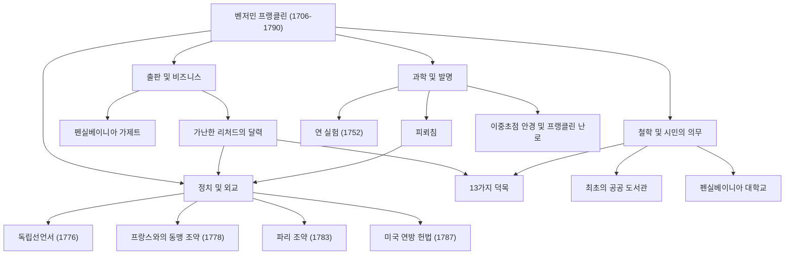

벤저민 프랭클린(1706년~1790년)이라고 하면 많은 사람들이 가장 먼저 떠올리는 것은 미국 100달러 지폐에 그려진 온화한 초상화일지도 모릅니다. 하지만 그의 진면목은 '건국의 아버지'라는 정치적인 틀 안에만 갇혀 있는 것이 아닙니다. 인쇄업자, 저술가, 과학자, 발명가, 외교관, 그리고 철학자 등, 프랭클린은 모든 분야에서 역사적인 발자취를 남긴 희대의 '만능 천재(폴리매스)'였습니다.

이 글에서는 맨손으로 일어나 미국이라는 국가의 초석을 다진 프랭클린의 파란만장한 생애, 그가 실천했던 인생 철학, 그리고 현대에까지 이어지는 지대한 영향에 대해 깊이 파헤쳐 봅니다.

## 자수성가한 청년기와 인쇄업에서의 성공

1706년, 프랭클린은 매사추세츠 식민지의 보스턴에서 비누와 양초 제조업을 하는 가난한 가정의 15번째 아이로 태어났습니다. 가정 형편 때문에 정규 학교 교육은 불과 2년 만에 끝났지만, 그의 비할 데 없는 지적 호기심은 결코 사라지지 않았습니다. 독학으로 독서에 몰두했고, 형의 인쇄소에서 견습생으로 일하며 글쓰기 실력을 갈고닦았습니다.

17세에 형과 충돌하여 보스턴을 떠난 프랭클린은 필라델피아에 도착하게 됩니다. 무일푼으로 시작했지만 특유의 근면함과 기지로 두각을 나타내어 결국 자신의 인쇄소를 설립했습니다. 그가 발행한 『펜실베이니아 가제트』지는 식민지에서 가장 많이 읽히는 신문 중 하나가 되었고, 나아가 그 자신이 집필한 『가난한 리처드의 달력(Poor Richard's Almanack)』은 격언과 생활의 지혜를 담은 내용으로 전례 없는 베스트셀러가 되었습니다. 이 성공으로 그는 젊은 나이에 경제적 독립을 이루게 됩니다.

## 전기의 비밀을 밝혀낸 과학자이자 발명가로서

실업가로서 성공을 거둔 후, 프랭클린의 관심은 자연과학으로 향했습니다. 특히 유명한 것이 '전기'에 관한 연구입니다. 1752년, 뇌우 속에서 연을 날리는 목숨을 건 '연 실험'을 통해 번개의 정체가 전기임을 증명했습니다. 이 발견을 바탕으로 '피뢰침'을 발명하여 수많은 건물과 인명을 화재로부터 구하게 됩니다.

그의 재능은 이론에만 머물지 않고 실용적인 발명에서도 유감없이 발휘되었습니다. 방 전체를 효율적으로 난방하는 '프랭클린 난로', 원근 양용의 '이중초점 렌즈', 심지어 '글라스 하모니카'라는 악기까지, 사람들의 생활을 풍요롭게 하기 위한 아이디어를 끊임없이 실현했습니다. 놀랍게도 그는 '발명은 사람들에게 도움이 되어야 한다'는 신념 아래 이 모든 것에 대해 어떤 특허도 취득하지 않고 사회에 무료로 환원했습니다.

## 건국의 아버지와 천재적인 외교 수완

미국 독립의 기운이 고조되자 프랭클린은 정치인이자 외교관으로서 역사의 전면에 섭니다. 그는 독립선언서(1776년)의 기초 위원 중 한 명으로서 토머스 제퍼슨을 도와 미국의 이상을 명문화하는 중요한 역할을 담당했습니다.

하지만 그의 가장 큰 정치적 공적은 아마도 독립 전쟁 당시 프랑스에서의 외교 교섭일 것입니다. 당시 70세가 넘었던 프랭클린은 파리로 건너가 그의 지성과 유머, 그리고 소박하면서도 세련된 행동으로 프랑스 사교계를 매료시켰습니다. 그의 노력으로 1778년에 미불 동맹 조약이 맺어졌고, 프랑스군의 결정적인 지원을 이끌어내는 데 성공합니다. 이것이 없었다면 미국의 독립은 불가능했을 것이라고 해도 과언이 아닙니다. 이후에도 영국과의 파리 조약(1783년) 교섭을 마무리 지었고, 미국 헌법 제정(1787년)에도 조정자로서 크게 기여했습니다.

## 13가지 덕목과 후세에 미친 영향

프랭클린이 현대에 와서도 높이 평가받는 이유는 그의 업적뿐만 아니라 그 실천적인 '인생 철학'에 있습니다. 그는 20대 시절, 도덕적으로 완벽한 인간이 되기 위한 계획을 세우고 '13가지 덕목(Thirteen Virtues)'을 정했습니다.

1. **절제** (Temperance)
2. **침묵** (Silence)
3. **질서** (Order)
4. **결단** (Resolution)
5. **절약** (Frugality)
6. **근면** (Industry)
7. **진실** (Sincerity)
8. **정의** (Justice)
9. **중용** (Moderation)
10. **청결** (Cleanliness)
11. **침착** (Tranquility)
12. **순결** (Chastity)
13. **겸손** (Humility)

그는 이 모든 것을 한 번에 지키려 하지 않고, 매주 한 가지 덕목에 집중하며 수첩에 기록을 남겨 지속적인 자기 평가를 반복했습니다. 이러한 끊임없는 자기 수양의 자세는 훗날 자기계발의 원조라고도 할 수 있으며, 셀 수 없이 많은 사람들에게 영향을 주고 있습니다.

## 요약: 공공의 정신을 체현한 생애

벤저민 프랭클린은 1790년에 84세의 나이로 세상을 떠났지만, 그가 필라델피아에 설립한 도서관, 소방대, 병원, 그리고 대학(현재의 펜실베이니아 대학)은 지금도 사회의 기반으로서 기능하고 있습니다.

"당신이 다른 사람을 위해 할 수 있는 가장 훌륭한 일은 그가 스스로 무언가를 할 수 있도록 돕는 것이다."라는 그의 정신은 미국 기저에 흐르는 실용주의와 민주주의의 상징입니다. 가난한 직공의 아이에서 국가의 초석을 다지기까지의 그 발자취는, 끊임없는 향상심과 공공에 대한 봉사가 멋지게 융합된 인류 역사상 최고의 롤 모델 중 하나라고 할 수 있을 것입니다.

### [도해] 벤저민 프랭클린의 업적과 궤적

아래 도해는 프랭클린이 다양한 분야에서 남긴 주요 업적과 그 연관성을 보여줍니다.

