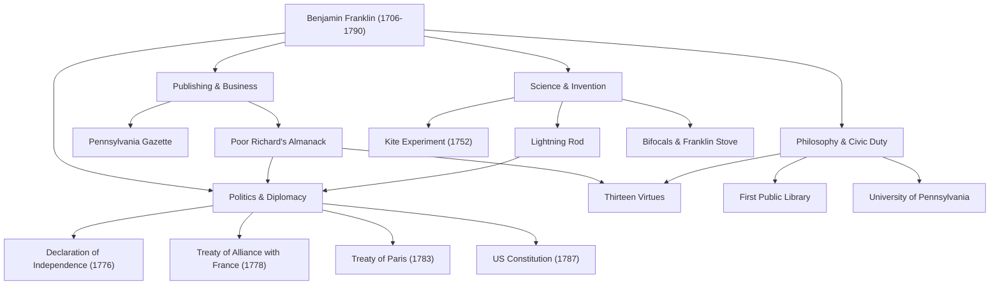

ベンジャミン・フランクリン（1706年〜1790年）と聞いて、多くの人がまず思い浮かべるのは、アメリカ合衆国の100ドル紙幣に描かれた穏やかな肖像画かもしれません。しかし、彼の真の姿は「建国の父」という政治的な枠組みに収まるものではありません。印刷業者、著述家、科学者、発明家、外交官、そして哲学者——フランクリンは、あらゆる分野で歴史的な足跡を残した稀代の「万能の天才（ポリマス）」でした。

本記事では、ゼロから身を立ててアメリカという国家の礎を築いたフランクリンの波乱万丈な生涯、彼が実践した人生哲学、そして現代にまで続く多大な影響について深く掘り下げていきます。

## 叩き上げの青年期と印刷業での成功

1706年、マサチューセッツ植民地のボストンで、石鹸・ろうそく製造業を営む貧しい家庭の15番目の子供としてフランクリンは生まれました。家計の事情から正規の学校教育はわずか2年で終了しましたが、彼の比類なき知的好奇心が失われることはありませんでした。独学で読書に没頭し、兄の印刷所で徒弟として働きながら文章力を磨きました。

17歳で兄と衝突してボストンを出奔したフランクリンは、フィラデルフィアへと辿り着きます。無一文からのスタートでしたが、持ち前の勤勉さと機転で頭角を現し、自身の印刷所を設立。彼が発行した『ペンシルベニア・ガゼット』紙は植民地で最も読まれる新聞の一つとなり、さらに彼自身が執筆した『貧しいリチャードの暦（Poor Richard's Almanack）』は、格言や生活の知恵をちりばめた内容で空前のベストセラーとなりました。この成功により、彼は若くして経済的な独立を果たします。

## 電気を解き明かした科学者・発明家として

実業家として成功を収めた後、フランクリンの関心は自然科学へと向かいました。特に有名なのが「電気」に関する研究です。1752年、雷雨の中で凧を揚げるという命がけの「凧の実験」を行い、雷の正体が電気であることを証明しました。この発見をもとに「避雷針」を発明し、多くの建物や人命を火災から救うことになります。

彼の才能は理論にとどまらず、実用的な発明にも遺憾なく発揮されました。部屋全体を効率的に暖める「フランクリン・ストーブ」、遠近両用の「バイフォーカル（二重焦点）レンズ」、さらには「グラス・ハーモニカ」という楽器まで、人々の生活を豊かにするためのアイデアを次々と形にしました。驚くべきことに、彼は「発明は人々の役に立つべきだ」という信念のもと、これらの特許を一切取得せず、社会に無料で還元しました。

## 建国の父と天才的な外交手腕

アメリカ独立の気運が高まると、フランクリンは政治家・外交官として歴史の表舞台に立ちます。彼は独立宣言（1776年）の起草委員の一人として、トーマス・ジェファーソンをサポートし、アメリカの理想を明文化する重要な役割を担いました。

しかし、彼の最大の政治的功績は、独立戦争中におけるフランスでの外交交渉でしょう。当時70歳を超えていたフランクリンはパリへ渡り、その知性とユーモア、そして質素でありながら洗練された振る舞いでフランス社交界を魅了しました。彼の尽力により、1778年に米仏同盟条約が結ばれ、フランス軍の決定的な支援を引き出すことに成功します。これがなければ、アメリカの独立は不可能だったと言っても過言ではありません。その後もイギリスとのパリ条約（1783年）の交渉をまとめ上げ、アメリカ合衆国憲法の制定（1787年）にも調停者として大きく貢献しました。

## 十三の徳目と後世への影響

フランクリンが現代においても高く評価される理由は、彼の業績だけでなく、その実践的な「人生哲学」にあります。彼は20代の時、道徳的に完璧な人間になるための計画を立て、「十三の徳目（Thirteen Virtues）」を定めました。

1. **節制**（Temperance）
2. **沈黙**（Silence）
3. **規律**（Order）
4. **決断**（Resolution）
5. **節約**（Frugality）
6. **勤勉**（Industry）
7. **誠実**（Sincerity）
8. **正義**（Justice）
9. **中庸**（Moderation）
10. **清潔**（Cleanliness）
11. **平静**（Tranquility）
12. **純潔**（Chastity）
13. **謙遜**（Humility）

彼はこれらを一度に全て守ろうとするのではなく、毎週1つの徳目に集中し、手帳に記録をつけて自己評価を繰り返しました。この継続的な自己修養の姿勢は、のちの自己啓発の元祖とも言え、数え切れないほどの人々に影響を与えています。

## まとめ：公共の精神を体現した生涯

ベンジャミン・フランクリンは1790年に84歳でこの世を去りましたが、彼がフィラデルフィアに設立した図書館、消防団、病院、そして大学（現在のペンシルベニア大学）は、今も社会の基盤として機能しています。

「あなたのためにできる最も素晴らしいことは、あなたが自分自身のために何かをできるように手助けすることだ」という彼の精神は、アメリカの根底に流れるプラグマティズム（実用主義）と民主主義の象徴です。貧しい職人の子から国家の礎を築くに至ったその足跡は、絶え間ない向上心と公共への奉仕が見事に融合した、人類史における最高のロールモデルの一つと言えるでしょう。

### 【図解】ベンジャミン・フランクリンの功績と軌跡

以下の図は、フランクリンが様々な分野で残した主要な功績とその繋がりを示しています。

