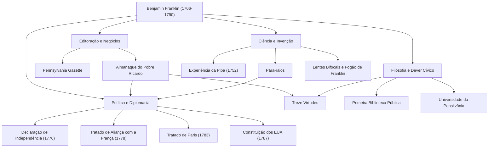

Quando se ouve o nome de Benjamin Franklin (1706–1790), muitas pessoas podem pensar primeiro no retrato gentil da nota de 100 dólares dos Estados Unidos. No entanto, sua verdadeira figura não pode ser contida na estrutura política de um "Pai Fundador". Impressor, escritor, cientista, inventor, diplomata e filósofo — Franklin foi um raro "polímata" (gênio universal) que deixou uma marca histórica em todos os campos.

Neste artigo, nos aprofundamos na agitada vida de Franklin, que partiu do nada para construir as bases da nação americana, na filosofia de vida que ele praticou e em sua imensa influência que perdura até hoje.

## Juventude Autodidata e Sucesso na Indústria Gráfica

Em 1706, Franklin nasceu em Boston, na colônia de Massachusetts, como o 15º filho de uma família pobre que administrava um negócio de fabricação de sabão e velas. Devido às finanças da família, sua educação escolar formal terminou após apenas dois anos, mas sua curiosidade intelectual incomparável nunca se perdeu. Ele mergulhou na leitura de forma autodidata e aprimorou suas habilidades de escrita enquanto trabalhava como aprendiz na gráfica de seu irmão mais velho.

Entrando em conflito com o irmão aos 17 anos, Franklin fugiu de Boston e chegou à Filadélfia. Começando sem dinheiro, ele se destacou por sua diligência natural e raciocínio rápido, estabelecendo finalmente sua própria gráfica. O "Pennsylvania Gazette", que ele publicava, tornou-se um dos jornais mais lidos das colônias. Além disso, o "Almanaque do Pobre Ricardo" (Poor Richard's Almanack), escrito pelo próprio Franklin e repleto de máximas e sabedoria prática, tornou-se um best-seller sem precedentes. Com esse sucesso, ele alcançou a independência financeira muito jovem.

## Como Cientista e Inventor que Desvendou os Segredos da Eletricidade

Após alcançar o sucesso como homem de negócios, o interesse de Franklin voltou-se para as ciências naturais. Ele é especialmente famoso por sua pesquisa sobre "eletricidade". Em 1752, ele conduziu a perigosa "experiência da pipa" durante uma tempestade, provando que os raios são, na verdade, eletricidade. Com base nessa descoberta, ele inventou o "pára-raios", salvando muitos edifícios e vidas humanas de incêndios.

Seus talentos não se limitavam à teoria; eles também foram plenamente demonstrados em invenções práticas. O "fogão de Franklin", que aquecia eficientemente um cômodo inteiro, as lentes "bifocais" e até mesmo um instrumento musical chamado "harmônica de vidro" — ele deu vida a uma sucessão de ideias para enriquecer a vida das pessoas. Surpreendentemente, sob a crença de que "as invenções devem servir ao povo", ele nunca obteve patentes para nenhuma delas, devolvendo-as gratuitamente à sociedade.

## Pai Fundador e Geniais Habilidades Diplomáticas

À medida que o impulso para a independência americana crescia, Franklin ocupou o centro da história como político e diplomata. Como um dos membros do comitê de redação da Declaração da Independência (1776), ele apoiou Thomas Jefferson e desempenhou um papel crucial na codificação dos ideais americanos.

No entanto, sua maior conquista política provavelmente foram suas negociações diplomáticas na França durante a Guerra da Independência. Com mais de 70 anos, Franklin viajou para Paris e encantou a alta sociedade francesa com sua inteligência, humor e comportamento simples, porém refinado. Através de seus esforços, o Tratado de Aliança com a França foi assinado em 1778, garantindo com sucesso o apoio decisivo do exército francês. Não é exagero dizer que a independência americana teria sido impossível sem isso. Posteriormente, ele concluiu as negociações para o Tratado de Paris (1783) com a Grã-Bretanha e fez contribuições significativas como mediador na redação da Constituição dos Estados Unidos (1787).

## As Treze Virtudes e o Legado para as Gerações Posteriores

A razão pela qual Franklin ainda é muito valorizado hoje reside não apenas em suas conquistas, mas também em sua "filosofia de vida" prática. Aos 20 e poucos anos, ele elaborou um plano para se tornar um ser humano moralmente perfeito, estabelecendo as "Treze Virtudes".

1. **Temperança**
2. **Silêncio**
3. **Ordem**
4. **Resolução**
5. **Frugalidade**
6. **Indústria (Trabalho)**
7. **Sinceridade**
8. **Justiça**
9. **Moderação**
10. **Limpeza**
11. **Tranquilidade**
12. **Castidade**
13. **Humildade**

Em vez de tentar observar todas elas de uma só vez, ele focava em uma virtude a cada semana e mantinha um registro em seu caderno para uma autoavaliação contínua. Essa atitude de autocultivo contínuo pode ser considerada a pioneira da autoajuda, influenciando inúmeras pessoas.

## Conclusão: Uma Vida que Incorpora o Espírito Público

Benjamin Franklin faleceu em 1790 aos 84 anos, mas a biblioteca, o corpo de bombeiros, o hospital e a universidade (agora Universidade da Pensilvânia) que ele fundou na Filadélfia continuam a funcionar como a base da sociedade hoje.

Seu espírito, representado pela frase: "A coisa mais maravilhosa que você pode fazer por alguém é ajudá-lo a ser capaz de fazer algo por si mesmo", é um símbolo do pragmatismo e da democracia que fluem nas raízes da América. Sua jornada, de filho de um artesão pobre a construtor das fundações de uma nação, pode ser considerada um dos maiores modelos da história humana, fundindo brilhantemente uma ambição incessante com o serviço público.

### [Diagrama] As Conquistas e a Trajetória de Benjamin Franklin

O diagrama a seguir mostra as principais conquistas de Franklin em vários campos e suas conexões.

