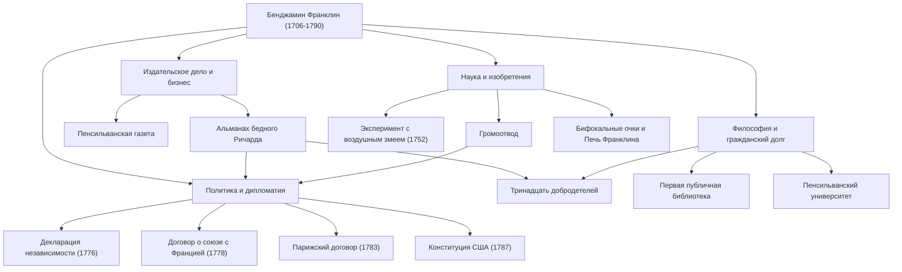

При упоминании имени Бенджамина Франклина (1706–1790) многим людям в первую очередь приходит на ум спокойный портрет на 100-долларовой купюре США. Однако его истинную сущность невозможно уместить в политические рамки «Отца-основателя». Печатник, писатель, ученый, изобретатель, дипломат и философ — Франклин был редким «полиматом» (универсальным гением), оставившим исторический след в каждой из этих областей.

В этой статье мы подробно рассмотрим насыщенную событиями жизнь Франклина, который, начав с нуля, заложил основы американского государства, его жизненную философию и огромное влияние, которое сохраняется и по сей день.

## Юность самоучки и успех в печатном деле

В 1706 году Франклин родился в Бостоне, колония Массачусетс, став 15-м ребенком в бедной семье, занимавшейся производством мыла и свечей. Из-за финансовых трудностей семьи его формальное школьное образование закончилось всего через два года, но его беспрецедентная интеллектуальная любознательность никогда не угасала. Он с головой ушел в чтение, занимаясь самообразованием, и оттачивал писательские навыки, работая подмастерьем в типографии своего старшего брата.

Поссорившись с братом в возрасте 17 лет, Франклин сбежал из Бостона и прибыл в Филадельфию. Начав без гроша в кармане, он выделился благодаря своему природному трудолюбию и сообразительности, в конечном итоге открыв собственную типографию. Издаваемая им «Пенсильванская газета» стала одной из самых читаемых газет в колониях. Кроме того, написанный самим Франклином «Альманах бедного Ричарда», полный афоризмов и житейской мудрости, стал беспрецедентным бестселлером. Благодаря этому успеху он в молодом возрасте достиг финансовой независимости.

## Ученый и изобретатель, разгадавший тайны электричества

Добившись успеха как бизнесмен, Франклин обратил свой интерес к естественным наукам. Особенно известны его исследования «электричества». В 1752 году он провел опасный для жизни «эксперимент с воздушным змеем» во время грозы, доказав, что молния — это электричество. На основе этого открытия он изобрел «громоотвод», спасший множество зданий и человеческих жизней от пожаров.

Его таланты не ограничивались теорией; они также в полной мере проявились в практических изобретениях. «Печь Франклина», эффективно обогревавшая целую комнату, «бифокальные» линзы и даже музыкальный инструмент под названием «стеклянная гармоника» — он одну за другой воплощал идеи, призванные обогатить жизнь людей. Удивительно, но, веря в то, что «изобретения должны служить людям», он никогда не получал патентов ни на одно из них, безвозмездно передав их обществу.

## Отец-основатель и гениальные дипломатические навыки

По мере того как росло стремление к независимости Америки, Франклин вышел на авансцену истории как политик и дипломат. В качестве одного из членов комитета по разработке Декларации независимости (1776) он поддерживал Томаса Джефферсона и сыграл решающую роль в закреплении американских идеалов.

Однако его величайшим политическим достижением, вероятно, стали дипломатические переговоры во Франции во время Войны за независимость. Будучи уже старше 70 лет, Франклин отправился в Париж и очаровал французский высший свет своим умом, юмором и простыми, но утонченными манерами. Благодаря его усилиям в 1778 году был подписан Договор о союзе с Францией, что позволило заручиться решающей поддержкой французской армии. Без преувеличения можно сказать, что без этого независимость Америки была бы невозможна. Впоследствии он успешно завершил переговоры по Парижскому договору (1783) с Великобританией и внес значительный вклад как посредник при разработке Конституции США (1787).

## Тринадцать добродетелей и наследие для будущих поколений

Причина, по которой Франклина высоко ценят и сегодня, кроется не только в его достижениях, но и в его практической «жизненной философии». В 20 с небольшим лет он разработал план того, как стать морально совершенным человеком, установив «Тринадцать добродетелей».

1. **Воздержанность**
2. **Молчание**
3. **Порядок**
4. **Решительность**
5. **Бережливость**
6. **Трудолюбие**
7. **Искренность**
8. **Справедливость**
9. **Умеренность**
10. **Чистоплотность**
11. **Спокойствие**
12. **Целомудрие**
13. **Скромность**

Вместо того чтобы пытаться соблюдать все это одновременно, он концентрировался на одной добродетели каждую неделю и вел записи в блокноте для постоянной самооценки. Такое отношение к непрерывному самосовершенствованию можно назвать пионером движения самопомощи, оказавшим влияние на бесчисленное множество людей.

## Заключение: жизнь, воплощающая общественный дух

Бенджамин Франклин скончался в 1790 году в возрасте 84 лет, но библиотека, пожарная часть, больница и университет (ныне Пенсильванский университет), которые он основал в Филадельфии, продолжают функционировать как основа общества и сегодня.

Его дух, отраженный в словах: «Самое замечательное, что вы можете сделать для кого-то — это помочь ему научиться делать что-то для себя», является символом прагматизма и демократии, лежащих в основе Америки. Его путь от ребенка бедного ремесленника до создателя фундамента нации можно считать одной из величайших ролевых моделей в истории человечества, блестяще сочетающей в себе неустанные амбиции и служение обществу.

### [Схема] Достижения и жизненный путь Бенджамина Франклина

На следующей схеме показаны основные достижения Франклина в различных областях и их взаимосвязи.

