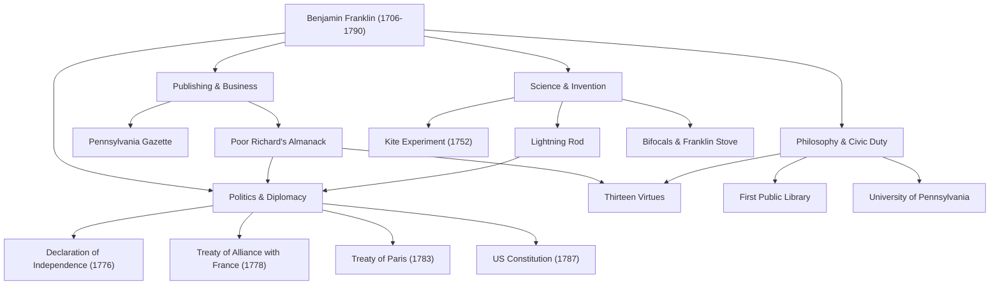

提到本杰明·富兰克林（1706年〜1790年），许多人首先想到的可能是美国100美元纸币上那幅温和的肖像。然而，他的真实面貌并非“开国元勋”这一政治框架所能完全概括。印刷商、作家、科学家、发明家、外交官，以及哲学家——富兰克林是一位在各个领域都留下了历史足迹的罕见“全才”（Polymath）。

在本文中，我们将深入探讨富兰克林从白手起家到为美国奠定国家基石的波澜壮阔的一生，他所践行的人生哲学，以及至今仍影响深远的伟大遗产。

## 白手起家的青年时期与印刷业的成功

1706年，富兰克林出生于马萨诸塞殖民地的波士顿，是一个经营肥皂和蜡烛制造的贫困家庭的第15个孩子。由于家庭经济原因，他的正规学校教育仅仅维持了两年，但这并未磨灭他无与伦比的求知欲。他通过自学沉迷于阅读，并在哥哥的印刷厂当学徒期间磨练了写作能力。

17岁时，因与哥哥发生冲突，富兰克林离家出走并辗转来到了费城。虽然身无分文，但他凭借天生的勤奋和机智崭露头角，最终创办了自己的印刷厂。他发行的《宾夕法尼亚公报》成为了殖民地阅读量最高的报纸之一，而他亲自执笔的《穷理查年鉴》则因充满了格言与生活智慧而成为空前的畅销书。这一成功使他在年轻时便实现了经济独立。

## 揭开电之奥秘的科学家与发明家

在作为实业家取得成功后，富兰克林的兴趣转向了自然科学。其中最著名的是关于“电”的研究。1752年，他冒着生命危险在雷雨中进行了“风筝实验”，证明了雷电的本质其实就是电。基于这一发现，他发明了“避雷针”，从火灾中拯救了无数建筑和生命。

他的才华不仅仅停留在理论上，在实用发明中也展现得淋漓尽致。能高效加热整个房间的“富兰克林火炉”、远近两用的“双光眼镜”，甚至还有一种名为“玻璃琴”的乐器——他不断将造福人类生活的想法化为现实。令人惊叹的是，出于“发明应该为人类服务”的信念，他从未为这些发明申请过任何专利，而是将它们无偿献给了社会。

## 开国元勋与天才的外交手腕

随着美国独立运动的高涨，富兰克林作为政治家和外交官登上了历史的舞台。作为1776年《独立宣言》的起草委员之一，他协助托马斯·杰斐逊，在将美国理想明文化的过程中发挥了重要作用。

然而，他最伟大的政治功绩或许是美国独立战争期间在法国进行的外交谈判。当时已年过七旬的富兰克林远赴巴黎，以其智慧、幽默以及质朴却不失优雅的举止倾倒了法国社交界。通过他的不懈努力，美法两国于1778年签订了同盟条约，成功争取到了法国军队决定性的支援。毫不夸张地说，如果没有这一支持，美国的独立是根本不可能的。之后，他又促成了与英国的《巴黎条约》（1783年），并作为调停者在美国宪法的制定（1787年）中做出了巨大贡献。

## 十三美德与对后世的影响

富兰克林至今仍备受推崇的原因，不仅在于他的丰功伟绩，更在于他实践的“人生哲学”。他在20多岁时制定了一个旨在成为道德完美之人的计划，并确立了“十三美德”。

1. **节制**
2. **缄默**
3. **秩序**
4. **决心**
5. **节俭**
6. **勤奋**
7. **真诚**
8. **正义**
9. **中庸**
10. **清洁**
11. **平静**
12. **贞洁**
13. **谦逊**

他并没有试图一次性遵守所有这些美德，而是每周专注于一项，并在笔记本上记录下来进行反复的自我评估。这种持续自我修养的态度可以说是后世自我提升（Self-help）的先驱，影响了无数人。

## 总结：公共精神的终极体现

本杰明·富兰克林于1790年逝世，享年84岁，但他生前在费城建立的图书馆、消防队、医院以及大学（即现在的宾夕法尼亚大学）至今仍作为社会的基石发挥着作用。

“你能为别人做的最伟大的事情，就是帮助别人能够为自己做点什么。”他的这一精神是流淌在美国根基中的实用主义与民主主义的象征。从贫穷工匠之子到奠定国家基石，他的足迹将不懈的进取心与公共服务精神完美融合，堪称人类历史上最伟大的榜样之一。

### 【图解】本杰明·富兰克林的功绩与轨迹

下图展示了富兰克林在各个领域留下的主要功绩及其关联。

