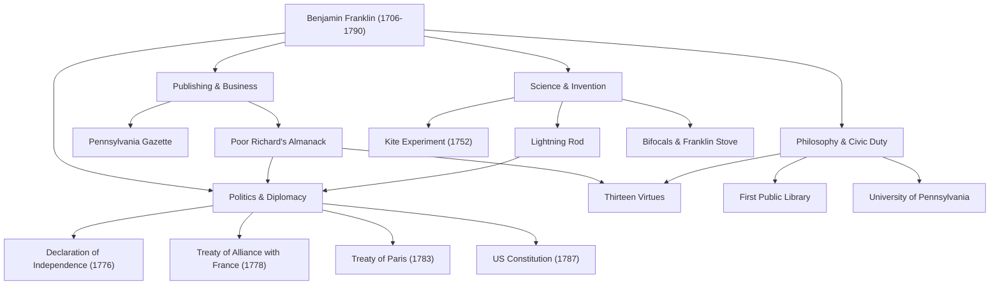

提到班傑明·富蘭克林（1706年〜1790年），許多人首先想到的可能是美國100美元紙幣上那幅溫和的肖像。然而，他的真實面貌並非「開國元勳」這一政治框架所能完全概括。印刷商、作家、科學家、發明家、外交官，以及哲學家——富蘭克林是一位在各個領域都留下了歷史足跡的罕見「全才」（Polymath）。

在本文中，我們將深入探討富蘭克林從白手起家到為美國奠定國家基石的波瀾壯闊的一生，他所踐行的人生哲學，以及至今仍影響深遠的偉大遺產。

## 白手起家的青年時期與印刷業的成功

1706年，富蘭克林出生於麻薩諸塞殖民地的波士頓，是一個經營肥皂和蠟燭製造的貧困家庭的第15個孩子。由於家庭經濟原因，他的正規學校教育僅僅維持了兩年，但這並未磨滅他無與倫比的求知慾。他通過自學沉迷於閱讀，並在哥哥的印刷廠當學徒期間磨練了寫作能力。

17歲時，因與哥哥發生衝突，富蘭克林離家出走並輾轉來到了費城。雖然身無分文，但他憑藉天生的勤奮和機智嶄露頭角，最終創辦了自己的印刷廠。他發行的《賓夕法尼亞公報》成為了殖民地閱讀量最高的報紙之一，而他親自執筆的《窮理查年鑑》則因充滿了格言與生活智慧而成為空前的暢銷書。這一成功使他在年輕時便實現了經濟獨立。

## 揭開電之奧秘的科學家與發明家

在作為實業家取得成功後，富蘭克林的興趣轉向了自然科學。其中最著名的是關於「電」的研究。1752年，他冒著生命危險在雷雨中進行了「風箏實驗」，證明了雷電的本質其實就是電。基於這一發現，他發明了「避雷針」，從火災中拯救了無數建築和生命。

他的才華不僅僅停留在理論上，在實用發明中也展現得淋漓盡致。能高效加熱整個房間的「富蘭克林火爐」、遠近兩用的「雙光眼鏡」，甚至還有一種名為「玻璃琴」的樂器——他不斷將造福人類生活的想法化為現實。令人驚嘆的是，出於「發明應該為人類服務」的信念，他從未為這些發明申請過任何專利，而是將它們無償獻給了社會。

## 開國元勳與天才的外交手腕

隨著美國獨立運動的高漲，富蘭克林作為政治家和外交官登上了歷史的舞台。作為1776年《獨立宣言》的起草委員之一，他協助托馬斯·傑佛遜，在將美國理想明文化的過程中發揮了重要作用。

然而，他最偉大的政治功績或許是美國獨立戰爭期間在法國進行的外交談判。當時已年過七旬的富蘭克林遠赴巴黎，以其智慧、幽默以及質樸卻不失優雅的舉止傾倒了法國社交界。通過他的不懈努力，美法兩國於1778年簽訂了同盟條約，成功爭取到了法國軍隊決定性的支援。毫不誇張地說，如果沒有這一支持，美國的獨立是根本不可能的。之後，他又促成了與英國的《巴黎條約》（1783年），並作為調停者在美國憲法的制定（1787年）中做出了巨大貢獻。

## 十三美德與對後世的影響

富蘭克林至今仍備受推崇的原因，不僅在於他的豐功偉績，更在於他實踐的「人生哲學」。他在20多歲時制定了一個旨在成為道德完美之人的計劃，並確立了「十三美德」。

1. **節制**
2. **緘默**
3. **秩序**
4. **決心**
5. **節儉**
6. **勤奮**
7. **真誠**
8. **正義**
9. **中庸**
10. **清潔**
11. **平靜**
12. **貞潔**
13. **謙遜**

他並沒有試圖一次性遵守所有這些美德，而是每週專注於一項，並在筆記本上記錄下來進行反覆的自我評估。這種持續自我修養的態度可以說是後世自我提昇（Self-help）的先驅，影響了無數人。

## 總結：公共精神的終極體現

班傑明·富蘭克林於1790年逝世，享年84歲，但他生前在費城建立的圖書館、消防隊、醫院以及大學（即現在的賓夕法尼亞大學）至今仍作為社會的基石發揮著作用。

「你能為別人做的最偉大的事情，就是幫助別人能夠為自己做點什麼。」他的這一精神是流淌在美國根基中的實用主義與民主主義的象徵。從貧窮工匠之子到奠定國家基石，他的足跡將不懈的進取心與公共服務精神完美融合，堪稱人類歷史上最偉大的榜樣之一。

### 【圖解】班傑明·富蘭克林的功績與軌跡

下圖展示了富蘭克林在各個領域留下的主要功績及其關聯。

