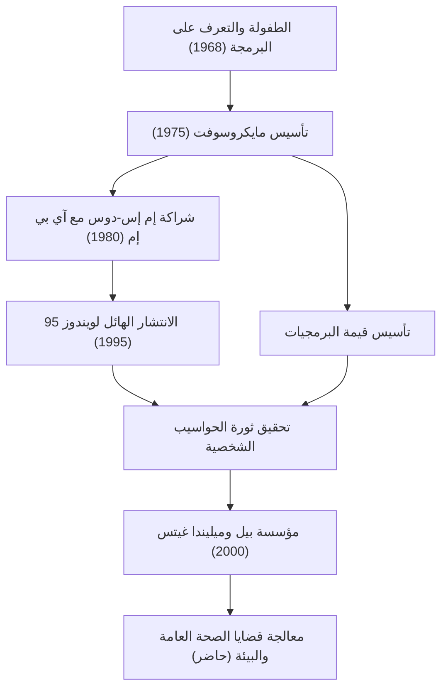

اليوم، توجد أجهزة الكمبيوتر على مكاتبنا وفي جيوبنا كأمر واقع. بيل غيتس (ويليام هنري غيتس الثالث) هو أكبر مساهم قام بتعميم مفهوم "الكمبيوتر الشخصي" (PC) في جميع أنحاء العالم وأنشأ صناعة البرمجيات الضخمة. أكثر من مجرد تقني، كان رجل أعمال متميز تحول لاحقًا إلى أكبر فاعل خير في العالم. يمكن القول إن قصة حياته هي تاريخ تطور المجتمع الحديث.

### الصحوة على قيمة البرمجيات

وُلد غيتس في سياتل، واشنطن عام 1955، وأظهر ذكاءً غير عادي منذ سن مبكرة. لقد أسره سحر البرمجة في سن 13 عامًا. من خلال محطة تيلترايب التي تم تقديمها في مدرسة ليكسايد التي التحق بها، انغمس في عالم أجهزة الكمبيوتر. جنبًا إلى جنب مع بول ألين (المؤسس المشارك لاحقًا لشركة مايكروسوفت)، كانوا يجدون أخطاء النظام لكسب وقت استخدام الكمبيوتر، ونموا في النهاية لتولي نظام كشوف المرتبات لشركة محلية.

على الرغم من التحاقه بجامعة هارفارد في عام 1973، إلا أن شغفه لم يكن في الأوساط الأكاديمية. في عام 1975، عندما تم إصدار أول كمبيوتر شخصي تجاري في العالم "Altair 8800"، قام غيتس وألين بتطوير مترجم BASIC له. برؤية كبرى تتمثل في "كمبيوتر على كل مكتب وفي كل منزل"، تركوا الكلية وأسسوا "مايكرو-سوفت" (لاحقًا مايكروسوفت). في وقت كانت فيه "البرمجيات" مجرد إضافة للأجهزة، كانت أكبر بصيرة لغيتس هي إدراك قيمتها كحقوق طبع ونشر ووضعها في قلب أعمالهم.

### بناء إمبراطورية وانتصار "ويندوز"

أصبحت قفزة مايكروسوفت إلى الأمام حاسمة من خلال عقد مع آي بي إم في عام 1980. عندما تم التواصل معه لتوفير نظام تشغيل لكمبيوتر آي بي إم الجديد، اشترى غيتس نظام تشغيل من شركة أخرى ووقع عقدًا لترخيصه كـ "MS-DOS". والأهم من ذلك، أنه لم يمنح آي بي إم حقوقًا حصرية، بل احتفظ بالحق في ترخيصه لمصنعي أجهزة الكمبيوتر الآخرين. هذا جعل MS-DOS المعيار الفعلي لأجهزة الكمبيوتر الشخصية.

لاحقًا، بعد أن أدرك أهمية واجهة المستخدم الرسومية (GUI) في وقت مبكر، أعلن عن "ويندوز" في عام 1985. بعد العديد من ترقيات الإصدار، أصبح "ويندوز 95"، الذي تم إصداره في عام 1995، ظاهرة اجتماعية عالمية، وفتح الباب على مصراعيه لعصر الإنترنت.

### من مدير تنفيذي قاسٍ إلى فاعل خير ينقذ العالم

كمسؤول تنفيذي، كان غيتس قاسيًا بشكل لا يصدق تجاه المنافسة وسعى جاهدًا لتحقيق الفوز. تعد حرب المتصفحات الشرسة مع نتسكيب والمحاكمة المتعلقة بمكافحة الاحتكار مع وزارة العدل أحداثًا ترمز إلى أساليب عمله العدوانية. من ناحية أخرى، كان لديه عادة تسمى "أسبوع التفكير"، حيث كان يعزل نفسه في كوخ بضع مرات في السنة، ويقرأ كميات هائلة من الأوراق والكتب، ويتنبأ باستمرار باتجاهات التكنولوجيا المستقبلية. كان نجاحه مدعومًا بكل من هذا الوقت للتفكير العميق وقدرته على التنفيذ لربطه بالأعمال.

ومع ذلك، بعد تأسيس "مؤسسة بيل وميليندا غيتس" في عام 2000، تغيرت مرحلة حياته بشكل كبير. بعد تنحيه عن الخطوط الأمامية لإدارة مايكروسوفت في عام 2008، بدأ يصب ثروته الهائلة في حل التحديات العالمية. أنشطته متنوعة، بما في ذلك القضاء على الأمراض المعدية (شلل الأطفال والملاريا) في البلدان النامية، وتطوير مراحيض ثورية من الجيل التالي، وفي السنوات الأخيرة، التدابير المضادة لتغير المناخ (الاستثمار في الطاقة النظيفة).

الرجل الذي سعى وراء "الربح" في عالم الأعمال يسعى الآن للحصول على أقصى عائد من "بقاء ورفاهية البشرية"، محاولًا تحسين العالم بقوة العلم والتكنولوجيا.

### المستقبل والإرث الذي تقوده التكنولوجيا

تجسد حياة بيل غيتس بشكل مثالي كيف تعيد التكنولوجيا تشكيل المجتمع بشكل أساسي. على أساس صناعة البرمجيات التي بناها، يوجد تطوير الهواتف الذكية الحالية، والسحابة، والذكاء الاصطناعي.

قد يكون أعظم درس تركه وراءه هو أن "التكنولوجيا في حد ذاتها ليست جيدة ولا سيئة؛ ما يهم هو كيف يتم استخدامها وتنفيذها في المجتمع." الشاب الذي كتب التعليمات البرمجية وقدم نظام تشغيل لأجهزة الكمبيوتر في جميع أنحاء العالم أصبح الآن في طليعة مشروع ضخم لإصلاح الأخطاء العالمية. ستظل رحلته نموذجًا يُحتذى به إلى الأبد لأصحاب المشاريع في المستقبل، مما يوضح كيف تبدو "المساهمة الاجتماعية الحقيقية" إلى جانب نجاح الأعمال.
