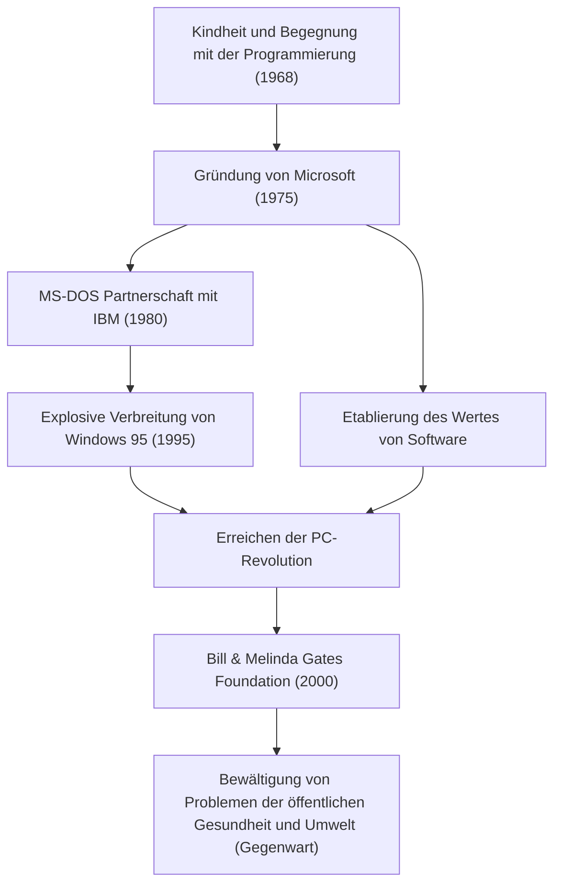

Heute sind Computer auf unseren Schreibtischen und in unseren Taschen eine Selbstverständlichkeit. Bill Gates (William Henry Gates III) ist der größte Mitwirkende, der dieses Konzept des "Personal Computers (PC)" weltweit populär machte und die riesige Softwareindustrie schuf. Er war mehr als nur ein Technologe, er war ein herausragender Geschäftsmann, der sich später in den größten Philanthropen der Welt verwandelte. Seine Lebensgeschichte ist gewissermaßen die Entwicklungsgeschichte der modernen Gesellschaft selbst.

### Das Erwachen für den Wert von Software

Der 1955 in Seattle, Washington, geborene Gates zeigte schon in jungen Jahren eine außergewöhnliche Intelligenz. Bereits im Alter von 13 Jahren war er von der Faszination des Programmierens gefesselt. Über ein Fernschreiber-Terminal, das an seiner Lakeside School eingeführt worden war, tauchte er in die Welt der Computer ein. Zusammen mit Paul Allen (dem späteren Mitbegründer von Microsoft) fanden sie Systemfehler, um Computerzeit zu verdienen, und wuchsen schließlich so weit, dass sie das Gehaltsabrechnungssystem eines lokalen Unternehmens übernahmen.

Obwohl er 1973 sein Studium an der Harvard University begann, lag seine Leidenschaft nicht in der Wissenschaft. Als 1975 der erste kommerzielle Personal Computer der Welt, der "Altair 8800", auf den Markt kam, entwickelten Gates und Allen einen BASIC-Interpreter dafür. Mit der großen Vision von "einem Computer auf jedem Schreibtisch und in jedem Zuhause" brachen sie das College ab und gründeten "Micro-Soft" (später Microsoft). In einer Zeit, in der "Software" nur ein Zusatz zur Hardware war, bestand Gates' größte Weitsicht darin, ihren Wert als Urheberrecht zu erkennen und sie in den Mittelpunkt ihres Geschäfts zu stellen.

### Der Aufbau eines Imperiums und der Sieg von "Windows"

Der Aufstieg von Microsoft wurde durch einen Vertrag mit IBM im Jahr 1980 entscheidend. Als Gates gebeten wurde, ein Betriebssystem (OS) für den neuen IBM-PC bereitzustellen, kaufte er ein OS von einem anderen Unternehmen und unterzeichnete einen Vertrag, um es als "MS-DOS" zu lizenzieren. Wichtig dabei ist, dass er IBM keine Exklusivrechte einräumte, sondern sich das Recht vorbehielt, es auch an andere Computerhersteller zu lizenzieren. Dies machte MS-DOS zum De-facto-Standard für PCs.

Nachdem er schon früh die Bedeutung der grafischen Benutzeroberfläche (GUI) erkannt hatte, kündigte er 1985 "Windows" an. Nach mehreren Versions-Upgrades wurde das 1995 veröffentlichte "Windows 95" zu einem weltweiten gesellschaftlichen Phänomen und öffnete die Tür zum Internetzeitalter weit.

### Vom skrupellosen Manager zum Philanthropen, der die Welt rettet

Als Manager war Gates im Wettbewerb unglaublich skrupellos und verfolgte den Sieg kompromisslos. Der erbitterte Browserkrieg mit Netscape und der Kartellrechtsprozess mit dem Justizministerium sind Ereignisse, die seine aggressiven Geschäftsmethoden symbolisieren. Andererseits hatte er eine Gewohnheit namens "Think Week" (Denkwoche), bei der er sich mehrmals im Jahr in ein Landhaus zurückzog, massenhaft Papiere und Bücher las und kontinuierlich die Trends der zukünftigen Technologie vorhersagte. Sein Erfolg wurde sowohl durch diese Zeit für tiefes Nachdenken als auch durch seine Fähigkeit zur Umsetzung unterstützt, um es mit dem Geschäft zu verbinden.

Nach der Gründung der "Bill & Melinda Gates Foundation" im Jahr 2000 änderte sich die Phase seines Lebens jedoch erheblich. Nachdem er 2008 von der vordersten Front des Microsoft-Managements zurückgetreten war, begann er, seinen immensen Reichtum in die Lösung globaler Herausforderungen zu stecken. Seine Aktivitäten sind vielfältig und umfassen die Ausrottung von Infektionskrankheiten (Polio und Malaria) in Entwicklungsländern, die Entwicklung revolutionärer Toiletten der nächsten Generation und in den letzten Jahren Maßnahmen gegen den Klimawandel (Investitionen in saubere Energie).

Der Mann, der in der Geschäftswelt nach "Profit" strebte, sucht nun nach der maximalen Rendite durch "das Überleben und Wohlergehen der Menschheit" und versucht, die Welt mit der Kraft von Wissenschaft und Technologie zu optimieren.

### Die von Technologie geleitete Zukunft und das Vermächtnis

Das Leben von Bill Gates verkörpert perfekt, wie Technologie die Gesellschaft grundlegend umgestaltet. Auf dem Fundament der von ihm aufgebauten Softwareindustrie basiert die Entwicklung aktueller Smartphones, der Cloud und der KI.

Die größte Lektion, die er hinterlassen hat, könnte sein, dass "Technologie an sich weder gut noch schlecht ist; was zählt, ist, wie sie genutzt und in der Gesellschaft implementiert wird." Der junge Mann, der Code schrieb und ein Betriebssystem für PCs auf der ganzen Welt lieferte, steht heute an vorderster Front eines riesigen Projekts, um globale Fehler zu beheben. Sein Weg wird auch in Zukunft ein ewiges Vorbild für angehende Unternehmer sein und zeigen, wie ein "wahrer gesellschaftlicher Beitrag" über den geschäftlichen Erfolg hinaus aussieht.
